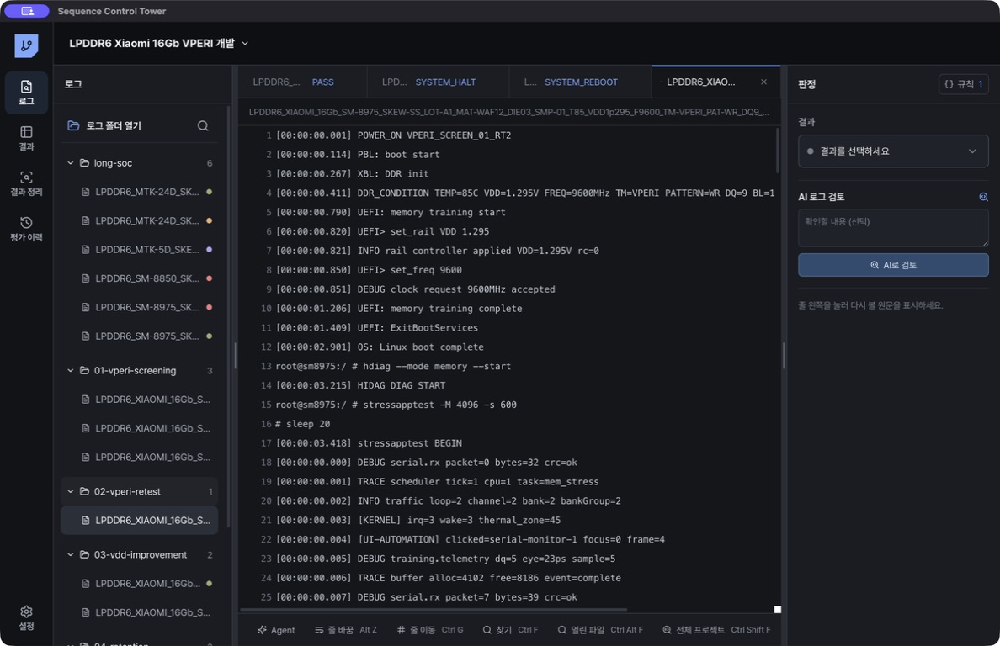

<p align="center">
  
</p>

# Sequence Control Tower

여러 폴더의 SoC 평가 로그를 검색·판정·정리하고, 엔지니어의 분석 절차와 평가 문맥을 프로젝트 단위로 축적하는 Windows/macOS 데스크톱 앱입니다.

[](https://github.com/stpcoder/sequence-control-tower/actions/workflows/ci.yml)
[](https://github.com/stpcoder/sequence-control-tower/releases/latest)

[](https://github.com/stpcoder/sequence-control-tower/releases/latest/download/Sequence-Control-Tower-Setup.exe)
[](https://github.com/stpcoder/sequence-control-tower/releases/latest/download/Sequence-Control-Tower-Portable.exe)
[](https://github.com/stpcoder/sequence-control-tower/releases/latest/download/Sequence-Control-Tower-macOS-Universal.dmg)

[온라인 매뉴얼](https://stpcoder.github.io/sequence-control-tower/) · [Agent 사용](docs/manual/05-Agent.md) · [LLM·OpenCode 설정](docs/manual/07-LLM-OpenCode.md) · [모든 Release](https://github.com/stpcoder/sequence-control-tower/releases)



## 핵심 작업

1. 여러 폴더의 `.log` 파일을 프로젝트에 연결합니다.
2. Notepad++/VS Code 방식으로 현재 파일, 열린 탭, 전체 프로젝트를 검색합니다.
3. marker 존재·부재·개수·순서를 규칙으로 저장하고 로그를 일괄 판정합니다.
4. Agent가 파일명 조건, SoC 부팅 profile, 입력 명령, 상태 marker와 조건별 실패 경향을 확인합니다.
5. 엔지니어가 사용한 Ctrl-F·정규식 순서를 확인한 뒤 프로젝트 분석 절차로 재사용합니다.
6. 결과 조건을 왼쪽·상단 축에 배치하고 판정 결과, 불량률, 실제 Fail address 집중을 확인한 뒤 표·평가 결과·주소 이벤트 CSV로 공유합니다.
7. 불량 가설, 평가, RT, 개선·검출 실험과 source 근거를 평가 이력에 남깁니다.

아직 정리하지 않은 평가 폴더의 Agent 분석을 시작하면 목적과 결론에 필요한 미확인 항목만 한 번에 하나씩 묻습니다. 기존 폴더에서 확정한 Ctrl-F·정규식 순서는 testMode·SoC·Boot profile이 호환될 때만 새 폴더의 검토 후보로 적용됩니다.

## Agent 네이티브 구조

Agent는 일반 채팅에 로그 전체를 올리는 방식이 아닙니다. 프로젝트 데이터와 다음 읽기 전용 도구를 앱 내부에서 호출합니다.

- 프로젝트 문맥·평가 이력·유사 사례
- 파일명 조건과 Sequence signature
- Qualcomm/MediaTek SoC 및 부팅 profile
- 콘솔 입력 명령과 장비 출력 분리
- 결정적 Pass/Fail·training fail·reboot·halt 판정
- Sample·SKEW별 평가 범위, Grid·Sequence 조건, 온도/VDD/4-Corner/주파수/Test Mode별 분자·분모
- Hdiag Fail 본문의 CS, Rank, Bank Group, Bank, Row, Column, WR, RD, DQ, BL 분포
- 제한 검색과 최대 24줄 근거 확인
- 확정된 엔지니어 분석 절차 적용

OpenCode가 설치되어 있으면 앱 전용 headless sidecar가 대화와 MCP 도구 호출을 관리합니다. 사용자의 전역 OpenCode plugin·규칙과 격리되며, shell·파일 편집·웹 도구는 차단됩니다. OpenCode를 사용할 수 없으면 동일한 SCT 도구를 쓰는 내부 bounded 하네스로 자동 전환합니다.

자세한 흐름과 질문 예시는 [Agent 사용](docs/manual/05-Agent.md)에 있습니다.

## LLM과 데이터 경계

검색, 정규식, marker 판정, 실패율 계산, 규칙 적용과 내보내기는 로컬에서 실행됩니다. LLM에는 질문, 구조화된 프로젝트 문맥, source ID와 검색으로 좁힌 근거 구간만 전달합니다. 원본 로그 전체, API key, token과 불필요한 절대경로는 전달하지 않습니다.

사내 OpenAI-compatible vLLM과 Vertex AI OpenAI-compatible endpoint를 사용할 수 있습니다. RPM, TPM, timeout, retries를 설정하며, 느린 응답은 대기·중지·재시도를 지원합니다.

## 설치

- Windows 10/11 x64: Setup 또는 Portable
- macOS 12 이상: Intel/Apple Silicon Universal DMG

조직 인증서가 적용되지 않은 빌드는 Windows SmartScreen 또는 macOS Gatekeeper 경고를 표시할 수 있습니다. [문제 해결](docs/manual/08-문제-해결.md)을 확인하세요.

## 개발과 검증

Node.js 22 LTS와 npm 10 이상이 필요합니다.

```bash
git clone https://github.com/stpcoder/sequence-control-tower.git
cd sequence-control-tower
npm ci
npm run dev
```

```bash
npm run typecheck
npm test
npm run build
npm run dist:win
npm run dist:mac
```

합성 LPDDR/SoC 로그는 `tests/fixtures/`에 있습니다. 실제 회사 로그와 인증 정보는 저장소에 커밋하지 마세요.

## 배포

모든 branch push와 pull request에서 의존성 감사, typecheck, tests, production build를 실행합니다. release tag는 `package.json` 버전과 같아야 합니다. 코드 서명과 수동 배포 절차는 [Release 운영 가이드](docs/releasing.md)를 참고하세요.

## 현재 제한

- Agent 조회 도구는 읽기 전용입니다. 결과와 평가 이력은 Agent의 구조화된 제안을 엔지니어가 승인한 경우에만 함께 저장됩니다.
- 유사 사례 검색은 로컬 프로젝트의 단어 중첩 방식입니다.
- Agent 한 질문의 로그 범위는 최대 100개입니다.
- Serial 장비 직접 제어와 원격 장비 모니터링은 포함하지 않습니다.
- 조직 인증서를 사용한 Windows/macOS 서명 배포는 별도 설정이 필요합니다.
