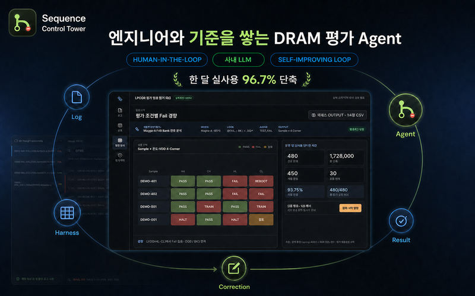

<p align="center">
  
</p>

# Sequence Control Tower

<p align="center"><strong>불량의 의미와 개선 효과 판단까지 연결하는 DRAM 평가 분석 Agent</strong></p>

Sequence Control Tower는 현재 평가의 불량 경향을 기존 평가 이력과 연결해, 불량 원인 가설과 개선 효과를 엔지니어와 함께 점검하는 DRAM 평가 분석 Agent입니다. 평가마다 반복되던 로그 판정, 조건별 데이터 정리와 시각화를 10분 미만에 구성하고, 내장 LPDDR 불량 분석 Skill로 원인 가설, 개선 효과, Side effect와 다음 평가 근거를 정리합니다. 엔지니어의 검색, 판정, 보정, 결과 구성은 Evaluation Harness로 축적되어 다음 평가에 적용됩니다.

[](https://github.com/stpcoder/sequence-control-tower/actions/workflows/ci.yml)
[](https://github.com/stpcoder/sequence-control-tower/releases/latest)

[](https://github.com/stpcoder/sequence-control-tower/releases/latest/download/Sequence-Control-Tower-Setup.exe)
[](https://github.com/stpcoder/sequence-control-tower/releases/latest/download/Sequence-Control-Tower-Portable.exe)
[](https://github.com/stpcoder/sequence-control-tower/releases/latest/download/Sequence-Control-Tower-macOS-Universal.dmg)

[실제 제품 90초 데모](docs/hackathon/video/sequence-control-tower-90s.mp4) | [온라인 매뉴얼](https://stpcoder.github.io/sequence-control-tower/) | [Agent 사용](docs/manual/05-Agent.md) | [LLM, OpenCode 설정](docs/manual/07-LLM-OpenCode.md) | [모든 Release](https://github.com/stpcoder/sequence-control-tower/releases)

<p align="center">
  
</p>

## DRAM 불량 분석에 맞춰진 Agent

앱에는 [`lpddr-failure-analysis` Skill](agent-skills/lpddr-failure-analysis/SKILL.md)이 포함되어 있습니다. 이 Skill은 LPDDR 평가의 기본 구조와 불량 분석 순서를 Agent의 공통 기준으로 제공합니다.

| 분석 단계 | Agent가 확인하는 내용 |
| --- | --- |
| **평가 구조 파악** | 프로젝트, 평가 폴더, Sample, SKEW, Grid, Sequence를 구분하고 온도, VDD, 주파수, Test Mode, Pattern을 비교합니다. |
| **실패 단계 판정** | Qualcomm과 MediaTek 부팅 흐름을 구분하고 Training Fail, Hdiag Fail, Halt, Reboot, 미완료를 판정합니다. |
| **불량 경향 계산** | Sample과 SKEW별 평가 범위, 조건별 FAIL 수와 전체 수, Hdiag 본문의 DQ, BL, Channel, Rank, Bank Group, Bank, Row, Column 분포를 계산합니다. |
| **원인 가설 점검** | 실패 단계, 평가 조건 경향, Fail address signature, 기존 평가 이력을 함께 비교해 원인 후보의 지지 근거와 반대 근거를 정리합니다. |
| **개선 방법 확인** | 동일 조건 RT, 가속 조건, 개선 조건, Side effect, 안정성 검증 기록을 이어 보고 기존 signature 감소와 새로운 불량 발생 여부를 확인합니다. |
| **다음 평가 제안** | 현재 가설을 구분할 수 있는 조건을 제안하고 엔지니어가 확인한 결과를 평가 이력과 다음 Harness에 남깁니다. |

분석 전문성은 내장 LPDDR Skill이 제공하고, 프로젝트별 판단 기준은 엔지니어가 확정한 행동과 평가 이력으로 축적됩니다.

`현재 로그 근거 → 불량 경향 → 원인 가설 → 기존 평가 비교 → 개선과 Side effect 점검 → 다음 평가 → 엔지니어 확인 → 다음 분석에 반영`

## 제품의 세 가지 장점

| 장점 | 실제 동작 |
| --- | --- |
| **LPDDR 불량 분석 Skill** | 실패 단계, 조건별 불량률, Fail address 집중도, RT, 개선과 Side effect를 같은 분석 기준으로 확인합니다. |
| **프로젝트별 개선 루프** | 엔지니어가 확정한 검색, 판정, 보정, 결과 형식과 평가 이력이 Harness로 누적되고 다음 평가의 분석 절차에 반영됩니다. |
| **업무 환경에 맞는 실행** | Windows와 macOS 앱에서 평가 폴더를 직접 열고, 사내 OpenAI-compatible LLM 또는 Vertex AI endpoint와 연결할 수 있습니다. |

## 왜 만들었나

엔지니어는 평가 결과를 바탕으로 불량 원인과 개선 여부를 해석하고 다음 평가를 결정해야 합니다. 이 판단을 시작하기 위해 단품 수십 개에서 수백 개의 로그를 먼저 정리해야 했습니다. 로그 한 개는 수천 줄이고, 온도, 전압, 동작 모드, 평가 목적이 바뀌면 확인할 구간, 판정 기준, 결과 표의 축과 열도 달라집니다.

100개 이상의 로그를 하나씩 확인하는 데 3~4시간, 결과를 정리하고 시각화하는 데 평균 2시간 이상이 걸렸습니다. 정리 작업이 끝난 뒤에야 불량 원인과 개선 효과를 분석할 수 있었습니다. 전체 로그는 입력량과 사내 데이터 특성으로 인해 범용 AI 대화창에 그대로 넣기 어렵고, 평가 배경과 예외, 결과 형식을 매번 장문으로 설명해야 했습니다.

## 불량 분석에 확보한 시간

| 평가 1회 기준 | 기존 업무 | Sequence Control Tower |
| --- | ---: | ---: |
| 로그 판정, 조건별 데이터 추출 | 3~4시간 | 전체 10분 미만에 포함 |
| 데이터 정리, 시각화 | 2시간 이상 | 전체 10분 미만에 포함 |
| 전체 소요 시간 | 5~6시간 이상 | 10분 미만 |
| 개선 효과 |  | 최소 96.7%, 30배 이상 |

한 달 동안 실제 DRAM 평가 업무에 사용한 결과, 평가 1회당 5시간 이상 걸리던 분석 준비와 결과 정리를 10분 미만으로 줄였습니다. 평가 1회당 최소 4시간 50분을 불량 원인 검토, 개선 여부 판단과 다음 평가 결정에 사용할 수 있게 됐습니다. 공개 합성 데이터 사용자 점검에서도 3명 모두 같은 작업을 10분 미만에 완료했습니다.

| 사용자 점검 | 결과 |
| --- | ---: |
| 공개 합성 데이터 참여자 | 3명 |
| 전체 흐름 완료 | 3명 중 3명 |
| 로그 판정부터 시각화까지 | 3명 모두 10분 미만 |

## 수천 가지 평가 조건에 대응하는 방법

1. 엔지니어가 평소처럼 로그를 검색하고 필요한 구간을 확인합니다.
2. 앱이 당시의 온도, 전압, 동작 모드와 검색, 판정, 결과 구성 행동을 함께 기록합니다.
3. 기록된 행동은 `WHEN`, `LOOK`, `JUDGE`, `OUTPUT` 구조의 평가 Harness로 저장됩니다.
4. 다음 평가에서 Agent가 현재 조건과 기존 Harness를 비교해 적절한 분석 절차를 선택합니다.
5. 전체 로그를 일괄 판정하고 새로운 예외만 검토 목록에 모읍니다.
6. 조건별 불량률과 Fail address signature를 기존 평가 이력과 비교해 원인 후보, 개선 경향, Side effect를 점검합니다.
7. 엔지니어의 수정 결과가 다음 실행에 연결되고, 표, 그래프, CSV가 평가 형식에 맞춰 생성됩니다.

`DRAM 평가 조건 확인 → 엔지니어 행동 기록 → 평가 Harness 생성 → 전체 로그 분석 → 예외 검토 → 결과 시각화`

보정이 실제로 다음 평가에 적용되는 과정은 다음 순서로 반복됩니다.

`검토 필요 → 엔지니어 판정 보정 → 근거와 판정 경계 저장 → 다음 평가 실행 → 자동 판정 범위 확대`

## 핵심 기능

1. 여러 폴더의 `.log` 파일을 프로젝트에 연결합니다.
2. Notepad++/VS Code 방식으로 현재 파일, 열린 탭, 전체 프로젝트를 검색합니다.
3. marker 존재, 부재, 개수, 순서를 규칙으로 저장하고 로그를 일괄 판정합니다.
4. Agent가 파일명 조건, SoC 부팅 profile, 입력 명령, 상태 marker와 조건별 실패 경향을 확인합니다.
5. 엔지니어가 사용한 Ctrl-F, 정규식 순서를 확인한 뒤 프로젝트 분석 절차로 재사용합니다.
6. 실패 단계, 조건별 불량률, Fail address signature와 기존 평가를 비교해 불량 원인 후보를 좁힙니다.
7. 기존 개선 평가에서 어떤 조건이 signature를 줄였는지, 새로운 Side effect가 생겼는지, 목표 Sample과 SKEW에서 PASS가 유지됐는지 확인합니다.
8. 결과 조건을 왼쪽, 상단 축에 배치하고 판정 결과, 불량률, 실제 Fail address 집중을 확인한 뒤 표, 평가 결과, 주소 이벤트 CSV로 공유합니다.
9. 불량 가설, 평가, RT, 개선, 검출 실험과 source 근거를 평가 이력에 남깁니다.

아직 정리하지 않은 평가 폴더의 Agent 분석을 시작하면 목적과 결론에 필요한 미확인 항목만 한 번에 하나씩 묻습니다. 기존 폴더에서 확정한 Ctrl-F, 정규식 순서는 testMode, SoC, Boot profile이 호환될 때만 새 폴더의 검토 후보로 적용됩니다.

## Agent 네이티브 구조

Agent는 내장 LPDDR 불량 분석 Skill에 따라 프로젝트 데이터와 읽기 전용 도구를 호출합니다. 현재 평가의 근거를 먼저 확정한 뒤 기존 이력과 유사 사례를 연결합니다.

- 프로젝트 문맥, 평가 이력, 유사 사례
- 파일명 조건과 Sequence signature
- Qualcomm/MediaTek SoC 및 부팅 profile
- 콘솔 입력 명령과 장비 출력 분리
- 결정적 Pass/Fail, training fail, reboot, halt 판정
- Sample, SKEW별 평가 범위, Grid, Sequence 조건, 온도, VDD, 4-Corner, 주파수, Test Mode별 분자와 분모
- Hdiag Fail 본문의 CS, Rank, Bank Group, Bank, Row, Column, WR, RD, DQ, BL 분포
- 같은 불량 이슈의 기준 평가, 동일 조건 RT, 가속 조건, 개선 조건, Side effect, 안정성 검증 비교
- 현재 원인 가설과 유사한 LPDDR5, LPDDR6 과거 평가 검색
- 원인 후보별 지지 근거, 반대 근거, 미확인 항목과 다음 판별 평가
- 제한 검색과 최대 24줄 근거 확인
- 확정된 엔지니어 분석 절차 적용

OpenCode가 설치되어 있으면 앱 전용 headless sidecar가 대화와 MCP 도구 호출을 관리합니다. 사용자의 전역 OpenCode plugin, 규칙과 격리되며, shell, 파일 편집, 웹 도구는 차단됩니다. OpenCode를 사용할 수 없으면 동일한 SCT 도구를 쓰는 내부 bounded 하네스로 자동 전환합니다.

자세한 흐름과 질문 예시는 [Agent 사용](docs/manual/05-Agent.md)에 있습니다.

## LLM과 데이터 경계

검색, 정규식, marker 판정, 실패율 계산, 규칙 적용과 내보내기는 로컬에서 실행됩니다. LLM에는 질문, 구조화된 프로젝트 문맥, source ID와 검색으로 좁힌 근거 구간만 전달합니다. 원본 로그 전체, API key, token과 불필요한 절대경로는 전달하지 않습니다.

사내 OpenAI-compatible vLLM과 Vertex AI OpenAI-compatible endpoint를 사용할 수 있습니다. RPM, TPM, timeout, retries를 설정하며, 느린 응답은 대기, 중지, 재시도를 지원합니다.

## 설치

- Windows 10/11 x64: Setup 또는 Portable
- macOS 12 이상: Intel/Apple Silicon Universal DMG

조직 인증서가 적용되지 않은 빌드는 Windows SmartScreen 또는 macOS Gatekeeper 경고를 표시할 수 있습니다. [문제 해결](docs/manual/08-문제-해결.md)을 확인하세요.

## 개발과 검증

Node.js 22 LTS와 npm 10 이상이 필요합니다.

```bash
git clone https://github.com/stpcoder/sequence-control-tower.git
cd sequence-control-tower
npm ci
npm run dev
```

```bash
npm run typecheck
npm test
npm run build
npm run dist:win
npm run dist:mac
```

합성 LPDDR/SoC 로그는 `tests/fixtures/`에 있습니다. 실제 회사 로그와 인증 정보는 저장소에 커밋하지 마세요.

## 배포

모든 branch push와 pull request에서 의존성 감사, typecheck, tests, production build를 실행합니다. release tag는 `package.json` 버전과 같아야 합니다. 코드 서명과 수동 배포 절차는 [Release 운영 가이드](docs/releasing.md)를 참고하세요.

## 현재 제한

- Agent 조회 도구는 읽기 전용입니다. 결과와 평가 이력은 Agent의 구조화된 제안을 엔지니어가 승인한 경우에만 함께 저장됩니다.
- 유사 사례 검색은 로컬 프로젝트의 단어 중첩 방식입니다.
- Agent 한 질문의 로그 범위는 최대 100개입니다.
- Serial 장비 직접 제어와 원격 장비 모니터링은 포함하지 않습니다.
- 조직 인증서를 사용한 Windows/macOS 서명 배포는 별도 설정이 필요합니다.
