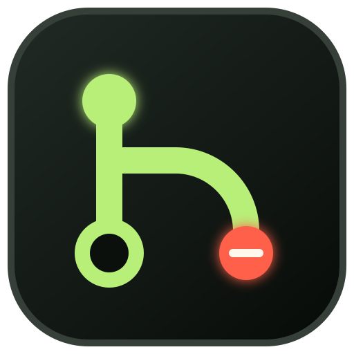
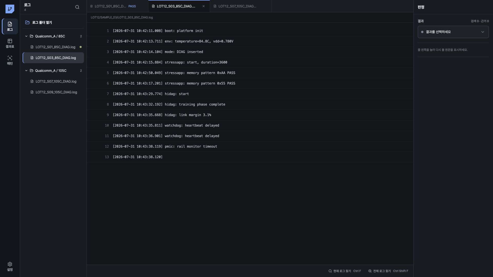

<p align="center">
  
</p>

# Sequence Control Tower · Log Workbench

여러 폴더의 `.log` 파일을 검색하고, 판정 규칙을 저장하고, 일괄 판정 결과를 내보내는 Windows/macOS 데스크톱 앱입니다.

[](https://github.com/stpcoder/sequence-control-tower/actions/workflows/ci.yml)
[](https://github.com/stpcoder/sequence-control-tower/releases/latest)

[](https://github.com/stpcoder/sequence-control-tower/releases/latest/download/Sequence-Control-Tower-Setup.exe)
[](https://github.com/stpcoder/sequence-control-tower/releases/latest/download/Sequence-Control-Tower-Portable.exe)
[](https://github.com/stpcoder/sequence-control-tower/releases/latest/download/Sequence-Control-Tower-macOS-Universal.dmg)

[Windows ZIP](https://github.com/stpcoder/sequence-control-tower/releases/latest/download/Sequence-Control-Tower-Windows.zip) · [macOS ZIP](https://github.com/stpcoder/sequence-control-tower/releases/latest/download/Sequence-Control-Tower-macOS-Universal.zip) · [모든 Release](https://github.com/stpcoder/sequence-control-tower/releases)

> Private 저장소의 Release를 받으려면 저장소 읽기 권한이 필요합니다. 조직 인증서가 적용되지 않은 빌드는 Windows SmartScreen 또는 macOS Gatekeeper 경고를 표시할 수 있습니다.



[v0.8 평가 이력과 Agent](docs/manual/05-v0.8-평가-이력-Agent.md) · [v0.7 빠른 시작](docs/manual/00-v0.7-빠른-시작.md) · [사용자 매뉴얼](docs/manual/README.md) · [시작하기](docs/manual/10-시작하기.md) · [로그 워크벤치](docs/manual/20-로그-워크벤치.md) · [여러 폴더 반복 분석](docs/manual/30-여러-폴더-반복-분석.md)

## 작업 순서

1. **폴더 가져오기**: 여러 폴더의 `.log` 파일을 재귀 수집합니다.
2. **전체 검색**: 현재 로그 또는 모든 로그에서 문자열과 정규식을 검색합니다.
3. **근거 선택**: 판정에 사용할 검색 조건과 원문 줄을 선택합니다.
4. **규칙 저장**: 결과, marker 존재 여부, marker 순서를 규칙으로 저장합니다.
5. **일괄 판정**: 저장된 규칙을 전체 로그에 적용합니다.
6. **예외 검토**: 충돌, 근거 누락, 검색 실패 로그와 근거 줄을 확인합니다.
7. **결과 내보내기**: 결과표를 CSV 또는 TSV로 저장합니다.
8. **LLM 연결**: 필요한 경우 사내 OpenAI-compatible API를 설정합니다.

## 주요 기능

- Windows 다중 폴더 선택과 하위 `.log` 재귀 수집
- 최대 10,000개 로그 관리와 동일 내용 중복 저장 방지
- 스크롤 기반 연속 로그 로딩과 절대 줄 번호 이동
- literal, regex, 대소문자, 단어 단위 검색
- `Ctrl+O`, `Ctrl+F`, `Ctrl+Shift+F`, `Enter`, `Shift+Enter`, `F3`, `Shift+F3`, `Esc`
- 탐색 검색과 판정 근거의 분리
- marker 존재, 부재, 순서 규칙
- 로그별 first/last 근거 줄 저장
- `PASS`, `DIAG_FAIL`, `TEST_FAIL`, `TRAINING_FAIL`, `SYSTEM_HALT`, `SYSTEM_REBOOT`, `INCOMPLETE`, `UNKNOWN`, `EXCLUDED`
- 규칙 충돌, 근거 누락, 검색 실패의 검토 상태 관리
- 결과표 검색, 필터, 정렬, pagination, CSV/TSV 확인창 후 확정
- 파일명에서 Sample, 온도, Mode, Grid를 추출하고 값을 직접 수정
- 확인되지 않은 metadata는 LLM 후보 제안으로 검토
- 검색 결과를 판정 조건으로 pin하고 0개, 1개 이상, 정확히 N개와 marker 순서를 지정
- 저장한 규칙을 불러오고 revision을 관리하며 이전 규칙을 보관
- N × M 피벗: 최대 2개 행축과 2개 열축 조합
- 결과표의 `FAIL 모아보기` 및 `미확인·검토필요` preset
- 판정, 규칙, 일괄 판정, metadata 승인의 revision 저장
- 파일 내용 SHA가 변경된 경우 새 revision 검토

## LLM 연결

폴더 가져오기, 검색, 규칙 판정, 결과표 생성은 로컬에서 실행되며 LLM을 호출하지 않습니다. AI 분석은 사용자가 요청한 경우에만 구조화된 최소 근거를 사내 OpenAI-compatible API로 전송합니다. 로그 원문 전체, 절대경로, API key는 요청에 포함하지 않습니다.

Endpoint, model ID, API key, RPM/TPM, timeout 설정은 [LLM 연결 안내](docs/manual/50-LLM-연결-검증.md)를 참고하세요. `모델 목록 확인`을 선택한 경우에만 `/models`를 조회합니다.

## 데이터와 보안

- Artifact DB: content hash, 크기, 확장자, 파일 출처
- Evaluation DB: 엔지니어 판정, 규칙 revision, 일괄 판정, 예외, metadata 승인
- localStorage: 기존 규칙과 UI 상태 호환 데이터

Evaluation DB에는 로그 원문, excerpt, 절대경로, secret을 저장하지 않습니다. 판정은 artifact SHA와 연결됩니다. 손상되거나 지원하지 않는 DB는 `.corrupt-*` 또는 `.unsupported-*` 파일로 보존합니다.

실제 회사 로그와 인증 정보를 저장소에 커밋하지 마세요. 회사의 데이터 분류, LLM 전송, 코드 서명 정책을 따르세요.

## 설치

일반 사용자는 Node.js가 필요하지 않습니다.

- Windows 10/11 x64: Setup 또는 Portable
- macOS 12 이상: Intel/Apple Silicon Universal DMG

[Windows 설치 및 제거](docs/manual/windows-installation.md) · [macOS 설치](docs/manual/macos-installation.md) · [사용자 매뉴얼](docs/manual/README.md)

조직 배포용 서명:

- Windows: Authenticode code-signing certificate
- macOS: Apple Developer ID Application signing과 notarization

## v0.7.0

- 프로젝트 라이브러리와 초기화 마법사, 프로젝트별 폴더 연결
- 제한된 Mini Agent의 검색·줄 범위·정보 확인 도구 호출과 느린 LLM 대기/timeout 처리
- 검색창 `Enter` 포커스 및 첫 결과 이동 수정, 3개 작업 영역 크기 조절
- N × M 결과 레이아웃 저장, 현재 범위 추세 요약, 사람 확인 후 후보 저장

[v0.7.0 릴리스 노트와 설치 링크](docs/manual/90-v0.7.0-release-notes.md)

## 개발과 검증

Node.js 22 LTS와 npm 10 이상이 필요합니다.

```bash
git clone https://github.com/stpcoder/sequence-control-tower.git
cd sequence-control-tower
npm ci
npm run dev
```

```bash
npm run typecheck
npm test
RUN_LOG_SCALE=1 npm test -- tests/domain/artifact-scale.test.ts
npm run build
npm run dist:win
npm run dist:mac
```

`tests/fixtures/soc-logs/`에는 기존 합성 SoC 시나리오가 있고, `tests/fixtures/qualcomm-bringup/`에는 160개 규모의 결정적 Qualcomm-style bring-up corpus가 분리되어 있습니다. 생성 명령과 안전 주의사항은 [Qualcomm synthetic corpus](docs/testing/qualcomm-synthetic-corpus.md)를 참고하세요.

## 배포

- `CI`: typecheck, tests, production build
- `Windows Release`: x64 Setup, Portable, ZIP, 무결성 및 서명 상태 확인
- `macOS Release`: Universal DMG/ZIP, Intel/arm64 slice, macOS 12 최소 버전, 무결성 확인

tag는 `package.json` 버전과 같아야 합니다.

```bash
git tag v0.7.0
git push origin v0.7.0
```

코드 서명과 수동 배포 절차는 [Release 운영 가이드](docs/releasing.md)를 참고하세요.

## 현재 제한

- 폴더 가져오기 진행률과 취소 UI
- 대용량 로그용 sparse line index
- 여러 행 metadata 일괄 승인
- 사내 VPN, private CA, vLLM endpoint 실기 검증
- Windows 10/11 설치, 업데이트, 제거 smoke test
- 조직 인증서를 사용한 Windows/macOS 서명 배포
- Serial 장비 제어와 원격 장비 모니터링
