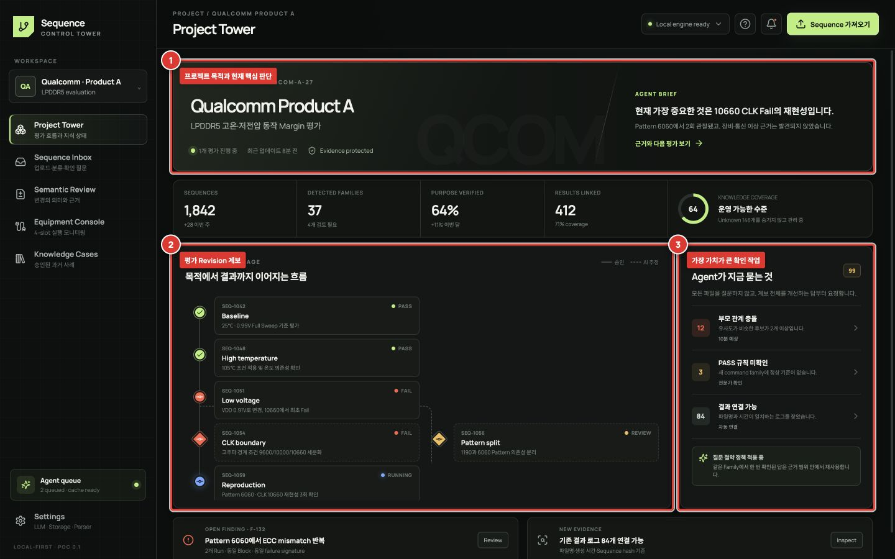

# Project Tower

Control Tower는 단순 파일 목록이 아니라, 고객사 제품 프로젝트가 **어떤 목적의 평가를 거쳐 현재 상태에 도달했는지** 보여주는 시작 화면입니다.

## 화면 읽는 순서

1. **① Project overview**에서 고객사/제품 프로젝트의 목적과 현재 핵심 판단을 확인합니다.
2. **② Evaluation lineage**에서 Baseline부터 현재 Sequence까지의 분기와 결과를 확인합니다.
3. **③ Knowledge gaps**에서 Agent가 고른 가장 정보 가치가 높은 확인 작업부터 처리합니다.

## 선과 상태의 의미

- 실선: 엔지니어가 확인한 부모·파생 관계
- 점선: Agent가 제안했지만 아직 확인되지 않은 관계
- 초록: 결과가 확인된 PASS
- 빨강: 결과가 확인된 FAIL
- 노랑: 엔지니어 검토 필요
- 파랑: 진행 중 또는 분석 중
- 회색: 결과/목적 미연결

## 좋은 사용 방법

모든 Unknown을 한 번에 채우려고 하지 마세요. 앞으로 재사용될 가능성이 높은 Family, 현재 진행 중인 Campaign, 결과가 연결된 Sequence부터 확인하면 적은 작업으로 전체 분류 품질을 높일 수 있습니다.

## 이 화면에서 하지 않는 일

원본 Sequence 편집, 상세 line diff, API 설정은 이 화면에서 하지 않습니다. 선택한 항목의 검토가 필요할 때만 Review 화면으로 이동합니다. 이렇게 해야 Control Tower가 버튼으로 복잡해지지 않고 “지금 중요한 것”을 유지할 수 있습니다.
