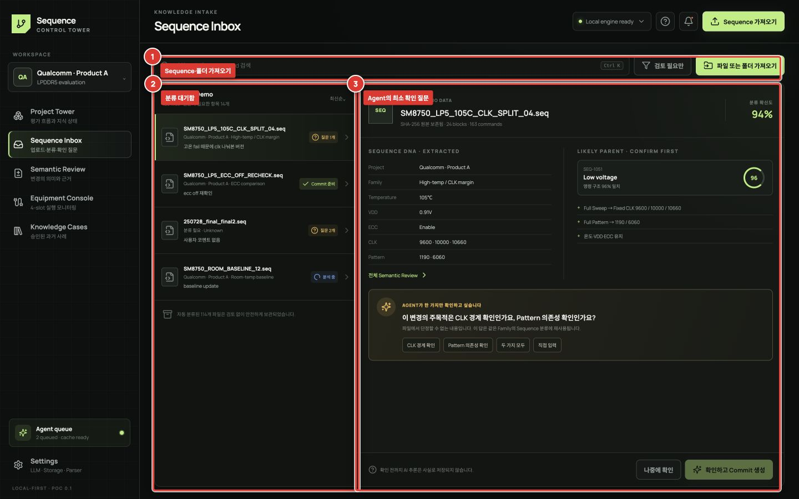

# Sequence Inbox



Sequence Inbox는 설명이 없는 기존 SEQ를 프로젝트 지식으로 가져오는 입구입니다. 긴 등록 양식을 작성하지 않아도 됩니다.

## Sequence 등록

1. **① 파일 또는 폴더 가져오기**에서 `.seq` 파일이나 기존 Sequence 폴더를 선택합니다.
2. **② 분류 대기함**에서 파일, 프로젝트/Family 후보, 기존 코멘트와 분석 상태를 확인합니다.
3. 선택한 파일의 DNA와 부모 후보를 확인하고, 알고 있는 내용이 있다면 짧은 context note를 남깁니다.
4. **③ Agent 질문**이 있다면 답하거나 `나중에 확인`을 선택합니다.

좋은 코멘트 예:

```text
105℃ fail 재현 때문에 10660/10000 clk로 나눈 버전. 결과는 아직 없음.
```

피해야 할 코멘트 예:

```text
테스트용
```

## Agent가 질문하는 조건

Agent는 매 업로드마다 질문하지 않아야 합니다. 아래 중 하나에 해당하고, 답이 분류나 계보를 실질적으로 바꿀 때만 질문합니다.

- 비슷한 부모 후보가 두 개 이상이며 차이가 작을 때
- 파일에서 평가 목적을 확인할 수 없고 사용자 메모도 모호할 때
- 추출한 조건이 충돌하거나 parser warning이 있을 때
- 같은 Family에 적용할 수 있는 대표 지식이 아직 없을 때

한 번에 최대 1~3개만 제시하며, `지금은 모름`은 정상적인 답입니다. 응답하지 않아도 원본과 추출 사실은 저장할 수 있어야 합니다.

## API가 느리거나 제한된 경우

파일 hash, 문법 파싱, DNA 추출, 중복 확인은 로컬에서 완료됩니다. Agent review가 quota/timeout으로 지연되면 `Queued`로 남기고 다른 파일을 계속 처리하세요. 같은 요청을 여러 번 누르면 quota만 소모되므로 상태 영역의 자동 재시도 시간을 확인합니다.
