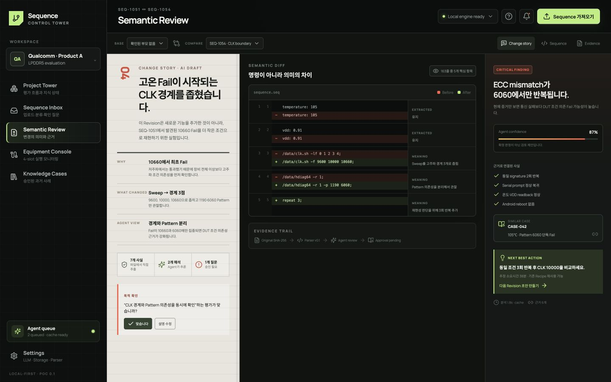

# Semantic Review



Review 화면은 “빨간 줄이 많은 diff viewer”가 아닙니다. 이전 Sequence와 달라진 실행 의미, 그 변경이 평가 목적에 미칠 영향, 아직 확인되지 않은 맥락을 한 화면에서 검토합니다.

## 검토 순서

1. **① Change story**에서 변경의 목적, 바뀐 조건과 기대 신호를 확인합니다.
2. **② Semantic Diff**에서 `Critical`과 `High` 변경 및 원본 근거를 확인합니다.
3. **③ Finding**의 추정 원인, 확신도, 유사 사례와 다음 행동을 읽습니다.
4. Change story 아래에서 승인, 설명 수정 또는 보류를 선택합니다.

## Diff보다 중요한 것

시간, 임시 ID, 실행 순서처럼 의미 없는 차이는 접힌 상태로 둡니다. 기본 화면에는 다음 질문에 답하는 변경만 노출합니다.

```text
무엇이 바뀌었는가?
왜 바꿨다고 추정하는가?
평가 범위나 위험에 어떤 영향을 주는가?
그 추정은 어느 파일/줄/코멘트를 근거로 하는가?
다음에 확인할 것은 무엇인가?
```

원시 명령이 필요하면 변경 카드를 펼쳐 전후 Sequence와 line range를 확인합니다.

## 승인 기준

- `Extracted` 값도 parser가 잘못 이해할 수 있으므로 근거 구간을 확인합니다.
- 높은 확신도는 사실 여부가 아니라 모델의 추론 강도를 뜻합니다.
- 목적과 부모가 불분명하면 `보류`를 선택해도 원본 저장에는 문제가 없습니다.
- 엔지니어가 수정한 내용과 이유는 이후 유사 파일에 재사용되는 중요한 지식입니다.

## AI 작업 상태

`Queued`, `Running`, `Ready`, `Fallback`, `Failed` 상태를 구분합니다. `Fallback`은 로컬 분석만으로 화면을 구성했다는 뜻이며 실패가 아닙니다. API 재시도 때문에 편집 중인 검토 내용이 사라져서는 안 됩니다.
