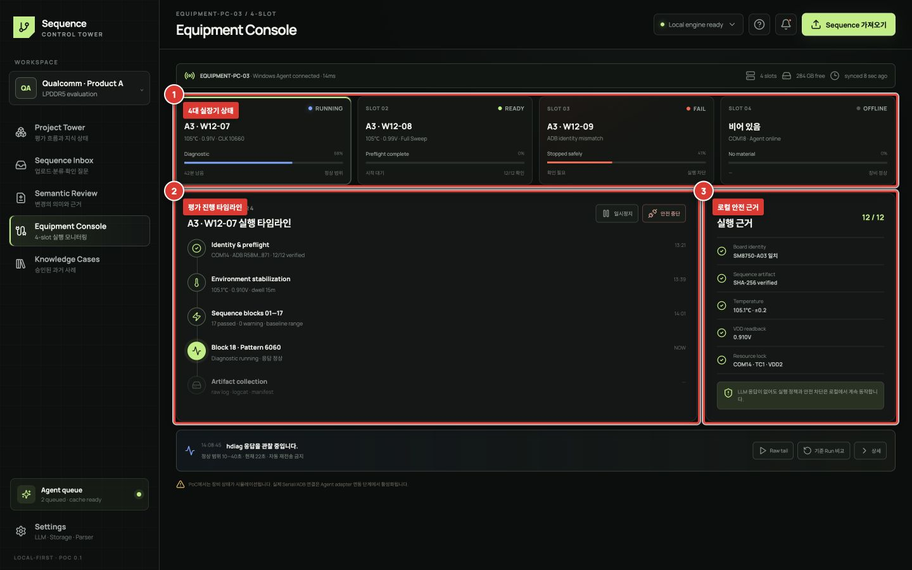

# Equipment Console

Equipment Console의 목표는 네 개의 원격 데스크톱 화면을 축소해서 보여주는 것이 아니라, **어느 PC와 슬롯에 사람의 확인이 필요한지 10초 안에 판단하게 하는 것**입니다.

## 화면 읽는 순서

1. 상단 connection banner에서 heartbeat와 마지막 수신 시각을 확인합니다.
2. **① Slot cards**에서 실행 중 Sequence, 현재 block, 경과 시간과 상태를 비교합니다.
3. **② Run timeline**에서 선택한 슬롯의 의미 있는 상태 변화를 확인합니다.
4. **③ Live safety**에서 identity, artifact hash, 환경 readback과 resource lock 근거를 확인합니다.

## 연결이 끊긴 경우

`Offline`은 장비 fail과 같지 않습니다. 마지막으로 확인된 상태와 수신 시각을 표시하고, 현재 상태를 추정해 PASS/FAIL로 바꾸지 않습니다. 로컬 Equipment Agent가 계속 실행 중이라면 연결이 회복된 뒤 누락된 이벤트를 동기화하는 구조가 필요합니다.

## PoC 주의 사항

현재 화면의 PC와 슬롯 데이터는 UX 검증용 simulation입니다. 실제 Serial 연결, 명령 실행, 원격 중단 기능은 구현 범위 밖입니다. 화면에서 보이는 조작을 실제 장비 안전 기능으로 간주하지 마세요.

실제 연동 단계에서는 최소한 다음이 필요합니다.

- PC별 Windows service 또는 tray Equipment Agent
- PC/Slot/COM/device identity 고정 및 heartbeat
- 로컬 실행 상태 machine과 event spool
- 네트워크 단절 후 재동기화
- 명령 allowlist, timeout, 승인 정책과 audit log
