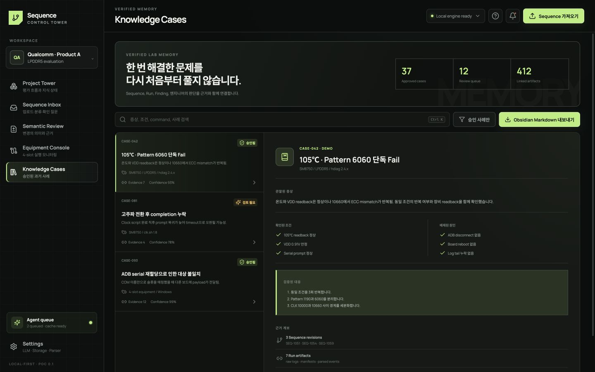

# Knowledge Cases

Knowledge Cases는 모든 Agent 요약을 모아 두는 곳이 아닙니다. 엔지니어가 확인해 다른 평가에도 재사용할 가치가 있는 사례만 저장합니다.

## 사례 찾기

1. **① Verified lab memory**에서 승인된 사례, 검토 대기와 연결된 Run 규모를 파악합니다.
2. 검색과 filter로 증상, 조건, Pattern, 명령 Family를 좁힙니다.
3. 사례 목록에서 적용 범위와 검증 상태를 먼저 확인합니다.
4. **② Case detail**에서 근거 Sequence와 Run을 연 뒤 현재 평가에 적용할지 결정합니다.

## 좋은 Knowledge Case의 구성

- 관찰된 증상과 발생 조건
- 확인된 원인 또는 아직 남은 불확실성
- 적용되는 장비, binary, parser/recipe 버전
- 재현·확인 방법
- 근거가 되는 원본과 엔지니어 결정
- 다음 평가에서 재사용할 수 있는 질문 또는 규칙

유사해 보인다는 이유만으로 오래된 사례를 자동 적용하지 않습니다. 적용 범위가 다르거나 근거 버전이 오래됐다면 Agent는 참고 후보로만 제안해야 합니다.

## 새 사례 승격

Semantic Review에서 목적과 결과를 확인하고 엔지니어 결정을 남긴 뒤 Knowledge Case로 승격합니다. Agent 추론만 있는 기록은 초안으로 남기고 기본 검색 결과에서 `Verified` 사례와 시각적으로 구분합니다.
