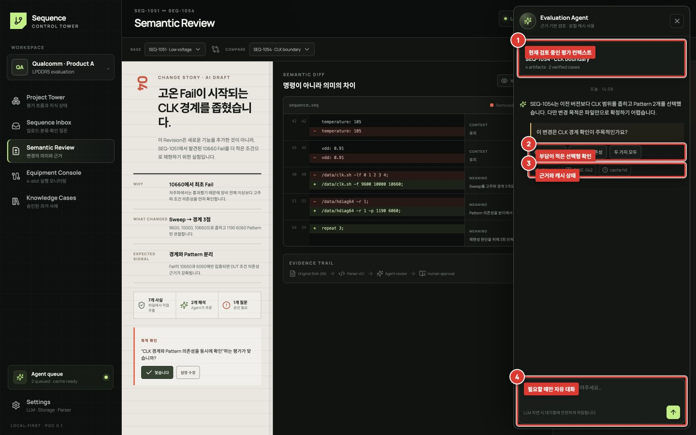

# Evaluation Agent와 상호작용

Evaluation Agent는 별도 챗봇 메뉴가 아니라 현재 보고 있는 Sequence, 변경, 사례를 이해하는 보조 패널입니다. 자유 대화보다 **빠진 맥락을 가장 적은 상호작용으로 확인하는 것**이 우선입니다.

## 패널 사용

1. **① Current context**가 의도한 프로젝트와 Sequence인지 확인합니다.
2. Agent 설명 아래의 **② Evidence**를 열어 추론의 근거를 확인합니다.
3. 질문에 적절한 선택지가 있으면 **③ Quick answers**로 답합니다.
4. 선택지로 설명할 수 없을 때만 **④ Composer**에 짧은 맥락을 입력합니다.

## Agent가 먼저 질문해야 할 때

- 부모 후보 두 개가 비슷하고 선택에 따라 평가 계보가 달라질 때
- 파일과 코멘트만으로 목적을 확정할 수 없을 때
- 조건 추출이 서로 충돌할 때
- 한 번의 답이 같은 Sequence Family 여러 개를 정리할 수 있을 때

질문에는 항상 `왜 묻는지`, 답변으로 `무엇이 달라지는지`, `지금은 모름` 선택이 있어야 합니다. 질문을 건너뛰어도 원본 수집과 로컬 분석은 진행됩니다.

## 느린 응답

메시지를 보낸 뒤 panel을 열어 둔 채 기다릴 필요가 없습니다. 요청은 queue에 남고 현재 화면은 로컬 분석으로 계속 사용할 수 있습니다. 상태가 `Fallback`이면 전체 로그를 읽지 않고 deterministic 결과만 사용했다는 뜻입니다. 같은 질문을 다시 보내기 전에 cache/queue 상태를 확인하세요.
