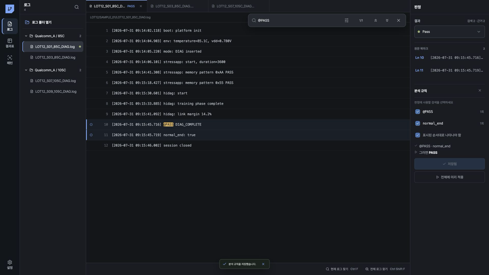
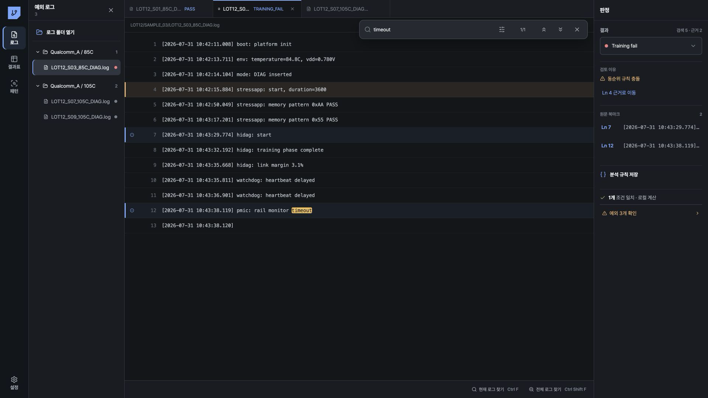
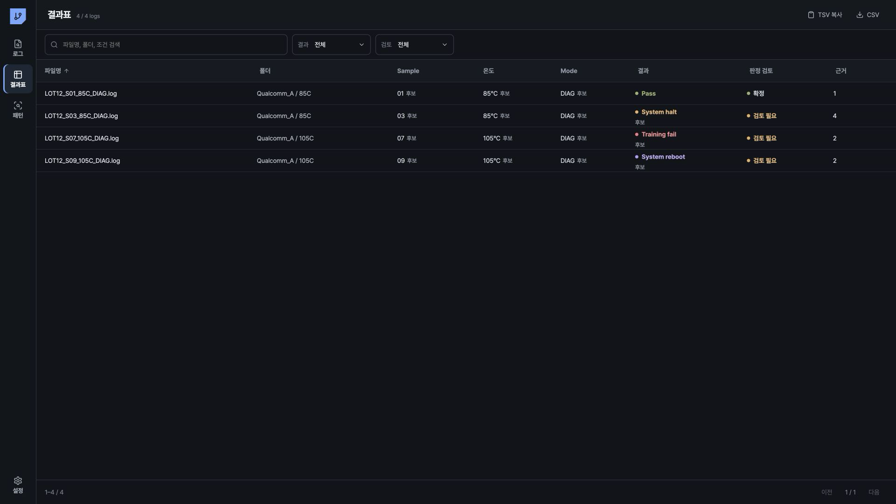
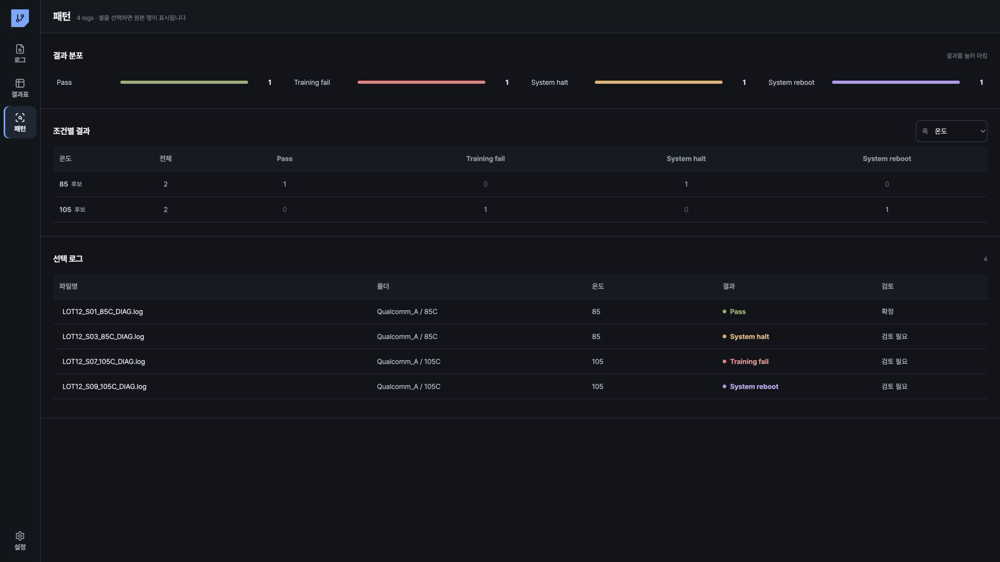

# Log Workbench 사용 안내

Log Workbench는 여러 폴더의 `.log` 파일을 읽기 전용으로 등록하고, 검색 근거와 엔지니어 판정, 일괄 판정 결과를 한 화면에서 관리하는 데스크톱 도구입니다. 기본 로그 작업에는 LLM API를 호출하지 않습니다.

PASS, DIAG_FAIL, SYSTEM_HALT, 조건 불일치와 같은 실제 작업은 [SoC 실장 평가 로그 실무 예제](01-practical-workflows.md)를 참고합니다.

## 화면 구성

왼쪽 메뉴는 `로그`, `결과표`, `패턴`, `설정`으로 구성됩니다.

| 영역 | 용도 |
|---|---|
| 왼쪽 로그 목록 | 폴더, 파일, 검색 결과, 예외 로그 선택 |
| 가운데 원문 | 읽기 전용 로그 확인, 검색 결과 이동, 줄 북마크 지정 |
| 오른쪽 판정 | 결과 선택, revision 확정, 검색 근거 선택, 규칙 저장·일괄 판정 |
| 결과표 | 메타데이터 후보 승인, 판정 검토, CSV·TSV 내보내기 |
| 패턴 | 결과 분포와 Sample·온도·Mode별 결과 확인 |

## 여러 폴더 등록

1. `로그`에서 `로그 폴더 열기`를 누릅니다. Windows 단축키는 `Ctrl+O`입니다.
2. 폴더 선택창에서 필요한 폴더를 복수 선택합니다.
3. 복수 선택이 지원되지 않는 환경에서는 폴더 열기를 반복합니다.
4. 완료 알림의 성공, 실패, 제외 수를 확인합니다. 입력 파일이 10,000개에 가까운데 실패가 있으면 입력 파일 수를 별도로 확인합니다.

하위 폴더의 `.log`도 등록됩니다. 동일 내용은 SHA 기준으로 관리되며 파일별 출처와 상대 경로는 유지됩니다. 같은 경로의 내용이 변경되면 새 SHA로 등록되고 이전 판정은 자동 적용되지 않습니다.

## 검색과 단축키

| 동작 | Windows | macOS |
|---|---|---|
| 현재 로그 찾기 | `Ctrl+F` | `⌘F` |
| 열린 탭 찾기 | `Ctrl+Alt+F` | `⌘⌥F` |
| 모든 로그 찾기 | `Ctrl+Shift+F` | `⌘⇧F` |
| 다음 결과 | `Enter` 또는 `F3` | `Enter` 또는 `F3` |
| 이전 결과 | `Shift+Enter` 또는 `Shift+F3` | `⇧Enter` 또는 `⇧F3` |
| 검색 닫기 | `Esc` | `Esc` |

검색 옵션은 `대/소문자 구분`, `단어 단위 일치`, `정규식 사용`입니다. 현재 로그 검색은 선택 파일을, 모든 로그 검색은 등록된 원본 전체를 검사합니다. 규칙에 사용할 검색은 오른쪽 `분석 규칙`에서 별도로 선택합니다.

## 판정과 근거

`결과`에서 `Pass`, `Diag fail`, `Test fail`, `Training fail`, `System halt`, `System reboot`, `Incomplete`, `Unknown`, `Excluded`를 선택할 수 있습니다.

- 줄 번호 왼쪽의 원을 누르면 `원문 북마크`가 지정됩니다.
- 기존 판정과 다른 값을 선택하면 `기존 ... → ... 변경 확정`을 눌러 새 revision을 저장합니다.
- 판정 저장에 실패하면 새 값은 확정 상태로 표시되지 않습니다.
- 엔지니어 판정이 없는 로그는 근거가 부족하거나 규칙이 충돌하면 `Unknown`을 유지합니다.
- 기존 엔지니어 판정과 규칙 결과가 충돌하면 기존 판정을 유지하고 예외로 표시합니다.

## 분석 규칙과 일괄 판정

1. 대표 로그에서 판정에 필요한 marker를 검색합니다.
2. 오른쪽 `검색 N`이 갱신됐는지 확인합니다.
3. 엔지니어 판정을 선택합니다.
4. `분석 규칙`에서 필요한 검색만 선택합니다.
5. 존재 marker의 순서가 조건일 때만 `표시된 순서대로 나타나야 함`을 켭니다.
6. `규칙 저장`을 누릅니다.
7. `전체에 미리 적용`을 실행하고 일치 수와 예외 수를 확인합니다.

검색 결과가 0건인 항목을 선택하면 부재 조건으로 저장됩니다. `Unknown`은 규칙 결과로 저장할 수 없습니다. 규칙 결과는 후보이며 기존 엔지니어 판정을 덮어쓰지 않습니다.

## 예외 확인

`예외 N개 확인`을 누르고 파일별 `검토 이유`를 확인합니다. `Ln N 근거로 이동`이 있으면 해당 원문 줄을 엽니다.

| 표시 | 확인 항목 |
|---|---|
| `일치하는 규칙 없음` | 저장한 조건과 원문 marker |
| `동순위 규칙 충돌` | 서로 다른 결과를 만든 규칙과 우선순위 |
| `잘못된 검색식` | 정규식과 matcher |
| `판정 근거 누락` | 필요한 marker 위치 |
| `로그 검사 실패` | 원본 접근과 검색 작업 상태 |
| `잘못된 규칙` | 규칙 구조와 순서 조건 |

## 메타데이터와 결과 내보내기

`결과표`에는 `파일명`, `폴더`, `Sample`, `온도`, `Mode`, `결과`, `판정 검토`, `근거`가 표시됩니다. 기본 파일명 `LOT12_S01_85C_DIAG.log`에서는 Sample `01`, 온도 `85`, Mode `DIAG`가 후보가 됩니다.

1. 원문의 sample, temperature, mode marker와 후보를 대조합니다.
2. 값이 일치할 때 후보를 눌러 `승인` 상태로 저장합니다.
3. 파일명과 원문이 다르면 후보를 승인하지 않습니다. 현재 화면에는 후보 값을 직접 수정하는 기능이 없습니다.
4. 필요한 필터를 적용합니다.
5. Excel에 붙여넣을 때 `TSV 복사`, 파일로 전달할 때 `CSV`를 누릅니다.

`열 선택`의 기본 내보내기 열은 `source_id`, `artifact_id`, `source_key`, `relative_path`, `run`, `filename`, `folder`, `sample_value`, `sample_state`, `temperature_value`, `temperature_state`, `mode_value`, `mode_state`, `result`, `result_source`, `review`입니다. 화면의 열 이름은 각각 `Sample 값`, `Sample 상태`, `온도 값`, `온도 상태`, `Mode 값`, `Mode 상태`, `결과`, `결과 출처`, `검토`입니다.

`열 선택`에서 `근거`를 선택하면 `evidence_count`와 `selected_evidence_count`가 추가됩니다. `Sample 상태`, `온도 상태`, `Mode 상태`에는 각 값의 현재 상태가 기록되며, 값이 없으면 빈 값과 `missing` 또는 `malformed` 상태가 기록됩니다. 후보를 승인하면 해당 값과 상태가 내보내기에 반영됩니다.

## 패턴 확인

`패턴`에서 `결과 분포`를 확인하고 `조건별 결과`의 축을 `Sample`, 온도, `Mode` 중 하나로 선택합니다. 결과 셀을 누르면 아래 `선택 로그`에 해당 원본 목록이 표시됩니다. 행을 누르면 `로그` 화면에서 원문이 열립니다.

## 안전과 LLM 범위

- 원본 로그는 수정하지 않습니다.
- 검색 결과가 없다는 사실만으로 PASS 또는 FAIL을 확정하지 않습니다.
- 규칙 충돌, 검사 오류, 근거 누락은 예외로 남깁니다.
- 불확실한 결과는 `Unknown`으로 유지합니다.
- 폴더 등록, 검색, 판정 저장, 일괄 판정, 결과표, 패턴은 로컬에서 실행됩니다.
- 원본 로그와 검색 줄은 LLM API에 자동 전송되지 않습니다.
- 원본 본문, 검색 excerpt, 절대 경로, API key는 평가 결과 저장소에 기록되지 않습니다.
- 사내 LLM 연결은 `설정`에서 관리합니다.
