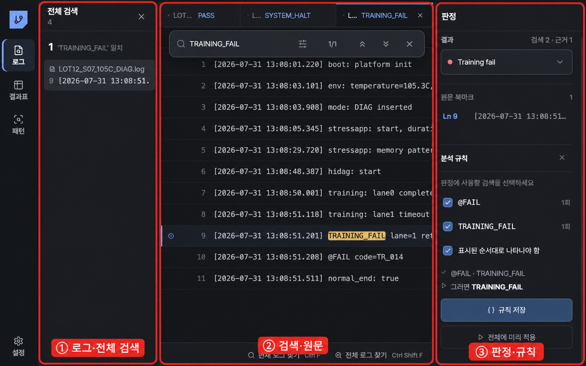

# Log Workbench 사용법

여러 폴더의 긴 `.log`를 읽기 전용으로 검색하고, 사람이 확인한 검색 조건만 재사용 규칙으로 만든 뒤 결과표와 패턴으로 정리하는 화면입니다.

## 1. 여러 로그 폴더 열기

왼쪽 `로그 폴더 열기`를 누릅니다. Windows에서는 한 번의 선택창에서 여러 폴더를 고를 수 있고, 같은 버튼으로 폴더를 추가할 수도 있습니다. macOS에서도 폴더를 반복 추가할 수 있습니다.

- 하위 폴더의 `.log`를 재귀 수집합니다.
- 원본 파일을 수정하지 않습니다.
- 동일 내용은 한 번만 보존하지만 각 파일명·폴더 출처는 유지합니다.
- 최대 10,000개를 수집하고, 내용은 열거나 검색할 때만 스트리밍으로 읽습니다.
- 같은 경로의 내용이 바뀌면 이전 판정을 자동 상속하지 않습니다.

현재 버전은 완료·부분 실패·제외 건수는 알리지만 세부 진행률과 가져오기 취소 UI는 아직 제공하지 않습니다.

## 2. Notepad++처럼 검색하기

| 동작 | Windows | macOS |
|---|---|---|
| 로그 폴더 열기 | `Ctrl+O` | `⌘O` |
| 현재 로그 찾기 | `Ctrl+F` | `⌘F` |
| 모든 로그 찾기 | `Ctrl+Shift+F` | `⌘⇧F` |
| 다음 결과 | `Enter` 또는 `F3` | `Enter` 또는 `F3` |
| 이전 결과 | `Shift+Enter` 또는 `Shift+F3` | `⇧Enter` 또는 `⇧F3` |
| 검색 닫기 | `Esc` | `Esc` |

검색 옵션에서 대소문자, 단어 단위, 정규식을 켤 수 있습니다. 전체 검색은 화면에 열린 240줄만이 아니라 원본 전체를 main process에서 읽습니다. 상위 80개 위치만 왼쪽에 표시하더라도 전체 일치 건수는 유지됩니다.

## 3. 판정과 원문 북마크

오른쪽 `결과`에서 다음 상태를 선택합니다.

- PASS
- DIAG FAIL
- TEST FAIL
- TRAINING FAIL
- SYSTEM HALT
- SYSTEM REBOOT
- INCOMPLETE
- UNKNOWN
- EXCLUDED

줄 왼쪽 점은 다시 볼 위치를 남기는 `원문 북마크`입니다. 검색한 단어가 자동으로 판정 규칙이 되지는 않습니다.

## 4. 판정 규칙 만들기

결과를 선택하면 `분석 규칙`을 열 수 있습니다.

1. 최근 검색 중 판정에 실제로 사용할 항목만 클릭해 선택합니다.
2. `없음` 검색은 marker 부재 조건이 됩니다.
3. 두 개 이상의 존재 marker를 선택했다면 필요할 때만 `표시된 순서대로 나타나야 함`을 켭니다.
4. `규칙 저장`으로 revision을 남깁니다.
5. `전체에 미리 적용`으로 모든 로그를 로컬에서 검사합니다.

탐색 중 검색한 `temperature`, 샘플 ID 같은 단어를 선택하지 않았다면 규칙에 들어가지 않습니다. marker 순서가 뒤집혔거나 근거 위치를 얻지 못하면 억지로 판정하지 않고 `UNKNOWN/검토 필요`가 됩니다.

## 5. 예외만 다시 보기

일괄 적용 후 `예외 N개 확인`을 누릅니다.

- 왼쪽 목록은 예외 로그만 표시합니다.
- 오른쪽에는 규칙 충돌, 일치 규칙 없음, 근거 누락, 검색 실패 같은 이유가 표시됩니다.
- 위치 근거가 있으면 `Ln N 근거로 이동`으로 해당 원문 구간을 엽니다.
- 기존 엔지니어 판정과 규칙 결과가 다르면 기존 판정을 덮어쓰지 않습니다.

## 6. 결과표와 Excel 전달

왼쪽 `결과표`에서 한 로그를 한 행으로 확인합니다.

- 파일명, 폴더, Sample, 온도, Mode, 결과, 판정 검토, 근거 수
- 검색, 결과/검토 필터, 모든 열 정렬
- CSV 다운로드
- Excel에 바로 붙여넣을 수 있는 TSV 복사
- 행 클릭 또는 `Enter`로 원본 로그 열기

Sample·온도·Mode는 파일명 또는 로그에서 추출한 `후보`로 표시됩니다. 후보 값을 클릭하면 해당 파일 revision에 대해 엔지니어 승인으로 저장됩니다. 파일 내용이 바뀐 새 SHA에는 이전 승인이 자동으로 붙지 않습니다.

## 7. 패턴에서 원본으로 내려가기

`패턴` 화면에는 결과 분포와 Sample/온도/Mode 피벗이 있습니다.

1. 결과 bar 또는 피벗 cell을 눌러 marking합니다.
2. 아래 `선택 로그`가 같은 조건으로 제한됩니다.
3. 로그 행을 눌러 Workbench 원문으로 돌아갑니다.

Spotfire 전체를 복제하지 않고, 집계에서 문제가 있는 로그 원문까지 내려가는 핵심 흐름만 제공합니다.

## LLM 사용 원칙

폴더 수집, 검색, 규칙 저장, 일괄 판정, 결과표, 패턴의 기본 LLM 호출 수는 `0`입니다. 사내 LLM 연결은 별도 Settings에서 구성하며, 의미 설명을 명시적으로 요청하는 기능에만 사용합니다. 전체 로그나 API key는 전송하지 않습니다.
