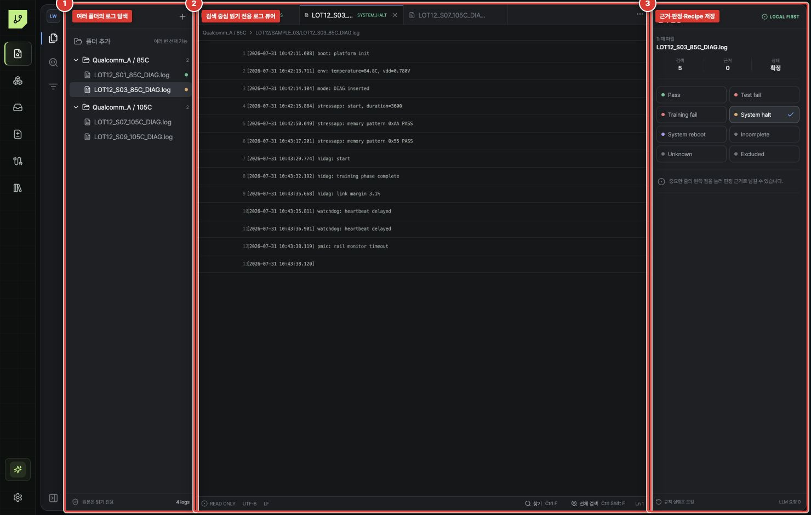

# Log Workbench 사용법

Log Workbench는 여러 폴더의 `.log`를 읽기 전용으로 열고, 엔지니어가 검색해서 판정한 과정을 재사용 가능한 Recipe 후보로 바꾸는 Windows 작업 화면입니다.

1. 여러 폴더와 로그 파일을 탐색합니다.
2. 현재 로그 또는 전체 로그를 검색하고 원문 근거로 이동합니다.
3. 결과를 판정하고 확인한 검색 조건을 Recipe 후보로 저장합니다.

## 1. 로그 폴더 열기

왼쪽 `LOG EXPLORER`의 `폴더 추가`를 누르고 Windows 폴더 선택기에서 하나 이상의 폴더를 선택합니다. 하위 폴더의 `.log`도 함께 수집됩니다.

- 원본 파일은 수정하지 않습니다.
- 동일 내용은 SHA-256 저장소에 한 번만 보존합니다.
- 동일 내용이 여러 파일명과 폴더에 있어도 Explorer의 파일 인스턴스는 유지합니다.
- 같은 경로에 새 내용이 들어오면 Explorer에는 최신 SHA만 보이고, 과거 내용의 판정은 새 로그에 자동 승계되지 않습니다.
- 로그 원문은 한꺼번에 화면 메모리에 올리지 않고, 열린 위치 주변만 읽습니다.

## 2. 평소처럼 검색하기

| 동작 | 단축키 |
|---|---|
| 현재 로그에서 찾기 | `Ctrl+F` |
| 모든 선택 로그에서 찾기 | `Ctrl+Shift+F` |
| 다음 결과 | `Enter` |
| 이전 결과 | `Shift+Enter` |
| 검색창 닫기 | `Escape` |

대소문자, 단어 단위, 정규식 옵션을 검색창 오른쪽에서 바꿀 수 있습니다. 전체 로그 검색은 Electron main process의 로컬 스트리밍 엔진에서 실행되며 LLM에 로그를 보내지 않습니다.

## 3. 근거와 결과 남기기

로그 줄 왼쪽의 점을 누르면 해당 줄을 판정 근거로 표시합니다. 검색어는 먼저 `검색 이력`으로만 기록되며, 오른쪽에서 결과를 선택했다고 바로 회사 공통 규칙이 되지 않습니다.

기본 결과 상태는 다음과 같습니다.

- PASS
- TEST FAIL
- TRAINING FAIL
- SYSTEM HALT
- SYSTEM REBOOT
- INCOMPLETE
- UNKNOWN
- EXCLUDED

## 4. 분석 방법 저장하기

결과를 선택하면 `이 분석 방법을 저장` 제안이 한 번 나타납니다. 표시된 존재/부재 조건을 확인한 뒤 `Recipe 저장`을 눌러야 검색 이력이 판정 근거로 승격되고 후보 규칙으로 저장됩니다.

`전체에 미리 적용`은 방금 만든 후보와 이 프로젝트에 저장된 Recipe를 같은 로컬 판정기로 실행합니다. 저장된 엔지니어 판정은 덮어쓰지 않으며, Recipe끼리 충돌하거나 검색 근거가 누락된 로그는 임의로 PASS/FAIL 처리하지 않고 예외로 남깁니다.

## LLM 사용 원칙

폴더 수집, 검색, 줄 이동, Recipe 실행과 일괄 판정의 기본 LLM 호출 수는 `0`입니다. 사내 LLM은 향후 사용자가 예외 설명을 요청하거나 규칙 충돌을 요약할 때만 사용합니다. 전체 로그 대신 필요한 최소 Evidence만 전달해야 합니다.
