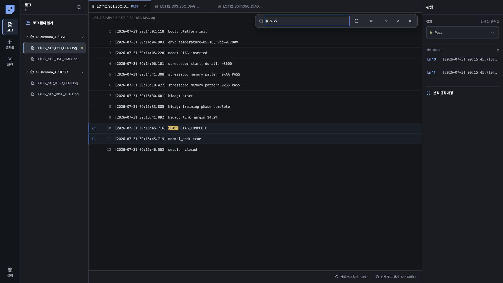
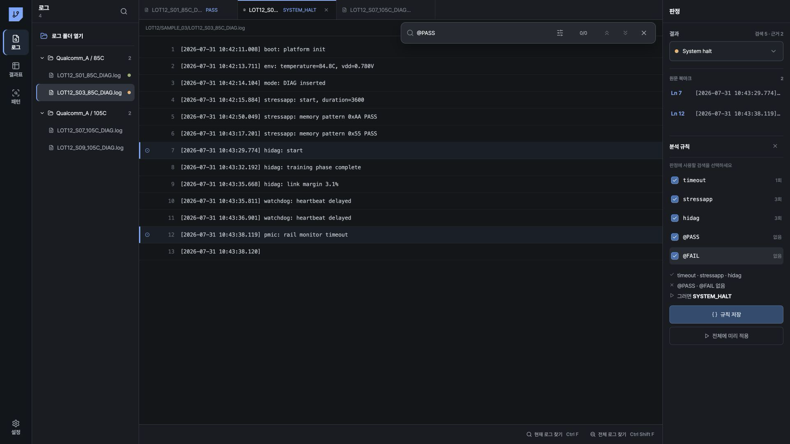
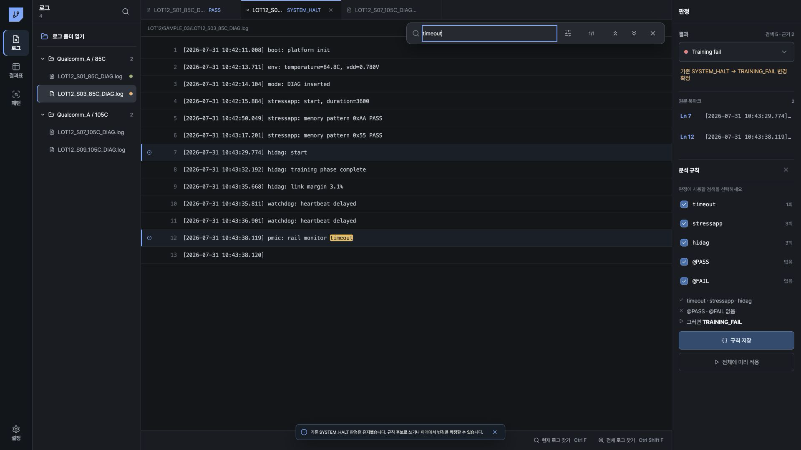
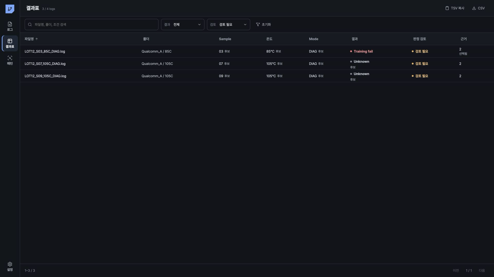

# SoC 실장 평가 로그 실무 예제

이 문서는 Log Workbench에서 실제로 수행할 수 있는 판정 사례를 설명합니다. 예시 marker는 프로젝트별 로그 명세에 맞게 조정해야 합니다.

모든 사례에서 불확실한 결과는 `Unknown`으로 유지합니다.

[사용자 매뉴얼](README.md) · [Log Workbench 사용 안내](00-log-workbench.md)

## 사례 1. 복수 온도·샘플 폴더 등록

### 입력

```text
Qualcomm_A/Room/
Qualcomm_A/85C/
Qualcomm_A/105C/
```

각 폴더에는 샘플별 `.log`가 있고 하위 디렉터리가 포함될 수 있습니다.

### 조작

1. `로그`에서 `로그 폴더 열기`를 누릅니다.
2. Windows 선택창에서 세 폴더를 복수 선택합니다.
3. 완료 알림의 등록 수와 실패 수를 확인합니다.
4. 왼쪽 폴더 그룹을 펼쳐 파일 수를 비교합니다.

### 예상 출력

- 세 폴더가 별도 그룹으로 표시됩니다.
- `.log`만 등록됩니다.
- 같은 내용의 파일은 SHA 기준으로 관리되고 파일별 출처는 유지됩니다.

### 근거

- 왼쪽 폴더명과 파일 수
- 파일 선택 시 표시되는 상대 경로
- 가져오기 완료 알림

### 안전 판단

실패 또는 제외 수가 1개 이상이면 결과 집계를 시작하기 전에 누락 파일을 확인합니다.

## 사례 2. 파일명에서 Sample·온도·Mode 확인

### 입력

```text
LOT12_S03_85C_DIAG.log
```

### 조작

1. `결과표`를 엽니다.
2. 해당 행에서 `Sample`, `온도`, `Mode`를 확인합니다.
3. 행을 눌러 원본을 엽니다.
4. `Ctrl+F`로 `sample`, `temperature`, `mode`를 각각 검색합니다.
5. 원문 조건이 파일명과 같으면 `결과표`에서 각 후보 값을 클릭합니다.

### 예상 출력

| 항목 | 값 | 상태 |
|---|---|---|
| Sample | `03` | 승인 전 `후보`, 클릭 후 `승인` |
| 온도 | `85` | 승인 전 `후보`, 클릭 후 `승인` |
| Mode | `DIAG` | 승인 전 `후보`, 클릭 후 `승인` |

### 근거

- 파일명 token
- 원문의 sample identifier
- 온도 readback
- mode insert 또는 mode start marker

### 안전 판단

원문에서 값이 확인되지 않으면 후보를 승인하지 않습니다. 현재 화면에는 승인 값 직접 편집 기능이 없으므로 다른 값으로 수정하지 않습니다.

## 사례 3. 정상 종료 PASS

### 입력

```text
[09:14:06] stressapp: start
[09:15:30] hidag: start
[09:15:45] @PASS DIAG_COMPLETE
[09:15:45] normal_end: true
```

### 조작

1. 현재 로그에서 `@PASS`를 검색합니다.
2. `normal_end`를 검색합니다.
3. 필요한 경우 `hidag`를 검색해 DIAG 실행 구간을 확인합니다.
4. `@FAIL`, fatal error, reboot marker가 없는지 확인합니다.
5. `@PASS`와 `normal_end` 줄을 `원문 북마크`로 지정합니다.
6. 오른쪽 `결과`에서 `Pass`를 선택합니다.

### 예상 출력

- 파일의 엔지니어 판정이 `PASS`로 저장됩니다.
- `결과표`에는 `Pass`가 `후보` 표기 없이 표시되고, CSV/TSV의 `result_source`에는 `engineer`가 기록됩니다.
- 판정 저장이 완료되고 규칙 예외가 없으면 `판정 검토`가 `확정`으로 표시됩니다.

### 근거

- `@PASS`
- 정상 종료 marker
- 평가 명세에서 요구하는 시작 marker
- 반대 결과 marker 부재 확인

### 안전 판단

`@PASS`가 중간 sub-test의 결과인지 전체 평가의 결과인지 명세에서 확인합니다. 전체 완료를 입증하지 못하면 `Incomplete` 또는 `Unknown`을 선택합니다.



## 사례 4. DIAG_FAIL

### 입력

```text
[10:02:11] hidag: start
[10:02:18] hidag: lane2 error
[10:02:18] DIAG_FAIL lane=2 code=DG_021
[10:02:19] @FAIL code=DG_021
```

### 조작

1. `hidag`를 검색하고 시작 위치를 확인합니다.
2. `DIAG_FAIL`을 검색합니다.
3. `@FAIL`을 검색합니다.
4. 세 marker가 같은 DIAG 실행 구간에 속하는지 확인합니다.
5. 오류 줄과 `@FAIL` 줄을 `원문 북마크`로 지정합니다.
6. `결과`에서 `Diag fail`을 선택합니다.

### 예상 출력

- 엔지니어 판정 `DIAG_FAIL`이 저장됩니다.
- 결과표에서 `Diag fail` 필터로 해당 로그를 확인할 수 있습니다.
- 저장된 근거 수가 결과표에 표시됩니다.

### 근거

- `hidag: start`
- `DIAG_FAIL` 또는 HIDAG 오류 marker
- 같은 구간의 `@FAIL`

### 안전 판단

`@FAIL`이 training, stress, DIAG 중 어느 단계에 속하는지 확인합니다. 단계가 확인되지 않으면 `Test fail` 또는 `Diag fail`을 임의로 선택하지 않고 `Unknown`을 유지합니다.

## 사례 5. stress 통과 후 HIDAG 시작, 종료 marker 없음

### 입력

```text
[10:42:15] stressapp: start
[10:42:50] stressapp: memory pattern 0xAA PASS
[10:43:17] stressapp: memory pattern 0x55 PASS
[10:43:29] hidag: start
[10:43:35] watchdog: heartbeat delayed
[10:43:38] pmic: rail monitor timeout
```

로그 끝까지 `@PASS`와 `@FAIL`이 없습니다.

### 조작

1. `stressapp`을 검색하고 stress 실행 및 sub-test PASS를 확인합니다.
2. `hidag`를 검색하고 HIDAG 시작 위치를 확인합니다.
3. `@PASS`를 검색하고 일치 수가 0인지 확인합니다.
4. `@FAIL`을 검색하고 일치 수가 0인지 확인합니다.
5. `watchdog` 또는 `timeout`을 검색합니다.
6. 로그 마지막 줄과 마지막 timestamp를 확인합니다.
7. 외부 로그 수집 도구에서 파일 크기와 수집 종료 상태를 확인합니다.
8. 로그 수집이 정상적으로 끝났고 시스템 정지 근거가 충분할 때만 `결과`에서 `System halt`를 선택합니다. 확인할 수 없으면 `Unknown`을 선택합니다.
9. `System halt`를 확정한 경우에만 규칙에서 `stressapp`, `hidag`, `@PASS` 없음, `@FAIL` 없음을 선택합니다.
10. 규칙을 만들었다면 `전체에 미리 적용` 후 예외를 확인합니다.

### 예상 출력

- 수집 종료 상태와 정지 근거를 확인한 대표 로그의 엔지니어 판정은 `SYSTEM_HALT`입니다. 확인하지 못한 대표 로그는 `UNKNOWN`입니다.
- `SYSTEM_HALT` 규칙을 만든 경우, 같은 규칙에 일치한 다른 로그의 `SYSTEM_HALT`는 규칙 후보입니다.
- 시작 marker나 부재 근거를 확인하지 못한 로그는 `UNKNOWN/검토 필요`입니다.

### 근거

- stress 실행 및 sub-test 결과
- `hidag: start`
- `@PASS` 부재
- `@FAIL` 부재
- watchdog 또는 timeout
- 정상 종료 marker 부재

### 안전 판단

파일 수집이 중간에 중단된 경우도 같은 형태가 될 수 있습니다. 파일 크기와 수집 종료 상태는 현재 Log Workbench에 표시되지 않으므로 외부 로그 수집 도구에서 확인합니다. 확인하지 못하면 `System halt`를 확정하지 않고 `Unknown`을 유지합니다.



## 사례 6. 파일명 온도·Mode와 원문 조건 불일치

### 입력

파일명:

```text
LOT12_S07_85C_DIAG.log
```

원문:

```text
env: temperature=105.2C
mode: TRAINING inserted
```

### 조작

1. `결과표`에서 온도 `85`, Mode `DIAG` 후보를 확인합니다.
2. 원문에서 `temperature=`와 `mode:`를 검색합니다.
3. 파일명과 원문 값이 다른 것을 확인합니다.
4. 온도와 Mode 후보를 클릭하지 않습니다.
5. 원문 두 줄을 `원문 북마크`로 지정합니다.
6. 평가 결과도 조건 불일치의 영향을 받으면 `Unknown`을 선택합니다.

### 예상 출력

- 파일명 값은 `후보` 상태로 남습니다.
- 자동 수정 또는 자동 승인은 발생하지 않습니다.
- 결과 판단이 불가능하면 `UNKNOWN/검토 필요`로 남습니다.

### 근거

- 파일명 token
- 원문 온도 readback
- 원문 mode insert marker
- 실행 대상 Sequence 또는 장비 설정 기록

### 안전 판단

파일명과 원문 중 어느 값이 맞는지 앱이 결정하지 않습니다. 장비 readback과 평가 설정을 확인한 뒤 다음 조치를 정합니다.

## 사례 7. 상충하거나 불완전한 로그

### 입력 A: 상충 marker

```text
@PASS DIAG_COMPLETE
kernel: fatal exception
@FAIL code=SYS_004
```

### 입력 B: 근거 부족

```text
stressapp: start
log capture stopped
```

### 조작

1. `@PASS`, `@FAIL`, `fatal`, `normal_end`를 각각 검색합니다.
2. 각 marker의 timestamp와 실행 구간을 확인합니다.
3. 서로 다른 결과 규칙이 같은 우선순위로 일치하면 `예외 N개 확인`을 엽니다.
4. `동순위 규칙 충돌` 또는 `일치하는 규칙 없음`을 확인합니다.
5. 엔지니어가 결과를 확정할 추가 근거가 없으면 `Unknown`을 유지합니다.

### 예상 출력

- 일괄 결과는 `UNKNOWN`입니다.
- 오른쪽 `검토 이유`에 충돌 또는 미일치 사유가 표시됩니다.
- 결과표는 `검토 필요`로 표시됩니다.

### 근거

- 상충 marker의 줄 번호와 timestamp
- 규칙별 일치 조건
- 정상 종료 marker 유무
- 로그 수집 완료 여부

### 안전 판단

규칙 우선순위를 임의로 정해 충돌을 제거하지 않습니다. 평가 명세 또는 추가 로그가 확보될 때까지 `Unknown`을 유지합니다.

## 사례 8. 예외 로그 수정과 판정 revision

### 입력

- 일괄 판정에서 `동순위 규칙 충돌`, `일치하는 규칙 없음`, `판정 근거 누락`, `로그 검사 실패`가 표시된 로그
- `엔지니어 판정과 규칙 결과가 다릅니다.` 경고가 표시된 로그

### 조작

1. `예외 N개 확인`을 누릅니다.
2. 왼쪽 예외 목록에서 첫 파일을 선택합니다.
3. 오른쪽 `검토 이유`를 읽습니다.
4. `Ln N 근거로 이동`을 눌러 원문 위치를 확인합니다.
5. 필요한 marker를 다시 검색합니다.
6. 판정을 확정할 수 있으면 `결과`에서 값을 선택합니다.
7. 기존 판정과 다른 값이면 `기존 ... → ... 변경 확정`을 누릅니다.
8. 확정할 수 없으면 `Unknown`을 유지합니다.

### 예상 출력

- 새 엔지니어 판정은 기존 판정을 삭제하지 않고 새 revision으로 저장됩니다.
- 앱 재실행 후 최신 revision이 결과표에 표시됩니다.
- 이전 SHA의 판정은 이력에 남고 새 SHA에는 붙지 않습니다.

### 근거

- 화면의 `검토 이유`
- 원문 줄 번호
- 선택한 원문 북마크
- 기존 판정과 새 판정

### 안전 판단

검색 실패 상태에서는 결과를 확정하지 않습니다. 원본을 다시 읽을 수 있는 상태에서 판정을 진행합니다.



## 사례 9. 검토를 마친 규칙 저장

### 입력

- 같은 평가 명세로 생성된 대표 로그
- 명확한 PASS 또는 FAIL 로그
- 판정에 필요한 존재·부재 marker 목록

### 조작

1. 대표 로그에서 각 marker를 검색합니다.
2. 검색 결과의 줄과 일치 수를 확인합니다.
3. 엔지니어 판정을 저장합니다.
4. `분석 규칙`에서 필요한 검색만 선택합니다.
5. `규칙 저장`을 누릅니다.
6. `전체에 미리 적용`을 누릅니다.
7. 모든 예외를 검토합니다.
8. 조건 일치 로그 중 최소한 팀이 정한 표본 수를 원문에서 확인합니다.
9. 규칙 조건, 평가 명세, 확인 날짜, 검토자를 별도 품질 기록에 남깁니다.

### 예상 출력

- 규칙 revision이 저장됩니다.
- 일괄 판정마다 실제 적용 규칙 집합이 immutable revision으로 저장됩니다.
- 일괄 판정 결과는 해당 immutable recipe revision ID를 참조합니다.
- 앱 재실행 후 결과표의 일괄 판정 결과, 검토 상태, 근거 수가 복원됩니다.
- 예외 목록과 `검토 이유`는 `전체에 미리 적용`을 다시 실행해 생성합니다.

### 근거

- 대표 로그의 엔지니어 판정
- 선택된 검색 조건
- 일괄 판정 결과
- 검토한 예외와 표본 로그

### 안전 판단

현재 UI에서 새 규칙의 기술 상태는 `candidate`로 저장됩니다. `verified` 상태로 승격하는 별도 UI는 없습니다. 팀 운영상 검증 완료는 대표 로그, 예외, 표본 검토를 마친 상태를 뜻하며 기술 상태와 구분해 기록합니다.

## 사례 10. 앱 재실행, 일괄 판정, CSV·TSV 전달

### 입력

- 저장된 엔지니어 판정
- 저장된 규칙과 이전 일괄 판정 결과
- 새 로그가 추가된 평가 폴더

### 조작

1. 앱을 종료하고 다시 실행합니다.
2. `결과표`에서 기존 판정, 근거 수, 메타데이터 승인이 복원됐는지 확인합니다.
3. `패턴`에서 이전 결과 분포를 확인합니다.
4. 새 로그가 있으면 `로그 폴더 열기`로 폴더를 다시 등록합니다.
5. 같은 경로의 내용이 변경된 파일이 `검토 필요`인지 확인합니다.
6. 대표 로그에서 규칙 검색을 확인하고 `전체에 미리 적용`을 실행합니다.
7. 예외를 검토합니다.
8. `결과표`에서 필요한 결과와 검토 필터를 적용합니다.
9. Excel 붙여넣기가 필요하면 `TSV 복사`를 누릅니다.
10. 파일 전달이 필요하면 `CSV`를 누릅니다.
11. 내보낸 행 수와 화면의 필터 결과 수가 같은지 확인합니다.

### 예상 출력

- exact source ID와 artifact SHA가 같은 로그에 기존 판정과 승인이 복원됩니다.
- 새 SHA는 이전 판정을 자동 상속하지 않습니다.
- 변경되지 않은 exact source의 결과는 재실행 후 복원됩니다.
- 새 로그나 새 SHA가 있으면 Results와 Patterns의 전체 수와 분포가 달라질 수 있습니다.
- CSV/TSV에는 현재 필터에 포함된 행만 기록됩니다.

### 근거

- 결과표의 결과, 판정 검토, 근거 수
- 패턴의 결과 분포
- 일괄 판정 예외 수
- CSV/TSV 행 수

### 안전 판단

CSV/TSV의 메타데이터 승인 상태는 별도 열로 기록되지 않습니다. 전달 전에 화면의 후보와 승인 상태를 확인합니다. 결과 수가 다르면 파일 추가, SHA 변경, 필터, 예외 상태를 먼저 확인합니다.

재실행 후 결과 복원은 저장소와 화면 상태에 대한 자동 회귀 테스트로 검증합니다. 아래 이미지는 재실행 복원을 입증하지 않습니다.


