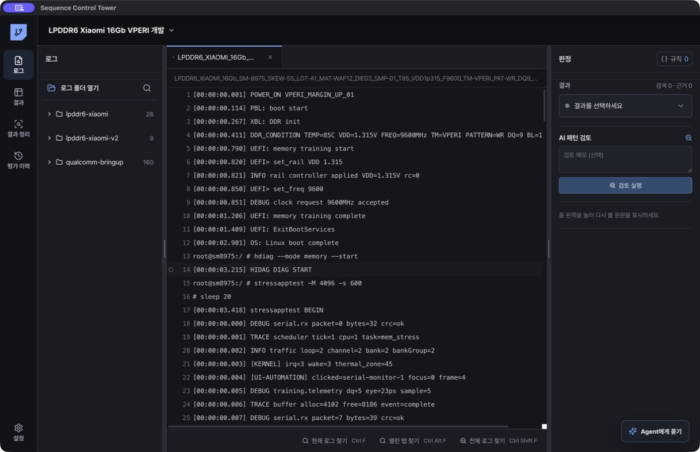

# 빠른 시작

## 1. 프로젝트와 로그 등록

1. 상단 프로젝트 메뉴에서 프로젝트를 만들거나 선택합니다.
2. `로그 폴더 열기`를 눌러 하나 이상의 폴더를 선택합니다.
3. 하위 폴더의 `.log` 파일이 프로젝트에 연결됩니다.
4. 좌측 목록에서 파일을 선택하면 가운데 읽기 전용 편집기에 전체 내용이 연속으로 표시됩니다.

원본 로그 파일은 읽기 전용으로 열립니다. 하나의 연결 폴더를 한 번의 평가로 취급하고, 폴더 안의 로그는 Sample·조건·반복 실행 단위로 묶습니다. 여러 평가 폴더를 같은 제품 프로젝트에 연결할 수 있지만 Agent의 검색 기억, RT 연결, 결과 정리는 현재 평가 폴더 밖으로 자동 확장되지 않습니다. 프로젝트에서 연 폴더는 앱을 다시 실행해도 유지되며, 폴더의 `.log` 목록을 다시 동기화합니다.

## 2. 로그 찾기

- `현재 로그 찾기`: 현재 파일에서 검색합니다. Windows `Ctrl+F`, macOS `⌘F`
- 검색창의 `현재 평가 폴더`: 현재 로그가 속한 폴더의 모든 로그에서 검색합니다.
- `열린 탭 찾기`: 열린 파일 전체에서 검색합니다. Windows `Ctrl+Alt+F`, macOS `⌘⌥F`
- `전체 로그 찾기`: 프로젝트 로그 전체에서 검색합니다. Windows `Ctrl+Shift+F`, macOS `⌘⇧F`
- `Enter` 또는 `F3`: 다음 결과
- `Shift+Enter` 또는 `Shift+F3`: 이전 결과
- `Esc`: 검색창 닫기
- Windows `Ctrl+O`, macOS `⌘O`: 로그 폴더 열기

문자열, 정규식, 대소문자 구분, 단어 단위 조건을 사용할 수 있습니다. 검색 결과를 선택하면 해당 줄로 이동합니다. 대용량 로그에서 검색 결과 계산 중 `Enter`를 먼저 눌러도 계산이 끝나는 즉시 첫 결과로 이동합니다.

## 3. 첫 판정

1. `@PASS`, `@FAIL`, training fail, reboot, halt와 같이 확인할 marker를 검색합니다.
2. 우측 `판정`에서 현재 로그의 결과를 선택합니다.
3. 반복 적용할 조건은 `규칙`에 저장합니다.
4. 결과 화면에서 전체 로그 판정과 예외를 검토합니다.

기본 상태에는 `PASS`, `DIAG_FAIL`, `TEST_FAIL`, `TRAINING_FAIL`, `SYSTEM_HALT`, `SYSTEM_REBOOT`, `INCOMPLETE`, `UNKNOWN`, `EXCLUDED`가 있습니다. 프로젝트에 필요한 사용자 정의 상태를 추가할 수 있습니다.

## 4. Agent로 프로젝트 확인

우측 `Agent`를 열면 선택한 로그가 속한 평가 폴더의 파일명 조건, SoC 부팅 profile, 콘솔 입력 형식, 종료 marker를 먼저 점검합니다. 여러 평가 폴더가 연결된 경우 로그 하나를 선택해야 새 대화를 시작할 수 있습니다. 불확실한 항목이 결론을 바꿀 때만 한 가지를 짧게 묻습니다.

질문 예시:

- `온도와 VDD별 실패율을 분모와 함께 비교해줘.`
- `DQ9, BL16, Channel 0 집중 여부를 확인해줘.`
- `이 로그가 이전 FAIL을 같은 Sample과 같은 Sequence로 다시 수행한 RT인지 확인해줘.`

특정 파일만 대상으로 질문하려면 입력창에서 `/`를 입력해 파일을 선택합니다.

## 5. 결과 저장

`결과`에서 개별 판정과 후보 값을 확인하고, `결과 정리`에서 가로·세로 조건과 필터를 선택해 CSV 또는 TSV를 만듭니다. 평가 목적과 해석은 `평가 이력`에 남깁니다.

Agent의 첫 화면에서 `결과와 평가 이력 정리`를 누르면 Agent가 최대 32개 로그의 파일명과 결정 marker를 점검합니다. 결과·목적·조건·근거 제안을 확인한 뒤 `결과·이력 저장`을 누르면 해당 로그의 결과와 평가 이력이 함께 저장됩니다. `UNKNOWN`은 결과를 확정하지 않고 평가 이력만 저장합니다.

