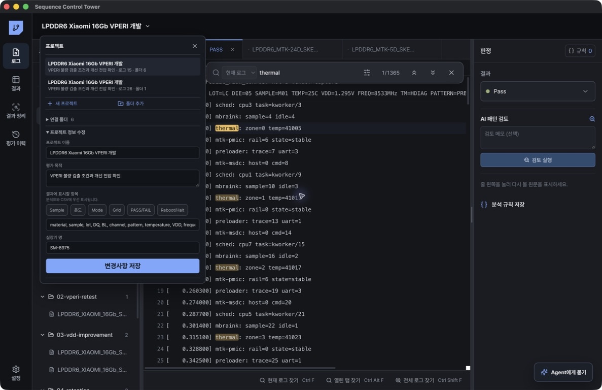

# 설치와 프로젝트

## 설치

### Windows

1. [최신 Release](https://github.com/stpcoder/sequence-control-tower/releases/latest)에서 `Sequence-Control-Tower-Setup.exe`를 받습니다.
2. 설치 관리자를 실행합니다.
3. 기존 버전을 제거할지 묻는 경우 제거 후 설치를 선택합니다.
4. 설치 권한이 없으면 `Sequence-Control-Tower-Portable.exe`를 사용합니다.

### macOS

1. 최신 Release에서 `Sequence-Control-Tower-macOS-Universal.dmg`를 받습니다.
2. `Sequence Control Tower`를 Applications 폴더로 이동합니다.
3. 조직 서명이 없는 빌드는 회사 보안 정책에 따라 실행을 허용합니다.

## 프로젝트 만들기

1. 상단 프로젝트 메뉴를 엽니다.
2. `새 프로젝트`를 누릅니다.
3. 프로젝트 이름과 평가 목적을 입력합니다.
4. 기존 프로젝트의 규칙과 표 설정을 재사용하려면 `기존 프로젝트 설정`에서 프로젝트를 고릅니다.
5. `프로젝트 만들기`를 누릅니다.
6. `폴더 추가`를 눌러 평가 로그가 들어 있는 폴더를 선택합니다.

한 프로젝트에 여러 폴더를 연결할 수 있습니다. 연결한 폴더 하나를 평가 하나로 사용합니다. 폴더 안의 로그는 Sample, 조건, 반복 실행 단위입니다.

Sample, Skew, 온도, VDD, 주파수, Mode, Pattern, 평가 제목, Grid, PASS/FAIL, Reboot/Halt는 모든 프로젝트에서 기본적으로 추출됩니다. 위치형 파일명은 ECC EN/EF 다음부터 `COM*` 직전까지를 평가 제목으로 보존합니다. 프로젝트를 만들 때 항목을 따로 선택할 필요가 없습니다.

내장 LPDDR6 샘플은 불량 검출, 동일 조건 RT, VDD 개선, retention, 부팅 Training 평가를 각각 별도 폴더로 구성합니다. 평가 이력에서 각 폴더가 하나의 점으로 표시됩니다.

## 기존 프로젝트 열기

1. 상단 프로젝트 메뉴를 엽니다.
2. 프로젝트를 선택합니다.
3. 연결된 폴더와 로그가 맞는지 확인합니다.

프로젝트를 전환하면 검색 절차, 분석 규칙, Agent 대화, 평가 이력도 선택한 프로젝트 기준으로 바뀝니다. 프로젝트를 여는 동작은 LLM을 호출하지 않습니다. 로그를 선택해 Agent 대화를 시작하거나 평가 이력에서 `현재 평가 분석`을 실행할 때만 AI 분석이 시작됩니다.

## 프로젝트 정보 수정

상단 프로젝트 메뉴에서 `프로젝트 정보 수정`을 펼칩니다.

| 항목 | 용도 |
|---|---|
| 프로젝트 이름 | 프로젝트 목록에 표시할 이름 |
| 평가 목적 | 현재 프로젝트에서 확인할 불량 또는 평가 목적 |
| 실장기 명 | 로그를 생성한 실장기를 구분할 이름 |

`연결 폴더`에는 이 프로젝트에 포함된 평가 폴더와 연결 상태가 표시됩니다. 폴더가 없거나 권한이 없으면 해당 폴더 아래에 경고가 표시됩니다.
