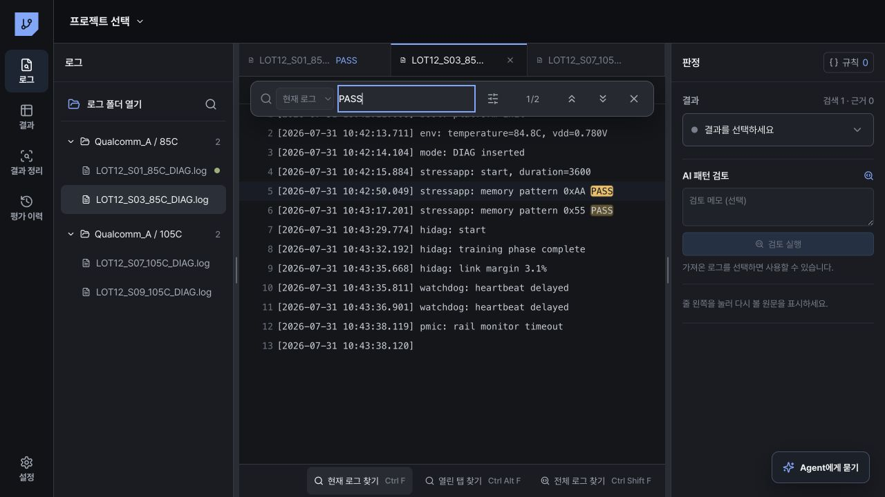

# 검색과 판정

## 현재 로그 검색

1. 로그를 선택합니다.
2. Windows는 `Ctrl+F`, macOS는 `⌘F`를 누릅니다.
3. 문자열 또는 정규식을 입력합니다.
4. `Enter` 또는 `F3`으로 다음 결과로 이동합니다.
5. `Shift+Enter` 또는 `Shift+F3`으로 이전 결과로 이동합니다.

검색창에서 대소문자 구분, 단어 단위, 정규식 사용 여부를 선택할 수 있습니다. 바꾸기는 현재 로그의 작업 사본에만 적용되며 원본 파일은 수정하지 않습니다.

검색창에서 `↑`와 `↓`를 누르면 현재 파일에서 사용한 이전 검색어를 다시 불러옵니다. 검색어는 프로젝트를 다시 열어도 유지됩니다.

일치 개수는 파일 전체를 기준으로 계산합니다. 일치 위치가 500개를 넘으면 `Enter`와 `F3`으로 다음 위치 묶음을 자동으로 불러오므로 마지막 결과까지 계속 이동할 수 있습니다.

## 여러 로그 검색

- `현재 평가`: 선택한 로그가 속한 평가 폴더의 모든 로그 검색
- `열린 파일`: 현재 열려 있는 로그 검색
- `전체 프로젝트`: 현재 프로젝트에 연결된 모든 로그 검색

Windows `Ctrl+Alt+F`, macOS `⌘⌥F`는 열린 파일 검색을 엽니다. Windows `Ctrl+Shift+F`, macOS `⌘⇧F`는 전체 프로젝트 검색을 엽니다.

전체 로그 검색 결과는 파일별로 묶여 표시됩니다. 파일명은 묶음 위에 한 번만 표시되고, 아래 줄을 누르면 해당 로그 위치로 이동합니다.

검색 결과 상단의 `AI`를 누르면 현재 검색어, 검색 범위, 옵션, 일치 개수, 일치한 로그가 Agent 대화로 전달됩니다. Agent는 이 검색이 부팅 단계, 입력 명령, Pass/Fail 판정 중 어디에 쓰이는지 확인합니다. 검색만으로 규칙을 확정하지 않으며, 반복할 조건은 저장할 검색 순서와 적용할 평가 범위를 제안합니다.

## 판정

오른쪽 판정 영역에서 결과를 선택합니다.

- `PASS`
- `DIAG_FAIL`
- `TEST_FAIL`
- `TRAINING_FAIL`
- `SYSTEM_HALT`
- `SYSTEM_REBOOT`
- `INCOMPLETE`
- `UNKNOWN`
- `EXCLUDED`

선택한 검색 줄을 근거로 저장하면 결과 화면에서 다시 열 수 있습니다. 판정은 취소하거나 다른 값으로 변경할 수 있습니다.

## 검색 절차 저장

검색 직후에는 문자열, 정규식 여부, 범위, 일치 개수, 실행 순서가 최근 관찰 기록으로 저장됩니다. 서로 다른 검색을 두 번 이상 수행하고 판정하면 `검색 절차 저장`이 나타납니다. 검색 순서와 평가 목적을 확인한 뒤 `절차 저장`을 누릅니다. 단순 탐색은 `저장하지 않음`을 눌러 확정 절차와 구분합니다.

확정한 절차는 같은 폴더에서 검색어, 발생 조건, 순서가 같을 때 재사용됩니다. 다른 폴더에서는 Mode, SoC, 부팅 프로파일, Pattern이 호환될 때만 수정 가능한 후보로 제시합니다. 호환되지 않는 실험에는 적용하지 않습니다. 온도, VDD, 주파수는 비교 조건으로 남으며 현재 폴더에서 다시 확인합니다.

## 긴 로그 이동

- `줄 이동` 또는 Windows `Ctrl+G`, macOS `⌘G`: 입력한 줄 번호로 바로 이동
- `줄 바꿈` 또는 `Alt+Z`: 긴 한 줄을 현재 창 너비에 맞춰 표시

장문 파일의 전체 줄 수가 아직 계산되지 않아도 줄 번호를 입력할 수 있습니다. 앱은 해당 구간만 읽어 화면 가운데에 표시합니다.
