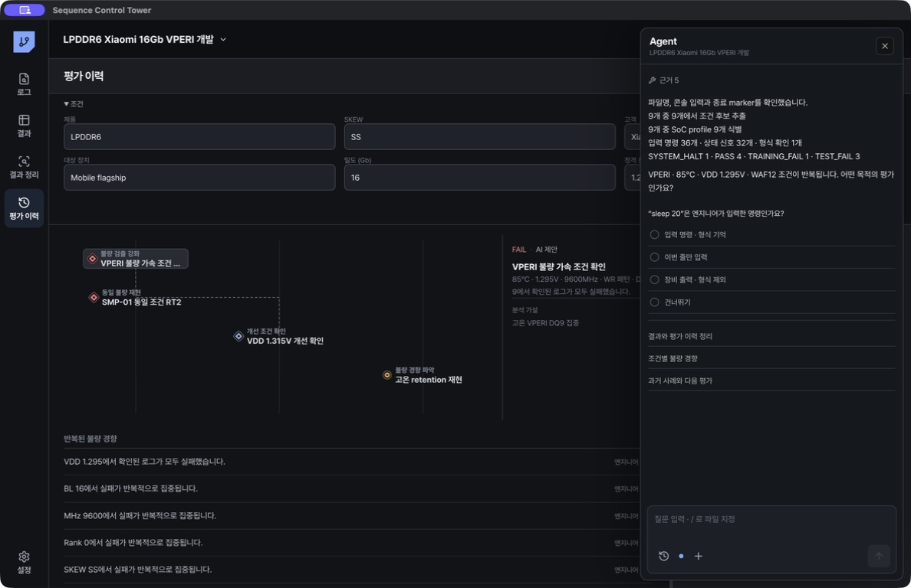

# Agent 네이티브 분석

## 이 제품에서 Agent 네이티브가 의미하는 것

Agent가 별도 채팅 사이트에서 파일을 받아 답하는 구조가 아닙니다. 프로젝트, 검색 행동, 확정 규칙, 평가 이력과 제한된 로그 근거를 앱 내부 도구로 직접 조회합니다. 대화와 도구 실행 기록도 현재 프로젝트에 저장됩니다.

처리 흐름은 다음과 같습니다.

`사용자 질문` → `프로젝트 범위 고정` → `읽기 전용 도구 선택` → `로컬 수치 계산` → `필요한 로그 구간만 확인` → `LLM 해석` → `근거가 포함된 답변` → `엔지니어 확정`

Agent는 최대 100개 로그를 한 질문의 범위로 사용합니다. 전체 원문을 LLM에 보내지 않고 검색 위치와 최대 24줄 구간만 읽습니다.

새 대화를 시작하면 앱이 먼저 각 로그의 단계·상태 marker 개수를 로컬에서 계산합니다. LLM은 이 요약을 보고 필요한 source와 검색어를 선택하므로 수천~수만 줄 로그 전체를 전송하지 않습니다. 연결 폴더 안의 `.log`만 분석 분모에 포함하며 JSON 같은 보조 파일은 제외합니다.

## Agent가 할 수 있는 일

- 파일명에서 Sample, Lot, Material, Die, SKEW, 온도, VDD, 주파수, test mode, pattern, DQ, BL, Channel, Sub Channel, Rank, Bank Group, Bank, Row, Column 후보 추출
- SM-8975 같은 Qualcomm SoC와 MTK 24D 같은 MediaTek SoC 후보 및 부팅 profile 선택
- Qualcomm UEFI 계열과 MediaTek Post-PBL/LK 계열의 마지막 도달 단계 구분
- 콘솔 입력 명령과 장비 출력·상태 marker 분리
- PASS, test fail, training fail, reboot, halt의 결정적 판정과 fast fail marker 구분
- 온도·VDD·DQ·BL·Channel·Sub Channel·Rank·Bank Group·Bank·Row·Column·Pattern·주파수·SKEW·Lot·Sample·Die·SoC별 실패 분자와 분모 계산
- 같은 Sample과 같은 Sequence signature로 이전 FAIL을 다시 수행한 RT 관계 확인
- 확정된 엔지니어 검색 절차를 새 로그에 재적용
- 현재 LPDDR6 프로젝트와 과거 LPDDR5/LPDDR6 프로젝트의 유사 평가 검색
- 평가 이력의 가설, 평가, 근거를 읽고 다음 평가 조건 제안

RT는 부팅 단계가 아닙니다. 동일 Sample·동일 Sequence로 수행된 이전 FAIL이 있어야 RT로 연결합니다. 파일명에 RT가 있어도 선행 FAIL을 찾지 못하면 `미해결 RT`로 둡니다.

## Agent에게 제공되는 도구

| 도구 | 기능 |
|---|---|
| `project_context_get` | 프로젝트 제품·고객·개발 조건과 로그 범위 조회 |
| `project_history_get` | 불량 가설, 평가 노드, 근거 조회 |
| `similar_case_search` | 다른 프로젝트의 유사 평가 검색 |
| `search_history_get` | 최근 Ctrl-F·정규식 행동 조회 |
| `engineer_workflow_memory_get` | 엔지니어가 확정한 분석 절차 조회 |
| `engineer_workflow_apply` | 확정 절차를 현재 로그에 적용 |
| `filename_dimensions_scan` | 파일명 조건과 Sequence signature 후보 추출 |
| `soc_boot_profile_scan` | SoC와 부팅 profile 판별 |
| `console_transcript_scan` | 입력 명령, 장비 출력, 상태 marker 분리 |
| `pass_fail_scan` | 결정적 결과 판정 |
| `log_search` | 로그에서 최대 12개 위치 검색 |
| `log_read_window` | 선택 위치 앞뒤 최대 24줄 확인 |
| `failure_trends_get` | 조건별 실패 분자·분모와 집중도 계산 |

내장 LPDDR 분석 Skill은 파일명은 후보로 취급하고, 수치에는 항상 분모를 표시하며, Qualcomm과 MediaTek 부팅 단계를 섞지 않고, 불확실한 인과관계는 `추정`으로 표시하도록 강제합니다.

## 결과와 평가 이력 저장

Agent 첫 화면의 `결과와 평가 이력 정리`는 파일명 조건을 먼저 읽고, marker 검색과 최대 24줄 근거 창을 제한적으로 사용합니다. 다음 항목을 제안합니다.

- 결과: `PASS`, `DIAG_FAIL`, `TEST_FAIL`, `TRAINING_FAIL`, `SYSTEM_HALT`, `SYSTEM_REBOOT`, `INCOMPLETE`, `UNKNOWN`
- 목적: 불량 검출 강화, 개선 조건 확인, 동일 불량 재현, 불량 경향 파악, 개선 효과 검증
- 조건: SKEW와 DRAM 위치, 온도, VDD, 주파수, Mode, Pattern
- 근거: source ID와 결정 marker의 줄 번호

결론을 바꾸는 정보가 부족하면 Agent가 한 가지를 먼저 질문합니다. 제안은 저장되지 않은 상태로 표시됩니다. `결과·이력 저장`을 누르면 근거 줄과 함께 결과가 저장되고, 같은 source ID가 평가 이력에 연결됩니다. `다시 분석`을 누르면 제안을 폐기하고 다시 확인합니다.

여러 로그를 함께 분석했을 때는 각 source별 근거와 결과가 있는 항목만 개별 판정으로 저장합니다. 하나의 종합 결론을 모든 로그에 복사하지 않습니다. 근거가 부족하거나 도구 호출 한도에 도달하면 결과는 `UNKNOWN`으로 제안하고 엔지니어 확인을 기다립니다.

## Agent가 먼저 묻는 경우

Agent는 다음 답이 평가 분기나 결론을 바꿀 때 한 번만 묻습니다.

- SoC 또는 부팅 profile이 Qualcomm인지 MediaTek인지
- 처음 보는 console prompt가 입력인지 출력인지
- 처음 보는 명령이 어떤 평가 목적인지
- 반복되는 조건이 검출 가속, 개선 확인, 재현, 선별 중 어떤 목적인지
- 엔지니어가 방금 수행한 검색 순서를 분석 절차로 저장할지

질문을 건너뛰면 미확인 상태를 유지합니다. 파일을 열거나 검색할 때마다 묻지 않습니다.

## 효과적인 지시 예시

- `현재 프로젝트에서 온도×VDD별 PASS/FAIL 분모와 실패율을 비교해줘.`
- `DQ9, BL16, Channel, Pattern 중 실패가 집중된 조건을 source 근거와 함께 보여줘.`
- `/파일명 이 로그가 이전 FAIL의 RT인지 Sample과 Sequence signature로 확인해줘.`
- `Qualcomm 또는 MTK 부팅 profile과 마지막 도달 단계를 확인해줘.`
- `내가 확인한 검색 순서와 있음·없음 조건을 적용해 후보 판정을 보여줘.`
- `과거 LPDDR5/LPDDR6 유사 평가와 차이를 찾고 다음 평가를 제안해줘.`

좋은 지시는 범위, 비교할 조건, 필요한 출력, 근거 수준을 포함합니다. 예: `85°C VPERI 로그에서 VDD별 실패율을 분모와 source ID를 포함한 표로 보여줘.`

## OpenCode와 내장 하네스

OpenCode가 설치되고 LLM이 연결되면 앱이 OpenCode headless sidecar를 시작합니다. OpenCode는 대화·도구 호출 순서를 관리하고, Sequence Control Tower의 `sct_*` MCP 도구만 호출합니다.

- `bash`, 파일 읽기·편집·쓰기, 웹 검색, 하위 task 도구는 차단됩니다.
- MCP 서버는 `127.0.0.1`에서 임의 bearer token으로만 열립니다.
- OpenCode는 앱 전용 설정·데이터·캐시 폴더에서 실행되어 사용자의 전역 plugin과 규칙을 불러오지 않습니다.
- Vertex의 Gemini 3 계열은 native `google-vertex` provider로 연결하여 여러 단계의 도구 호출 문맥을 유지합니다.
- 최대 도구 단계는 6입니다.
- OpenCode가 없거나 시작·호환 오류가 발생하면 같은 프로젝트 저장소와 읽기 전용 도구를 사용하는 내부 bounded 하네스로 자동 전환합니다.

## 저장되는 것과 저장되지 않는 것

저장:

- 프로젝트별 대화와 중지·재시도 상태
- 도구 이름, 상태, 요약, 근거 source ID
- 검색 행동, 확정 분석 절차, RT 시도 관계
- console prompt 규칙, 명령 목적 지식, SoC profile binding

새 프로젝트의 `설정 시작점`에서 기존 프로젝트를 선택하면 다음 확정 지식만 가져옵니다.

- 엔지니어가 저장한 검색 절차와 순서
- 엔지니어가 확정한 명령 목적
- 엔지니어가 확정한 console prompt 입력·출력 규칙
- 결과 Export 열과 결과 정리 축 같은 프로젝트 설정

원시 대화, 개별 Ctrl-F 기록, 평가 시도, 원본 로그 연결, source별 SoC binding은 복사하지 않습니다. 새 프로젝트의 실제 로그 근거와 섞이지 않게 하기 위한 범위 분리입니다.

저장 또는 전송하지 않음:

- API key와 token
- LLM 응답에 필요한 범위를 벗어난 절대경로
- 로그 원문 전체

LLM이 느리거나 호출 한도에 걸리면 현재 세션과 도구 근거는 유지됩니다. `다시 시도`로 이어서 실행할 수 있으며, 로컬 검색·규칙 판정·내보내기는 계속 사용할 수 있습니다.

Agent의 조회 도구는 읽기 전용입니다. Agent가 결과나 평가 이력을 임의로 확정하지 않습니다. 구조화된 제안을 엔지니어가 `결과·이력 저장`으로 승인한 경우에만 결과와 평가 이력을 함께 기록합니다. 유사 사례 검색은 현재 로컬 프로젝트의 단어 중첩 기반이며 embedding 검색은 아직 사용하지 않습니다.
