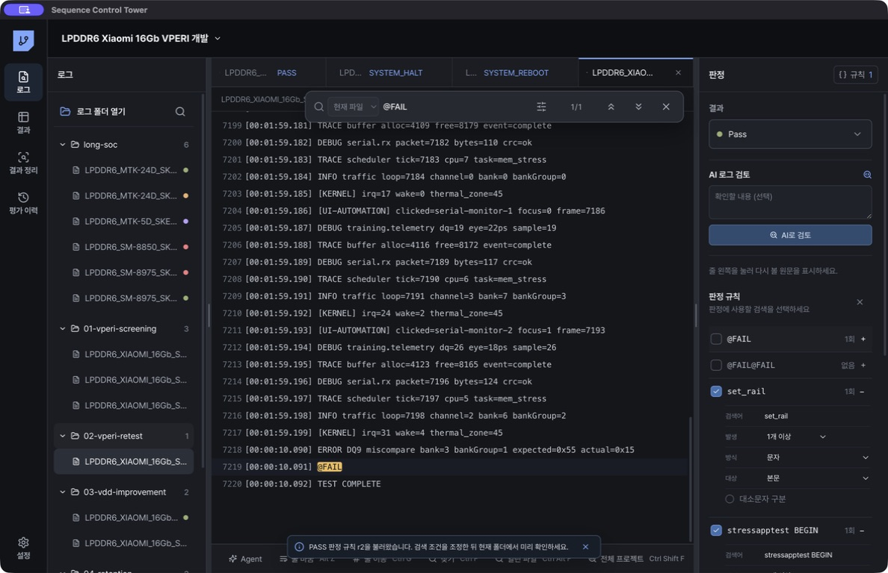

# 분석 규칙

## 규칙 만들기

1. 로그에서 `Ctrl+F`로 판정에 사용할 문자열 또는 정규식을 검색합니다.
2. 결과를 선택합니다.
3. `검색 절차 저장`에서 검색 순서와 평가 목적을 확인합니다.
4. `판정 규칙`에 앞에서 선택한 검색이 그대로 설정됐는지 확인합니다.
5. 발생 개수와 검색 대상을 확인합니다.
6. 순서가 중요하면 `판정 순서`에서 먼저 나타날 조건부터 정렬합니다.
7. `규칙 저장`을 누릅니다.

## 사용할 수 있는 조건

- 문자열 또는 정규식
- 대소문자 구분
- 본문 또는 파일명 검사
- 0개, 1개 이상, 정확히 N개
- 여러 marker의 출현 순서
- 반드시 포함 또는 반드시 제외

## 여러 로그에 적용

`규칙 저장`을 누르면 새 규칙이 저장되고 현재 평가 폴더에 자동으로 사용됩니다. 이미 사용 중인 규칙은 그대로 유지됩니다. 한 규칙과 일치하면 해당 결과가 바로 적용됩니다. 아무 규칙도 일치하지 않거나 서로 다른 결과의 규칙이 동시에 일치하면 `예외`로 남습니다. 사람이 직접 저장한 판정은 규칙 결과로 덮어쓰지 않습니다.

오른쪽 위 `규칙`을 누르면 `프로젝트 규칙` 목록이 열립니다. 규칙 자체는 프로젝트에 저장됩니다. `폴더 적용`을 누르면 선택한 평가 폴더의 기존 규칙에 추가되며, 다른 폴더에는 자동으로 적용되지 않습니다. 현재 폴더에서 쓰는 규칙에는 `적용됨`이 표시됩니다. `수정`은 같은 규칙을 변경하며, `삭제`는 프로젝트에서 해당 규칙과 적용 결과를 제거합니다.

규칙 수정 이력은 내부에 자동으로 보관됩니다. 화면에서는 최신 규칙만 표시합니다.
