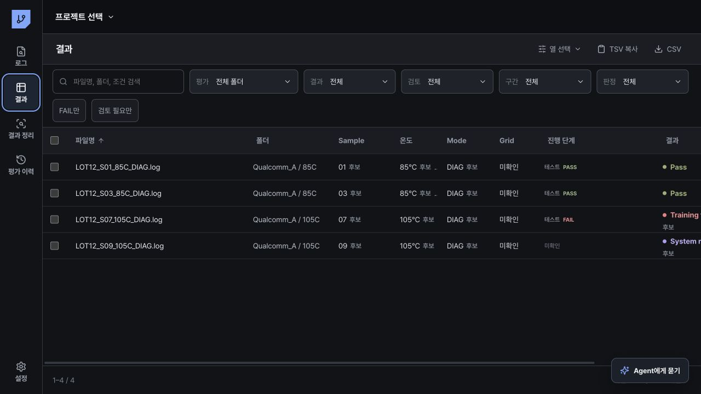
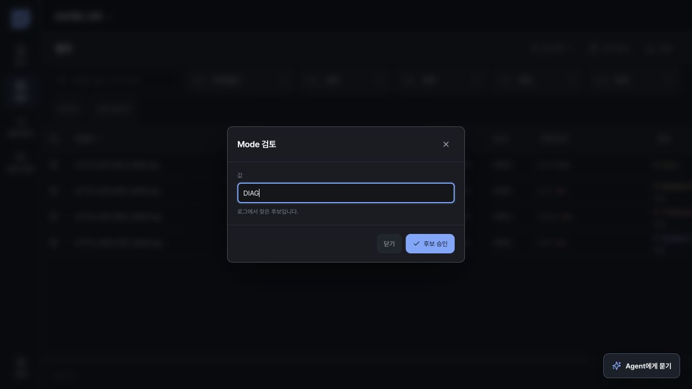
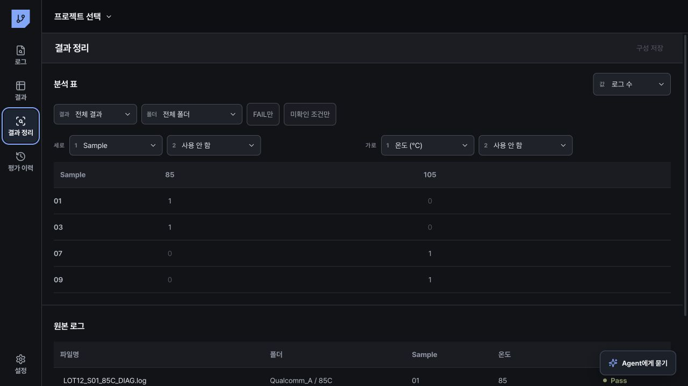
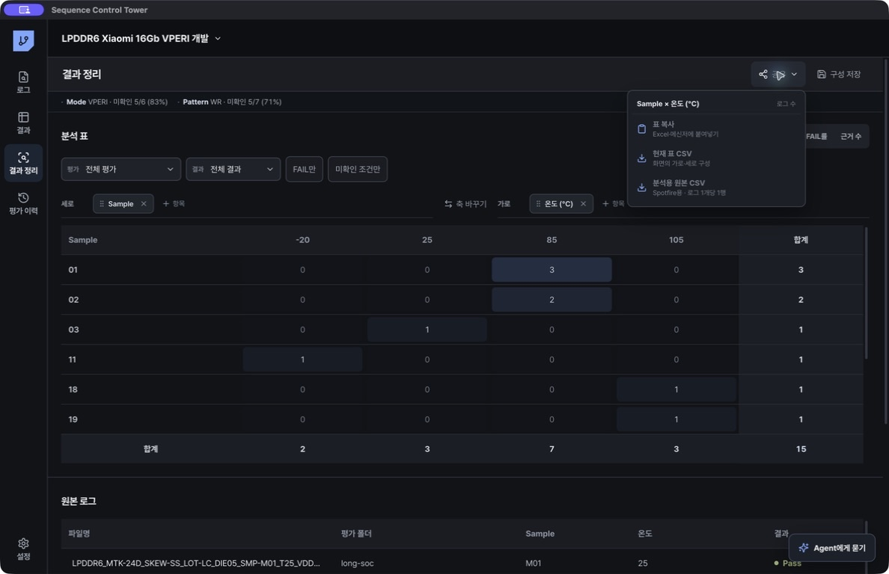

# 결과 정리와 내보내기

## 결과 확인

`결과`에서 로그별 판정, 조건 후보, 단계 결과, 검토 상태를 확인합니다. 필터에서 평가 폴더를 선택하면 해당 평가의 로그만 표시됩니다.

파일명에서 추출한 온도, Mode, Sample, SKEW 후보는 승인, 수정, 초기화할 수 있습니다. 자동 판정과 엔지니어 판정이 다르면 엔지니어 판정을 유지하고 충돌을 표시합니다.

후보 값을 누르면 해당 값만 검토하는 창이 열립니다. 긴 파일명은 검토창에 반복해서 표시하지 않습니다.

표 왼쪽의 체크박스로 로그를 선택하면 하단에 `Agent로 비교`가 표시됩니다. 선택한 로그만 Agent에 전달되며, 여러 평가 폴더를 선택한 경우 Agent는 폴더별 평가를 분리한 채 조건과 결과를 비교합니다.

`진행 단계`는 SoC에 맞는 마지막 부팅 단계, OS, 실제 테스트를 구분합니다. Qualcomm은 UEFI 계열, MediaTek은 LK 계열을 우선 표시합니다. 부팅만 확인한 로그에는 테스트 단계를 만들지 않습니다. Training fail은 Training에서 중단된 것으로 표시하고, 테스트 중 reboot 또는 halt는 테스트 FAIL로 표시합니다.

## 분석 표 만들기

1. `결과 정리`를 엽니다.
2. 평가 폴더와 결과 필터를 선택합니다.
3. 표에 표시할 값을 `로그 파일 수`, `Sample 수`, `Grid 수`, `PASS 로그`, `FAIL 로그`, `FAIL률`에서 선택합니다.
4. `세로`와 `가로`의 `항목`을 눌러 조건을 추가합니다.
5. 항목을 끌어서 순서를 바꾸거나 다른 방향으로 옮깁니다. `축 바꾸기`는 가로와 세로를 한 번에 교환합니다.
6. 표의 셀을 누르면 해당 값에 포함된 원본 로그만 표시됩니다.
7. `Agent로 해석`을 누르면 선택한 가로·세로 조건, 계산 값, 연결 로그만 Agent가 확인합니다.
8. `구성 저장`을 누르면 현재 필터, 항목 순서, 표시 값을 프로젝트에 저장합니다.

가로와 세로에는 각각 최대 3개 항목을 사용할 수 있습니다. 같은 상위 항목은 표에서 하나로 묶어 표시합니다. 온도와 온도 조건, VDD와 VDD 조건, 4-Corner, 주파수, SKEW, Sample, DQ, BL, Channel, Sub Channel, CS, Rank, Bank Group, Bank, Row, Column, WR, RD, Pattern, Mode, Lot, Die, SoC, Grid, 평가 폴더를 선택할 수 있습니다.

표의 계산 기준은 다음과 같습니다.

- `로그 파일 수`: 현재 범위에 포함된 `.log` 파일 수입니다. 로그 1개가 Grid 1개라고 확인된 경우에만 Grid 수와 같습니다.
- `Sample 수`: 중복 Sample ID를 제외한 수입니다.
- `Grid 수`: 평가 폴더·Sample·Grid ID·반복 번호를 기준으로 중복을 제외한 평가 단위 수입니다. Grid ID가 없는 로그는 계산에서 제외됩니다.
- `PASS 로그`: PASS로 판정된 로그 수입니다.
- `FAIL 로그`: Test/Diag/Training Fail, Halt, Reboot로 판정된 로그 수입니다.
- `FAIL률`: FAIL / (PASS + FAIL 확정 로그)입니다. 미확인과 미완료는 분모에서 제외합니다.

Grid ID가 파일명에 없어도 Agent는 로그 본문의 `Grid` 또는 전원 인가 경계를 찾아 Grid별 조건과 결과를 설명합니다.

## 회사에서 공유하기

상단의 `공유`를 누르고 목적에 맞는 형식을 선택합니다.

| 기능 | 사용 방법 |
| --- | --- |
| `표 복사` | 현재 표를 Excel, 메신저, 문서에 바로 붙여넣습니다. |
| `현재 표 CSV` | 화면의 가로·세로 항목과 합계를 그대로 저장합니다. |
| `선택 로그 CSV` | 표에서 선택한 셀의 원본 로그만 한 건당 한 행으로 저장합니다. |
| `분석용 원본 CSV` | 필터된 로그를 한 건당 한 행으로 저장합니다. 현재 축과 실제 값이 있는 DRAM 조건을 자동 포함하므로 Spotfire에서 다시 나눠 볼 수 있습니다. |

보고서에는 `현재 표 CSV`, 추가 분석에는 `분석용 원본 CSV`를 사용합니다. 원본 CSV는 병합 셀을 만들지 않아 필터, 조인, 시각화에 바로 사용할 수 있습니다.

## 로그별 결과 내보내기

`결과` 화면의 `열 선택`에서 평가 조건, 판정, 파일 정보를 선택할 수 있습니다. 선택한 열은 프로젝트 기본값으로 저장됩니다. `TSV 복사`는 Excel에 붙여넣을 때 사용하고, `CSV`는 파일로 공유할 때 사용합니다. `판정 근거 열`을 켜면 자동 판정에 사용한 신호 줄 수와 엔지니어가 직접 선택한 근거 줄 수가 추가됩니다.

## 자주 사용하는 필터

- FAIL만 표시
- 미확인만 표시
- 검토 필요만 표시
- 선택한 평가 폴더만 표시
- 파일 이름으로 필터
- 근거가 있는 로그만 표시

Source ID, 상대 경로, 판정 출처, 조건 승인 상태도 열 선택에서 추가할 수 있습니다. 원본 로그 파일은 내보내기 과정에서 변경되지 않습니다.
