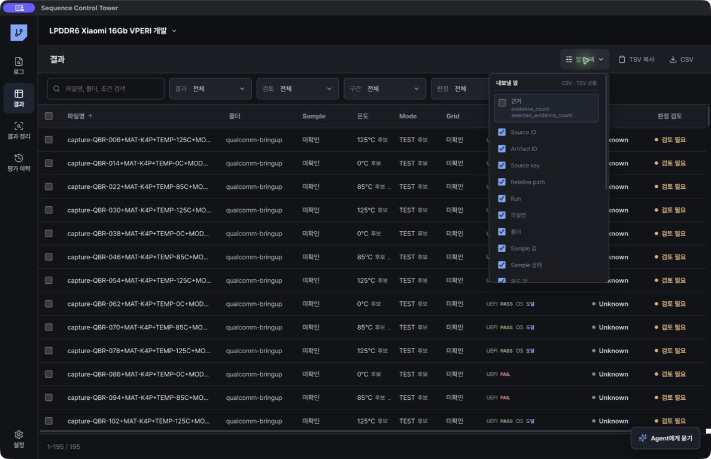
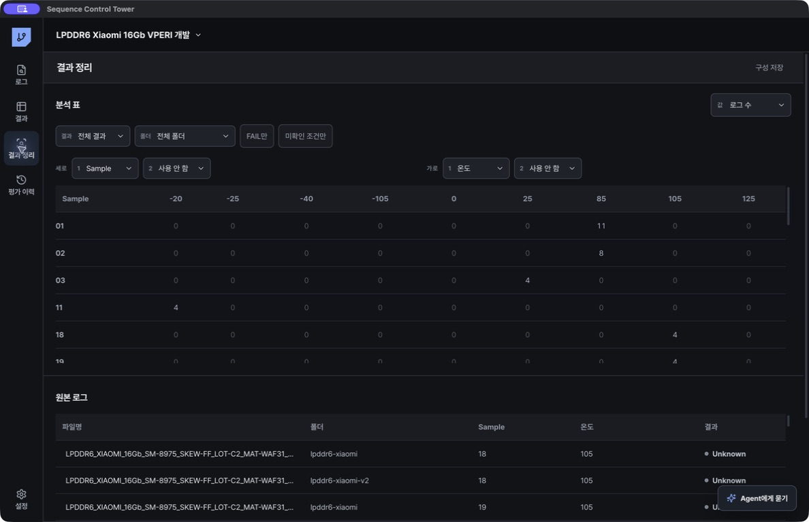
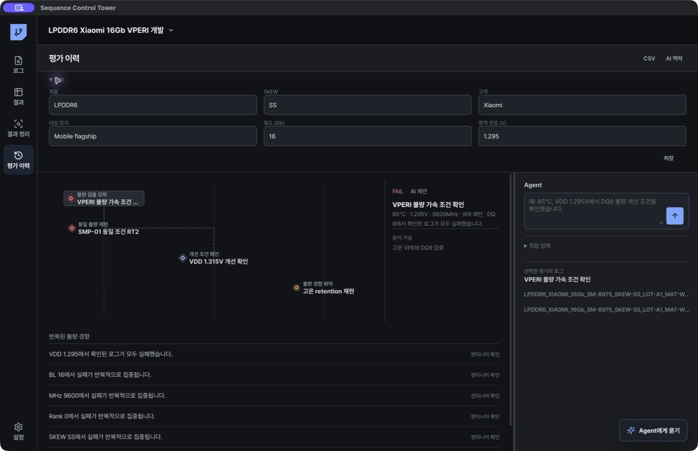

# 결과와 평가 이력

## 결과 검토

`결과` 화면에서 로그별 판정, 파일명 조건 후보, 단계별 상태와 검토 필요 항목을 확인합니다. 후보 값은 승인하거나 다시 미확인으로 돌릴 수 있습니다.

단계는 장비 profile에 맞게 해석합니다.

- Qualcomm: UEFI → OS 도달 → 테스트 결과
- MediaTek: Post-PBL/LK 계열 → OS 도달 → 테스트 결과
- 부팅 확인 평가: 테스트 단계 없음

PASS와 FAIL만 강제하지 않습니다. 진단 PASS, 부팅 PASS, training PASS, test fail, reboot, halt와 프로젝트 사용자 정의 상태를 사용할 수 있습니다.

## 결과 정리

`결과 정리`에서 다음을 지정합니다.

- 가로 조건과 세로 조건: 각각 최대 2개
- 결과, 폴더, 파일, 검토 상태 필터
- FAIL 모아보기, 미확인·검토 필요 모아보기
- 내보낼 행과 열
- 근거 열 포함 여부

N × M 표는 같은 결과를 온도×VDD, 주파수×DQ, Sample×Pattern, Channel×Sub Channel, Row×Column처럼 비교할 때 사용합니다. 축 메뉴는 평가 조건, 제품, DRAM 위치, 관리 항목으로 나뉩니다. 미확인 후보가 있는 경우 해당 값은 확정 데이터와 구분됩니다.

기본 내보내기 열:

`source_id`, `artifact_id`, `source_key`, `relative_path`, `run`, `filename`, `folder`, `sample_value`, `sample_state`, `temperature_value`, `temperature_state`, `mode_value`, `mode_state`, `grid_value`, `grid_state`, `result`, `result_source`, `review`, `stage_results`

선택 근거 열:

`evidence_count`, `selected_evidence_count`

추가 조건 열은 `열 선택`의 평가 조건에서 고릅니다. Source ID와 경로는 `파일 정보`를 펼쳐 선택합니다.

CSV와 TSV는 미리보기 후 저장합니다. 원본 로그 파일은 내보내기 과정에서 변경되지 않습니다.

## 평가 이력

평가 이력은 프로젝트 안에서 불량 분석 문맥을 점과 연결로 축적합니다.

- 불량 가설: 확인하려는 현상 또는 원인 후보
- 평가: 실제 수행한 한 번의 조건·결과
- 근거: 연결된 source ID와 엔지니어 확인 상태
- 연결: 선행 평가, RT, 개선 확인, 검출 가속, 재현 평가의 관계

각 평가에는 목적, 결과, Sample, Lot, Material, Die, SKEW, 온도, VDD, 주파수, test mode, pattern, DQ, BL, Channel, Sub Channel, Rank, Bank Group, Bank, Row, Column을 기록할 수 있습니다. 숫자 timing offset은 `Timing SKEW (ps)`로 따로 기록합니다.

평가 제목이나 설명을 Agent에게 적으면 Agent 대화로 전달해 조건 후보와 과거 사례를 먼저 확인할 수 있습니다. Agent의 `결과와 평가 이력 정리`에서 구조화된 제안을 확인한 뒤 한 번 승인하면 결과와 평가 관계가 함께 저장됩니다.

## 권장 기록 단위

프로젝트: `LPDDR6 Xiaomi 16Gb 개발`

가설: `85°C VPERI DQ9 집중`

평가:

1. `VDD 1.295V 검출 가속 확인` — 11개 중 7개 실패
2. `동일 Sample·Sequence RT2` — 이전 FAIL과 연결
3. `VDD 1.315V 개선 확인` — 4개 중 0개 실패
4. `1.305~1.310V 중간 전압 반복` — 다음 평가

정성 해석에는 `어떤 조건에서 주로 실패했는지`, `어떤 변경에서 개선 경향이 있었는지`, `추가 반복이 필요한지`를 적습니다. 실패율만 적어 원인을 확정하지 않습니다.

평가 이력은 CSV와 Markdown 문맥으로 내보낼 수 있습니다. source ID가 남기 때문에 나중에 원문 로그를 다시 열 수 있습니다.
