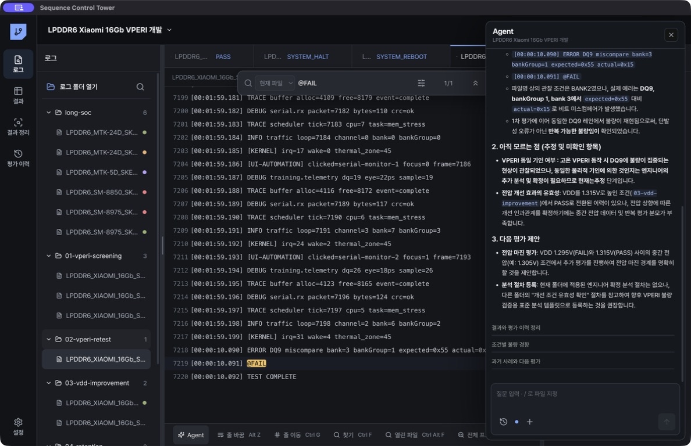

# Agent 사용

## Agent 화면의 두 분석 방식

우측 `Agent` 패널 안에는 목적이 다른 두 실행 방식이 있습니다.

- 입력창에서 질문하는 대화는 `OpenCode Agent`가 담당합니다. 대화 기록을 유지하며 프로젝트 이력과 현재 평가 폴더를 조회하고, 필요한 읽기 전용 도구를 선택해 호출합니다. OpenCode를 사용할 수 없을 때는 같은 도구를 쓰는 내장 Agent로 전환합니다.
- `결과와 평가 이력 정리`는 `평가 정리 Agent`가 담당합니다. 선택한 폴더의 로컬 Pass/Fail 판정을 유지한 채 결과, 평가 목적, 조건, 정성 해석을 구조화하고 이력 연결을 제안합니다. 엔지니어가 `결과·이력 저장`을 누르기 전에는 프로젝트 기록을 변경하지 않습니다.
- `평가 이력` 페이지는 Agent가 아닙니다. 확인 후 저장된 평가와 폴더 관계를 보는 프로젝트 기록 화면입니다. 이 화면의 `현재 평가 분석`은 우측 패널의 평가 정리 Agent를 실행합니다.

두 Agent는 패키지에 포함된 동일한 `lpddr-failure-analysis` Skill을 기준으로 사용합니다. OpenCode Agent는 Skill 전체와 SCT 분석 도구를 사용하고, 평가 정리 Agent는 같은 Skill에서 검증한 평가 단위·로컬 판정·RT·개선·Side effect·확인 저장 계약을 제한된 런타임에 적용합니다. `확인 과정`의 `LPDDR 분석 기준`과 결과 검토 상단의 `LPDDR 기준 적용`에서 적용 여부를 확인할 수 있습니다.

## Agent가 사용하는 평가 구조

Agent는 로그를 다음 단위로 구분합니다.

1. `프로젝트`: 같은 제품·고객·개발 목표의 전체 이력
2. `평가 폴더`: 재현, 가속 조건 탐색, 개선 조건 확인, 개선 효과 검증 등 한 가지 평가 목적
3. `Sample·SKEW`: 실제 자재와 TT, SS, SF, FS, FF 등 평가 corner
4. `Grid`: 한 번 전원을 인가해 부팅, Training, 테스트 후 종료하는 단위
5. `Sequence`: Grid에서 실행한 명령 순서와 온도, VDD, 주파수, Test Mode 조건

SKEW별 Sample 수와 반복 횟수는 따로 계산합니다. 로그 파일 1개를 Grid 1개로 자동 가정하지 않습니다. Agent는 로그의 Grid 또는 전원 인가 경계를 찾은 경우에만 Grid 수를 제시합니다.

불량 분석은 `기준 평가 확인 → 같은 조건 RT → 가속 조건 비교 → 개선 조건 적용 → 새 Fail 위치의 Side effect 확인 → 목표 Sample·SKEW 전체 PASS 확인` 순서로 해석합니다. 프로젝트에 처음 저장된 평가가 실제 최초 불량 로그라는 근거가 있을 때만 `최초 불량`으로 해석합니다. 재현 평가부터 기록을 시작했다면 첫 점도 `재현 평가`로 표시합니다.

## 대화 시작

1. 분석할 평가 폴더의 로그를 하나 선택합니다.
2. 화면 오른쪽 아래의 `Agent에게 묻기`를 누릅니다. 모든 페이지에서 위치와 동작이 같습니다.
3. `새 대화`를 누릅니다.
4. 질문을 입력합니다.

여러 폴더가 연결된 프로젝트에서는 선택한 로그의 폴더만 기본 분석 범위로 사용합니다. 입력창에서 `/`를 입력하면 특정 로그만 지정할 수 있습니다. 선택한 로그는 입력창 위에 한 줄로 표시되며 `×`로 해제할 수 있습니다.

## 검색 행동의 기억과 재사용

1. `Ctrl+F`로 수행한 검색은 먼저 관찰 기록으로 저장됩니다.
2. 서로 다른 검색을 두 번 이상 수행하고 판정하면 순서와 목적을 확인합니다.
3. `절차 저장`을 누른 검색만 확정 분석 절차가 됩니다.
4. 같은 폴더에서는 이 절차를 우선 적용합니다.
5. 다른 폴더에서는 SoC, 부팅 프로파일, Mode, Pattern이 맞을 때만 재사용 후보로 제시합니다. 검색어, 발생 개수, 순서를 현재 폴더에 맞게 수정한 뒤 저장하고 적용합니다.

일반 탐색 검색은 판정 규칙으로 승격되지 않습니다. Agent는 최근 검색과 확정 절차를 구분해 답변합니다.

## Agent가 확인하는 정보

- 파일명 조건: SKEW, Sample, Lot, Die, Grid, 온도, VDD, Hot/Room/Cold, HVDD/NVDD/LVDD, 4-Corner, 주파수, Mode
- Grid와 Sequence: 전원 인가 경계, setddrclk/clk.sh, DTVS, erase DDR, reset, Hdiag 실행 순서
- DRAM Fail 위치: CS, Rank, Bank Group, Bank, Row, Column, WR, RD, DQ, BL, Channel, Sub Channel
- SoC와 부팅 단계
- 콘솔 입력 명령과 장비 출력
- PASS, FAIL, halt, reboot marker
- 최근 검색 기록과 엔지니어가 확정한 검색 절차

로그 검색 결과의 `검색 분석`, 결과 화면의 `선택 비교`, 결과 정리의 `현재 표 분석`을 누르면 현재 화면의 선택 범위가 같은 Agent 패널로 전달됩니다. 결과 정리에서는 평가 결과와 Fail 주소 중 선택한 기준, 현재 시각화, 왼쪽·상단 축, 표시 값, 선택한 조건이 함께 전달됩니다. Agent는 화면 숫자를 그대로 복사하지 않고 로컬 분석 도구로 현재 평가 폴더를 다시 계산합니다. Fail 주소 분석에서는 실제 로그 본문의 DQ, BL, Channel, Bank 이벤트를 다시 확인합니다. 분석에 필요한 평가 목적이 미확인인 경우 Agent가 먼저 한 가지를 묻고, 답변이 끝나면 선택한 검색 또는 분석 보기 검토를 이어갑니다.

Agent 답변 아래에 표시되는 파일명을 누르면 근거 로그의 해당 프로젝트 파일을 엽니다. 다른 평가 폴더의 과거 사례가 근거에 포함된 경우에도 파일명을 눌러 원문을 확인할 수 있습니다.
- 현재 프로젝트의 폴더별 평가 이력과 과거 프로젝트의 유사 사례

Agent는 로그 전체를 LLM으로 보내지 않습니다. 한 번의 대화는 현재 선택 로그를 우선으로 최대 32개 source만 로컬 검사하고, 검색으로 좁힌 최대 24줄 근거 구간만 LLM에 전달합니다.

콘솔 입력은 `UEFI>`, `root@device #`, `LK>` 같은 prompt 뒤의 명령만 수집합니다. 주석, `META` 헤더, 디버그 출력은 입력 명령에서 제외하고 `@PASS`, `@FAIL`, halt, reboot 같은 상태 신호는 장비 출력으로 유지합니다.

응답이 느릴 때는 완료된 확인 항목이 Agent 창의 `확인 과정`에 한 줄씩 표시됩니다. `파일명 조건`, `Grid · Sequence`, `Pass/Fail 판정`, `조건별 경향`, `로그 검색`, `근거 구간`의 요약만 표시하며 원문 로그와 내부 식별자는 진행 화면에 표시하지 않습니다.

최근 Ctrl+F 검색은 엔지니어가 무엇을 확인했는지 파악하는 관찰 기록입니다. Agent는 검색 순서와 일치 개수를 확인하되, 엔지니어가 승인한 절차만 판정 규칙으로 적용합니다. 따라서 단순 탐색과 반복 가능한 판정 절차가 섞이지 않습니다.

## 질문 예시

- `온도와 VDD별 실패 수와 전체 수를 비교해줘.`
- `SKEW별 Sample 수와 PASS, FAIL, 미확인을 비교해줘.`
- `Grid마다 적용된 온도, VDD, 주파수, TM과 종료 결과를 정리해줘.`
- `DQ9, Channel 0, Bank Group 1에 실패가 집중되는지 확인해줘.`
- `Hdiag Fail address에서 DQ, BL, Bank, Row, Column 분포를 확인해줘.`
- `같은 Sample과 같은 Sequence의 이전 FAIL이 있는지 확인해줘.`
- `이 평가와 유사한 과거 LPDDR5 평가를 찾아줘.`
- `다음 평가에서 바꿀 조건을 근거와 함께 제안해줘.`

SKEW는 TT, SS, SF, FS, FF 같은 평가 corner입니다. PASS와 FAIL 로그에 모두 같은 값으로 들어간 조건은 현재 폴더에서 원인을 구별하지 못하므로 Agent가 원인으로 확정하지 않습니다. 파일명에 있는 DQ, Channel, Bank도 로그 근거 없이 취약 위치로 확정하지 않습니다.

조건별 FAIL률과 Hdiag Fail-address 분포는 분리해서 계산합니다. `Cold 4/5 FAIL`은 평가 조건 경향이고 `DQ0,1,2가 12/18 Fail events`는 실패 위치 분포입니다. Agent는 두 수치의 분모를 섞지 않고 포함된 로그 수도 함께 확인합니다.

## Agent가 먼저 묻는 경우

새 대화를 시작하면 Agent가 먼저 파일명, Pass/Fail marker, 부팅 단계, 콘솔 입력을 로컬에서 확인합니다. 결론에 영향을 주는 미확인 항목만 한 번에 하나씩 묻습니다. SoC 부팅 계열, 콘솔 줄의 입력·출력 구분, 처음 확인된 명령의 목적을 물을 수 있습니다.

`stressapptest`, `hdiag`, 주파수·전압 설정, 대기 명령은 표준 명령으로 자동 인식합니다. 의미가 불명확한 사내 또는 사용자 명령만 목적을 묻고, 답변은 같은 프로젝트의 다음 로그 분석에 사용합니다.

평가 목적이 없으면 `불량 재현`, `불량 검출 강화`, `개선 조건 확인`, `개선 효과 검증`, `불량 경향 파악`, `부팅·Training 확인` 중에서 선택합니다. 직접 입력하거나 `모름`으로 남길 수도 있습니다. 평가 이력에서 이미 확정한 폴더는 저장된 짧은 목적명을 그대로 사용하며 다시 묻지 않습니다. 이 확인 단계에서는 LLM을 호출하지 않습니다.

질문을 입력하거나 `결과와 평가 이력 정리`를 실행하면 필요한 marker를 검색하고 주변 최대 24줄만 LLM에 제공합니다.

고정된 조건 축에 없는 신규 신호는 버리지 않고 `추가 조건 후보`로 해석에 남깁니다. 다음 평가에서 규칙으로 쓰려면 Agent가 엔지니어에게 한 번 확인합니다.

## 결과와 평가 이력 정리

`결과와 평가 이력 정리`를 누르면 실행 상태가 즉시 표시됩니다. 분석은 백그라운드에서 계속되므로 다른 화면으로 이동할 수 있습니다. Agent 패널을 다시 열면 같은 진행 상태가 표시됩니다.

LLM 응답이 실패하면 `다시 시도`를 누릅니다. 로컬 도구에서 확인한 결과는 유지됩니다. 모델이 판정 제안 없이 종료해도 빈 화면을 표시하지 않고 `UNKNOWN` 검토안과 추가로 확인할 근거를 표시합니다. Agent가 결과, 목적, 조건, 정성 해석을 제안하면 내용을 확인한 뒤 `결과·이력 저장`을 누릅니다. 저장이 끝나면 버튼이 `저장됨`으로 바뀌고 같은 제안을 다시 저장하지 않습니다.

현재 폴더에 확정 절차가 없으면 testMode, SoC, Boot profile, Pattern이 호환되는 이전 폴더의 확정 검색 절차를 후보로 적용합니다. 온도·VDD·주파수는 비교 변수로 남기고, 현재 폴더에서 엔지니어가 확인하기 전에는 확정 판정으로 저장하지 않습니다.

Agent의 `평가 이력` 도구는 현재 폴더만 보지 않고, 프로젝트에 저장된 다른 폴더의 평가 목적·결과·정성 해석을 같이 읽습니다. 현재 폴더는 별도로 표시되며, 다른 폴더의 원문 로그나 경로는 전달하지 않습니다.

OpenCode Agent는 대화를 시작할 때 내장된 `lpddr-failure-analysis` Skill을 먼저 불러옵니다. 이 Skill은 폴더 하나를 평가 하나로 보는 기준, RT·조건 비교·개선·검증·Side effect 관계, 근거 확인 순서를 제공합니다. 평가 이력 연결 질문에는 프로젝트 이력과 현재 폴더의 근거를 읽은 뒤 `평가 관계 제안` 도구를 사용합니다. 이 도구는 관계를 제안할 뿐 저장하지 않으며, 화면에서 관계를 확인하고 `결과·이력 저장`을 눌러야 확정됩니다.

평가 흐름은 저장된 이전 평가 연결만 따라갑니다. 저장 순서가 가깝다는 이유만으로 서로 다른 폴더를 한 경로로 합치지 않습니다.

이전 버전에서 만든 폴더 미연결 평가는 진행 경로에서 제외하고 `폴더 연결 필요` 기록으로 구분합니다.

현재 폴더 질문에는 현재 폴더 도구 결과만 사용합니다. 과거 평가 수치나 다른 프로젝트 비교값은 `이전 평가` 또는 `유사 사례` 도구를 실제로 호출한 답변에서만 표시합니다.

질문 대기 또는 제안 검토 중 앱을 다시 실행해도 선택한 평가 폴더의 분석 세션을 복원합니다. 종료 시 실행 중이던 분석은 일시 정지 상태로 복원되며 `다시 시도`로 이어서 실행할 수 있습니다.

## 대화 기록

입력창 아래의 기록 버튼에서 이전 대화를 엽니다. 현재 폴더를 선택하지 않아도 저장된 프로젝트 대화 목록은 확인할 수 있습니다. 대화에는 질문, 답변, 사용한 도구, 근거 source ID가 저장됩니다. 새 대화와 새 분석은 평가 폴더의 로그를 선택한 뒤 시작합니다.

대화 기록과 검색 기록은 프로젝트에 저장됩니다. 다른 프로젝트에는 자동으로 섞이지 않으며, 같은 프로젝트에서도 선택한 평가 폴더를 기준으로 분석 범위를 제한합니다.
