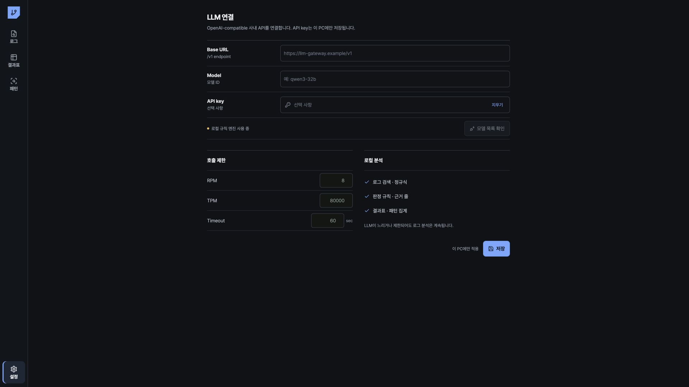

# LLM 연결

사내 OpenAI-compatible API의 주소, model ID, API key와 호출 제한을 설정합니다. LLM 연결은 선택 사항입니다.

## 연결 설정

1. `설정`에서 `LLM 연결`을 엽니다.
2. Base URL, model ID, API key를 입력합니다.
3. `저장`을 선택합니다.
4. `호출 제한`에서 `RPM`, `TPM`, `Timeout`, `Retries`를 확인합니다.
5. `모델 목록 확인`을 선택해 `/models` 응답을 확인합니다.

`모델 목록 확인`은 사용자가 선택할 때만 실행됩니다. 앱 시작, 폴더 가져오기, 검색, 일괄 판정은 `/models`를 호출하지 않습니다.

## 호출 제한

- `Timeout`은 5~300초 범위입니다. 기본값은 60초입니다.
- `TPM`은 1,201~10,000,000 범위입니다. 기본값은 80,000입니다.
- `TPM` 최소값 1,201은 응답 예약 1,200토큰과 최소 프롬프트 1토큰을 포함합니다. 저장값과 `SEQ_LLM_TPM` 환경 변수는 이 범위로 제한됩니다.
- 공유 endpoint의 한도에 맞춰 `SEQ_LLM_RPM`과 `SEQ_LLM_TPM`을 설정합니다.
- 동일한 분석 입력은 content hash 캐시를 사용합니다.
- 429, 503, `Timeout`은 설정된 횟수만 재시도합니다.
- 원본 로그 전체를 파일별로 요청하지 않습니다.

운영 PC에서는 다음 환경 변수를 사용할 수 있습니다. 환경 변수 값이 앱 저장값보다 우선합니다.

- `SEQ_LLM_BASE_URL`
- `SEQ_LLM_MODEL`
- `SEQ_LLM_API_KEY`
- `SEQ_LLM_RPM`
- `SEQ_LLM_TPM`
- `SEQ_LLM_TIMEOUT_MS`
- `SEQ_LLM_MAX_RETRIES`

## 보안

- API key를 화면 공유, 설정 내보내기, 진단 로그에 포함하지 마세요.
- 앱은 구조화된 최소 근거에 redaction을 적용해 요청합니다.
- 회사 데이터 분류와 전송 정책을 확인합니다.
- 인증서 검증을 비활성화하지 마세요. 연결 오류는 관리자에게 문의합니다.

## 연결 상태

| 상태 | 의미 | 조치 |
|---|---|---|
| Configured | Base URL과 model ID 저장됨 | AI 분석 요청 가능 |
| Rate limited | RPM 또는 TPM 초과 | 표시된 재시도 시각까지 대기 |
| Timed out | 제한 시간 내 응답 없음 | 로컬 판정 확인 또는 나중에 재요청 |
| Offline | endpoint 접근 불가 | URL, VPN, 사내망 확인 |
| Not configured | 연결 정보 없음 | 로컬 기능 사용 가능 |
