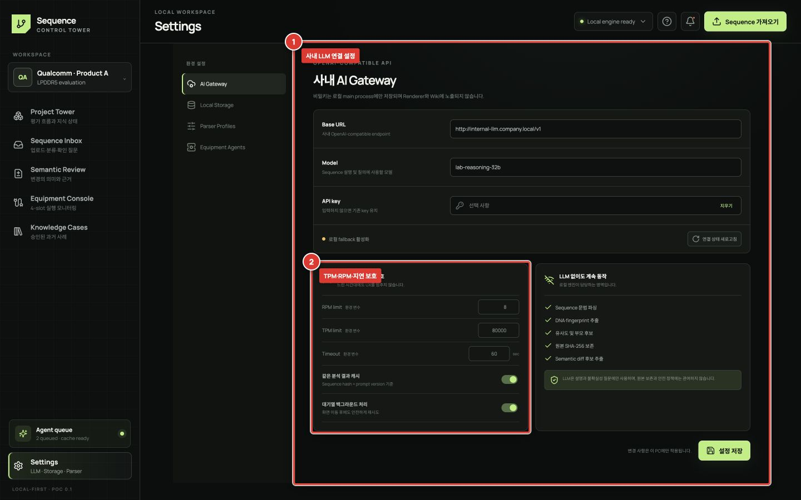

# Settings와 AI 연결

Settings에서는 로컬 데이터 위치와 사내 OpenAI-compatible API를 설정합니다. AI 연결이 없어도 SEQ 파싱과 로컬 분석은 사용할 수 있습니다.

## 처음 설정

1. **① AI Gateway**에 Base URL, model과 API key를 입력하고 짧은 연결 테스트 한 건을 보냅니다.
2. **② Rate & latency 보호**에서 현재 적용되는 RPM, 동시 요청, timeout과 cache 정책을 확인합니다.
3. 왼쪽 `Local Storage`에서 원본 artifact와 metadata의 저장 상태를 확인하고 Wiki를 내보냅니다.

## 권장 요청 정책

- timeout은 UI를 무기한 막지 않도록 30~90초 범위에서 시작합니다.
- RPM/TPM은 다른 사내 사용자와 공유되는 한도를 고려해 환경 변수 `SEQ_LLM_RPM`, `SEQ_LLM_TPM`으로 여유 있게 설정합니다.
- 대량 import 시 각 파일마다 호출하지 않고 유사 Family를 먼저 묶습니다.
- timeout 후 즉시 반복 호출하지 않고 exponential backoff와 jitter를 사용합니다.
- 동일한 분석 입력은 content hash 기반 cache를 재사용합니다.

운영 PC에서는 `SEQ_LLM_BASE_URL`, `SEQ_LLM_MODEL`, `SEQ_LLM_API_KEY`, `SEQ_LLM_TIMEOUT_MS`, `SEQ_LLM_MAX_RETRIES` 환경 변수로 설정을 중앙 관리할 수 있습니다. 환경 변수가 있으면 저장된 앱 설정보다 우선합니다.

## 보안 확인

- API key가 화면에 평문으로 계속 보이지 않는지 확인합니다.
- 설정 export, Markdown Wiki와 진단 로그에 key가 포함되지 않아야 합니다.
- LLM 전송 전 preview 또는 회사 정책에 맞는 redaction을 적용합니다.
- Endpoint와 인증서 오류가 있을 때 인증 검증을 무시하지 말고 관리자에게 문의합니다.

## 연결 상태 의미

| 상태 | 의미 | 행동 |
|---|---|---|
| Connected | 테스트 요청 성공 | Agent review 사용 가능 |
| Rate limited | RPM/TPM 초과 | queue의 다음 시각까지 대기 |
| Timed out | 제한 시간 내 응답 없음 | 로컬 기능 계속 사용, background 재시도 |
| Offline | endpoint 접근 불가 | URL/VPN/사내망 확인 |
| Not configured | 설정 없음 | 로컬 전용 모드로 사용 |
