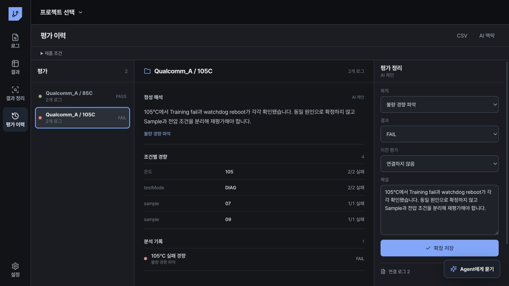

# 평가 이력

## 화면 구성

평가 이력은 연결 폴더 하나를 평가 하나로 표시합니다.

| 영역 | 표시 내용 | 작성 주체 |
|---|---|---|
| 왼쪽 평가 목록 | 폴더 이름, 로그 수, 현재 결과 | 앱 자동 집계 |
| 가운데 정성 해석 | 실패 집중 조건, 조건 변경 결과, 불확실성, 다음 확인 항목 | Agent 또는 엔지니어 |
| 가운데 조건별 경향 | 조건별 실패 수와 전체 수 | 앱 자동 계산 |
| 가운데 분석 기록 | 같은 폴더의 반복 실행과 조건 변경 | Agent 또는 엔지니어 |
| 오른쪽 평가 정리 | 목적, 결과, 이전 평가, 정성 해석 | 엔지니어 확인 후 저장 |

## Agent로 평가 기록 만들기

1. 평가 목록에서 폴더를 선택합니다.
2. `Agent에게 묻기`를 엽니다.
3. `결과와 평가 이력 정리`를 누릅니다.
4. Agent가 제안한 결과, 목적, 조건, 해석을 확인합니다.
5. `결과·이력 저장`을 누릅니다.

저장된 내용은 `AI 작성 · 엔지니어 확인`으로 표시됩니다. 저장 전 제안은 `AI 제안`으로 표시됩니다. 파일명과 규칙으로 계산한 값은 `자동 추출`, 사람이 직접 입력한 내용은 `엔지니어 작성`으로 표시됩니다.

## 정성 해석 작성 기준

정성 해석에는 다음 내용을 순서대로 기록합니다.

1. 실패 또는 PASS가 확인된 단계
2. 실패가 집중된 조건
3. 비교 조건에서 달라진 결과
4. 현재 근거로 확정할 수 없는 내용
5. 다음 평가에서 확인할 조건

실패 비율만으로 원인을 확정하지 않습니다. 분모가 작거나 비교 조건이 없으면 추가 확인이 필요하다고 기록합니다.

## 평가 연결

같은 폴더의 RT와 조건 반복은 한 평가의 분석 기록으로 저장합니다. 별도 폴더에서 수행한 개선 평가, 검출 강화 평가, 개선 효과 검증은 `이전 평가`를 선택해 연결합니다.

평가 목적은 `동일 불량 재현`, `개선 조건 확인`, `개선 효과 검증`, `불량 검출 강화`, `불량 경향 파악` 중에서 선택합니다.
