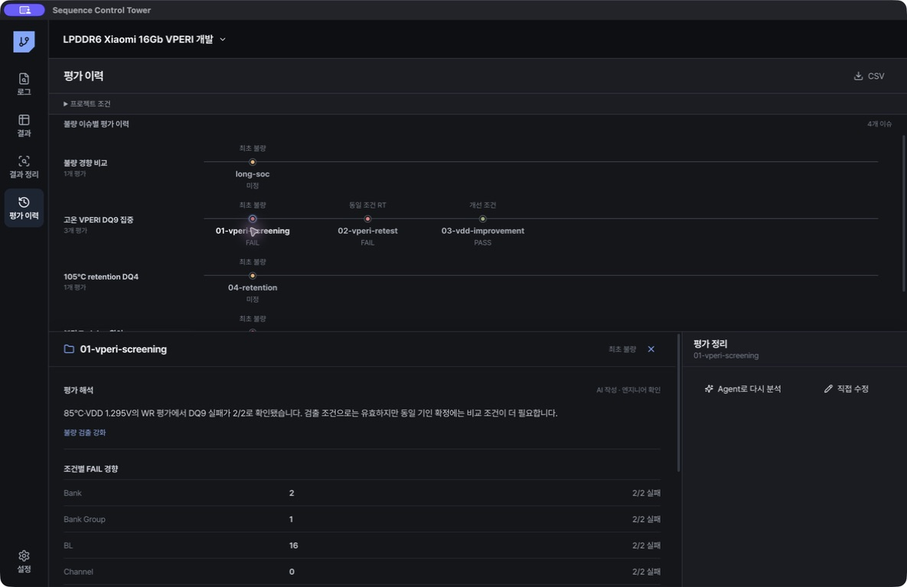
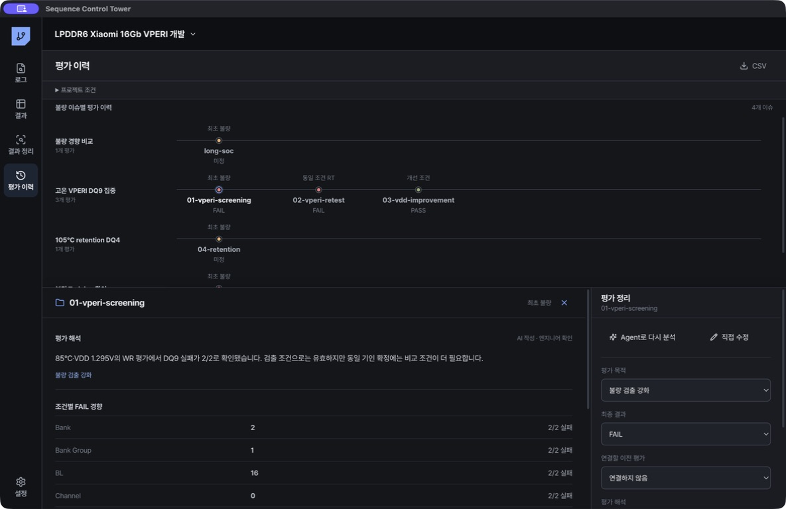

# 평가 이력

평가 이력은 프로젝트의 불량 이슈와 평가 폴더 관계를 보여줍니다. 연결 폴더 하나를 평가 하나로 표시합니다.

## 화면 보기

- 한 줄은 같은 불량 이슈입니다.
- 점 하나는 평가 폴더 하나입니다.
- 점 위의 글자는 앞선 평가와의 관계입니다.
- 점 색상은 PASS, FAIL, 진행 중, 미정을 표시합니다.
- 이슈가 정해지지 않은 폴더는 `분류 대기` 한 줄에 모입니다.

평가를 선택하지 않으면 이력 전체가 크게 표시됩니다. 점을 선택하면 화면 아래에서 평가 해석, 조건별 FAIL 경향, 연결 로그, 평가 정리가 열립니다. 같은 점을 다시 누르거나 닫기 버튼 또는 `Esc`를 누르면 상세 화면이 닫힙니다.

## 평가 관계

| 관계 | 의미 |
|---|---|
| 기준 평가 | 현재 프로젝트 이력에서 해당 불량 이슈를 설명하기 시작한 평가. 실제 최초 발생이 아닐 수 있음 |
| 동일 조건 RT | 같은 Sample, Sequence, 조건으로 앞선 FAIL을 다시 평가 |
| 가속·조건 비교 | 온도, VDD, 주파수, SKEW, Pattern을 바꿔 경향을 비교 |
| 개선 조건 | Test Mode 또는 조건을 바꿔 기존 불량이 줄어드는지 확인 |
| 안정성 검증 | 개선 조건을 반복해 목표 Sample과 SKEW에서 PASS를 확인 |
| Side effect 확인 | 기존 Fail signature가 사라진 뒤 다른 DQ, BL, Bank 등의 불량이 생겼는지 확인 |

평가 목적이 달라져도 같은 Fail signature를 분석하는 평가라면 같은 줄에 이어집니다. 부팅·Training 실패와 Hdiag 실패처럼 실패 단계가 다르거나, Fail signature가 명확히 다르면 별도 불량 이슈로 분류합니다.

첫 번째 점도 평가 목적에 따라 `재현 평가`, `개선 평가`, `검증 평가`, `검출 평가`, `경향 평가`로 표시할 수 있습니다. 실제 최초 불량이라는 로그 근거나 엔지니어 확인이 없는 상태에서 첫 번째 점을 자동으로 `최초 불량`이라 부르지 않습니다.

## Agent로 정리

1. `분류 대기` 또는 기존 이슈의 평가를 선택합니다.
2. `Agent로 분석`을 누릅니다.
3. 평가 목적 질문이 나오면 선택하거나 직접 입력합니다.
4. Agent가 결과, 조건, 평가 해석과 이력 연결을 제안합니다.
5. `이력 연결`에서 기존 불량, 새 불량, 분류 대기 중 하나를 확인합니다.
6. `결과·이력 저장`을 누릅니다.

같은 폴더를 다시 분석하면 기존 평가를 갱신합니다. 새 평가를 중복 생성하지 않습니다. 근거가 약하면 Agent는 새 이슈를 자동 생성하지 않고 분류 대기를 제안합니다.

Agent 제안을 저장하면 `AI 작성 · 엔지니어 확인`으로 표시됩니다. 직접 입력한 기록은 `엔지니어 작성`, 저장 전 Agent 기록은 `AI 제안`으로 표시됩니다.

## 직접 수정

`직접 수정`에서 다음 값을 바꿀 수 있습니다.

- 평가 목적
- 최종 결과
- 연결할 이전 평가
- 이전 평가와 관계
- 평가 해석

이전 평가를 선택하면 같은 불량 이슈에 연결됩니다. 이전 평가를 선택하지 않고 저장하면 새 불량 이슈의 시작 평가가 됩니다.

## 평가 해석

평가 해석에는 다음 내용을 기록합니다.

1. 실패 또는 PASS가 확인된 단계
2. 실패가 집중된 조건과 분모
3. 비교 조건에서 바뀐 결과
4. 현재 근거로 확정할 수 없는 내용
5. 다음 평가에서 확인할 조건

실패 비율만으로 원인을 확정하지 않습니다. 기존 DQ, BL, Bank 불량이 사라지고 다른 위치의 불량이 생기면 개선 완료가 아니라 Side effect 후보로 기록합니다.
