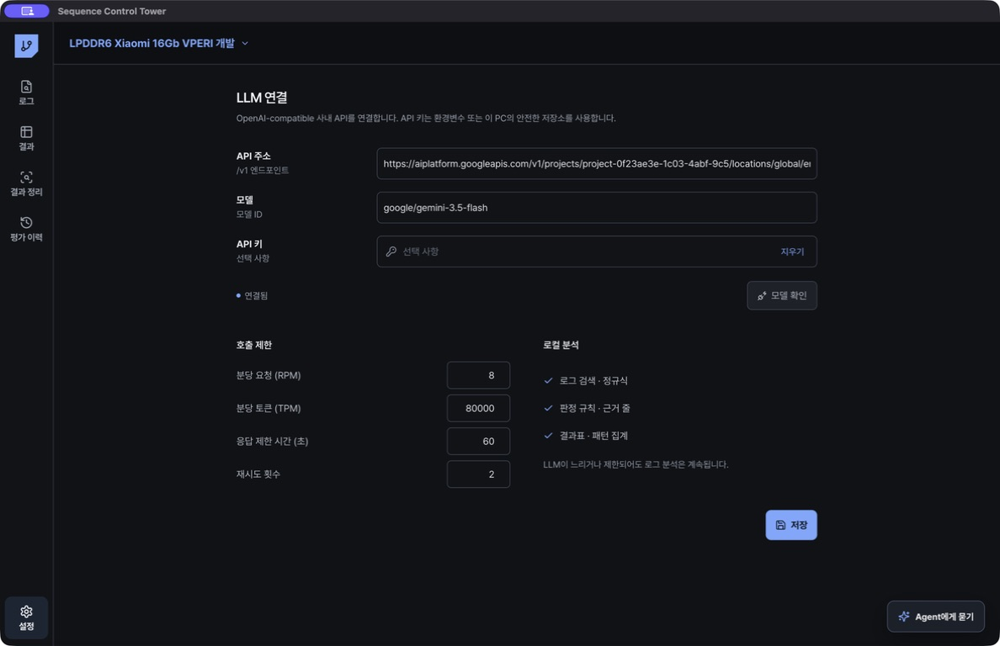

# LLM과 OpenCode

## LLM 연결

`설정`에서 다음 값을 입력합니다.

- API 주소
- 모델 ID
- API 키 또는 인증 토큰
- 분당 요청 수 (RPM)
- 분당 토큰 수 (TPM)
- 응답 제한 시간
- 재시도 횟수

`저장`을 누른 뒤 `모델 확인`을 실행합니다. 사내 vLLM, OpenAI-compatible API, Vertex AI OpenAI-compatible 엔드포인트를 사용할 수 있습니다.

## 느린 LLM 처리

- 요청 시작 상태를 즉시 표시합니다.
- 분석은 백그라운드에서 실행합니다.
- 실행 중 화면을 이동할 수 있습니다.
- timeout과 429 응답은 설정된 횟수만큼 재시도합니다.
- 실패한 분석은 같은 세션에서 다시 시도할 수 있습니다.
- 로컬 검색, 규칙, 판정, 내보내기는 LLM 없이 사용할 수 있습니다.

## OpenCode

앱은 `SEQ_OPENCODE_PATH`, 사용자 설치 경로, 시스템 `PATH` 순서로 OpenCode를 찾습니다. OpenCode가 있으면 Agent가 앱의 읽기 전용 분석 도구를 여러 단계로 호출합니다. OpenCode가 시작되지 않으면 같은 도구를 사용하는 내장 Agent로 전환합니다.

OpenCode는 앱에 포함된 `lpddr-failure-analysis` Skill을 사용합니다. Skill에는 Sample–SKEW–Grid–Sequence 구조, Qualcomm/MediaTek 부팅 단계, Hdiag 판정, Fail address, RT, 가속·개선·Side effect 검증 기준이 들어 있습니다. 내장 Agent도 같은 평가 기준과 같은 도구를 사용합니다.

OpenCode 대화와 `결과와 평가 이력 정리`는 서로 다른 런타임입니다. 전자는 자유 질문과 여러 도구의 단계적 호출을 담당하고, 후자는 폴더별 결과와 이력 저장안을 만드는 제한된 구조화 런타임입니다. 두 런타임은 같은 Skill 파일을 읽으며 항상 같은 프로젝트 평가 폴더 ID와 source 범위를 사용합니다.

Agent 입력창 아래 상태 표시에서 현재 실행 방식을 확인할 수 있습니다. 답변의 `근거`를 열면 실행한 도구와 결과 요약을 확인할 수 있습니다.

## 전송 범위

LLM에는 사용자 질문, 구조화된 프로젝트 조건, 검색으로 좁힌 근거 구간만 전달합니다. 원본 로그 전체, API 키, 토큰, 불필요한 절대경로는 전달하지 않습니다.
