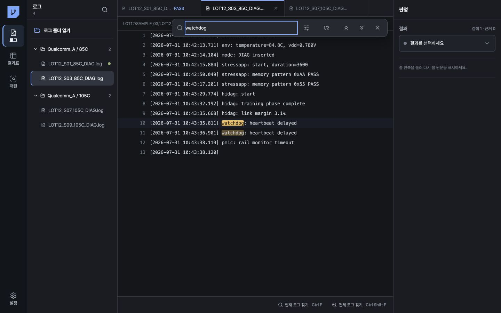

# 로그 워크벤치 사용 설명서

이 문서는 로그 워크벤치의 화면과 조작 순서를 설명합니다. 화면은 왼쪽 `로그` 영역, 가운데 원문 영역, 오른쪽 `판정` 영역으로 나뉩니다. 가운데 원문은 연속해서 읽는 읽기 전용 텍스트 편집기입니다. 로그 파일의 내용은 수정하지 않습니다.

표기 안내: 문서의 `N`은 화면에 표시되는 실제 개수로 바뀌는 숫자입니다. `Ln N`은 `N`번 줄을 뜻하며, `Ln`은 줄 번호를 나타냅니다.

## 1. 화면 구성

### 왼쪽 로그 영역

상단 제목은 현재 모드에 따라 `로그`, `검색 결과`, `예외 로그`로 표시됩니다. 제목 옆 숫자는 로그 또는 예외 로그의 개수입니다.

- `로그`: 등록된 로그 수를 표시합니다.
- `검색 결과`: 검색 결과 행을 표시합니다. 일치 개수는 가운데 검색 위젯에서 확인합니다.
- `예외 로그`: 일괄 적용에서 예외로 분류된 로그 수를 표시합니다.
- 오른쪽 아이콘: `로그` 모드에서는 모든 로그 검색을 열고, `검색 결과`와 `예외 로그` 모드에서는 로그 목록으로 돌아갑니다.

`로그` 모드의 목록에는 다음 행이 표시됩니다.

1. `로그 폴더 열기`: `.log` 파일을 포함한 폴더를 선택합니다.
2. 폴더 행: 펼침 화살표, 폴더 아이콘, 폴더 표시명, 파일 수를 표시합니다. 행을 누르면 파일 행을 펼치거나 접습니다.
3. 파일 행: 파일 아이콘, 파일명, 판정 상태 점을 표시합니다. 행을 누르면 파일을 활성 파일로 선택하고 열린 탭에 추가합니다.

활성 파일 행은 파란색 왼쪽 선과 어두운 선택 배경으로 표시됩니다. 상태 점의 색상은 `PASS`, 실패 계열, `SYSTEM_HALT`·`INCOMPLETE`, `SYSTEM_REBOOT`, `EXCLUDED`를 구분합니다. 상태 점에 마우스를 올리면 `엔지니어 판정` 또는 `규칙 미리보기`가 표시됩니다.

폴더명이 길면 화면에서 줄임표로 표시됩니다. 폴더 행에 마우스를 올리면 전체 표시명을 확인할 수 있습니다. 파일 행에 마우스를 올리면 상대 경로를 확인할 수 있습니다.

### 같은 파일명이 있는 폴더 두 개

가져온 폴더의 표시명이 같으면 폴더별 행을 유지하고 표시명을 `폴더명 · 1`, `폴더명 · 2` 형식으로 번호를 붙입니다. 예를 들어 `logs` 폴더 두 개는 `logs · 1`, `logs · 2`로 표시됩니다.

두 가져온 폴더에 `sample.log`가 각각 있으면 파일 행도 두 개가 표시됩니다. 각 행은 가져온 폴더와 상대 경로로 구분됩니다. 파일 행을 선택한 뒤 가운데 경로 표시줄 또는 파일 행 도움말에서 상대 경로를 확인하여 폴더를 구분합니다. 두 행의 파일명이 동일해도 한 행을 선택하면 해당 폴더의 탭만 활성화됩니다.

폴더를 구분하는 정보가 없는 자료는 폴더 표시명을 기준으로 묶습니다. 같은 이름의 폴더를 구분해야 하면 폴더를 다시 가져옵니다.

### 검색 결과

왼쪽이 `검색 결과` 모드이면 결과 행이 표시됩니다.

- 검색 중: `검색 중…`을 표시합니다.
- 결과 행: 파일명, `Ln N` 줄 번호, 검색된 줄의 일부를 표시합니다. 행을 누르면 해당 파일과 검색 결과를 활성화합니다.
- 결과 수가 80개를 초과하면 상위 80개만 행으로 표시하고 `상위 80개 표시 · 전체 N개`를 표시합니다.
- 검색어가 없으면 `검색어를 입력하세요.`를 표시합니다.
- 검색 오류가 있으면 결과 위에 오류 아이콘과 오류 메시지가 표시됩니다.

`예외 로그` 모드에서는 예외에 포함된 파일만 폴더 행과 파일 행으로 표시됩니다. 상단의 `X`를 누르면 전체 로그 목록으로 돌아갑니다.

### 가운데 원문 영역

가운데 영역은 위에서 아래 순서로 열린 탭, 경로 표시줄, 검색 위젯, 원문 편집기, 상태 표시줄을 포함합니다.

#### 열린 탭

각 탭에는 파일 아이콘, 파일명, 저장된 엔지니어 판정이 표시됩니다. 활성 탭은 파란색 위쪽 선으로 표시됩니다. 탭의 파일명 부분을 누르면 해당 로그를 활성화합니다.

탭 오른쪽의 `X`는 `탭 닫기` 버튼입니다. 활성 탭을 닫으면 열린 탭 목록에서 가장 오른쪽에 남은 탭이 활성화됩니다. 모든 탭을 닫으면 가운데 원문에 `분석할 로그 폴더를 추가하세요.`가 표시되고 오른쪽 판정 영역에 `로그를 선택하세요.`가 표시됩니다. 폴더 목록의 파일 행을 다시 누르면 탭이 열립니다.

탭을 닫을 때 해당 로그의 원문 구간 캐시와 원문 북마크 캐시가 제거됩니다. 닫기 전에 시작된 원문 로딩 또는 일괄 계산 결과는 닫힌 탭에 적용되지 않습니다.

#### 경로 표시줄

활성 로그의 상대 경로를 표시합니다. 상대 경로가 없으면 파일명을 표시합니다. 파일이 일부만 표시되는 상태이면 오른쪽에 경고 아이콘과 `미리보기 일부`가 표시됩니다.

#### 원문 편집기

원문은 하나의 연속된 읽기 전용 텍스트 편집기에서 줄 단위로 표시됩니다. 로그 본문은 `13.25px` 고정폭 글꼴과 `28px` 행 높이를 사용합니다. 공백, 탭, 줄 안의 빈칸을 원문 그대로 유지하며, 화면 너비를 넘는 긴 줄은 편집기 가로 스크롤로 확인합니다. 세로 스크롤로 현재 읽는 구간을 이동합니다.

각 줄은 왼쪽부터 다음 순서입니다.

1. `근거 거터`: 줄에 마우스를 올리면 원형 버튼이 표시됩니다. 누르면 해당 줄을 판정 근거로 지정하거나 해제합니다.
2. `줄 번호 거터`: 실제 줄 번호를 오른쪽 정렬로 표시합니다. 줄 번호는 선택되지 않습니다.
3. `로그 본문`: 공백과 탭을 유지한 13.25px 고정폭 텍스트를 표시합니다.

편집기에는 입력 커서와 수정 기능이 없습니다. 줄을 선택하거나 드래그해도 원문 파일은 변경되지 않습니다.

아티팩트 로그는 처음 파일을 열면 첫 240줄을 읽습니다. 이후에는 세로 스크롤 위치에 맞춰 앞이나 뒤의 원문을 자동으로 이어서 읽으므로 추가 로드 버튼을 누를 필요가 없습니다. 검색 결과나 근거 줄로 이동하면 대상 줄보다 앞선 80줄부터 최대 240줄을 읽습니다. 구간을 읽는 동안 `필요한 로그 구간을 읽고 있습니다.`가 표시됩니다.

검색 결과, `원문 북마크`, 예외 검토의 `Ln N 근거로 이동`을 선택하면 대상 파일을 활성화하고 정확한 줄을 읽습니다. 대상 줄이 현재 구간 밖에 있으면 대상 줄을 포함한 원문 구간을 먼저 읽은 뒤 해당 줄을 화면 가운데로 스크롤합니다. 이동한 줄은 주황색 왼쪽 선과 주황색 배경으로 표시됩니다.

로그가 없으면 `분석할 로그 폴더를 추가하세요.`가 표시됩니다.

#### 검색 표시와 근거 표시

검색된 문자는 노란색 검색 표시로 강조됩니다. 현재 선택된 검색 결과는 밝은 노란색 검색 표시로 표시되고 해당 줄은 옅은 파란색 배경으로 표시됩니다. 현재 파일의 원문에는 현재 활성 로그에 해당하는 검색 표시가 나타납니다.

판정 근거로 지정한 줄은 왼쪽 파란색 선과 파란색 원으로 표시됩니다. 왼쪽 `근거 거터`의 원형 버튼이 파란색으로 바뀌고 오른쪽 `원문 북마크` 목록에 줄 번호와 줄 일부가 추가됩니다. 오른쪽 목록의 줄을 누르면 해당 줄을 정확히 표시하고 주황색 선과 주황색 배경으로 강조합니다. 이 강조는 파일 선택이나 탭 전환 등 상태 변경 전까지 유지됩니다.

`근거 거터`의 원형 버튼을 다시 누르면 해당 줄이 근거 목록에서 제거됩니다. 오른쪽 목록에는 최대 4개의 근거 항목이 표시됩니다. 근거가 없으면 `줄 왼쪽을 눌러 다시 볼 원문을 표시하세요.`가 표시됩니다.

#### 상태 표시줄

오른쪽에 다음 두 버튼이 있습니다.

- `현재 로그 찾기` — `Ctrl+F` 또는 macOS `⌘F`와 동일합니다.
- `열린 탭 찾기` — `Ctrl+Alt+F` 또는 macOS `⌘⌥F`와 동일합니다.
- `전체 로그 찾기` — `Ctrl+Shift+F` 또는 macOS `⌘⇧F`와 동일합니다.

### 오른쪽 판정 영역

상단 제목은 `판정`입니다. 로그를 선택하지 않으면 `로그를 선택하세요.`가 표시됩니다. 로그를 선택하면 `결과` 영역, 원문 북마크, 분석 규칙, 일괄 적용 결과가 순서대로 표시됩니다.

`결과` 옆에는 현재 파일의 검색 기록 수와 근거 수가 `검색 N · 근거 N` 형식으로 표시됩니다.

초기 결과 선택 상자에는 `결과를 선택하세요.`가 표시됩니다. 결과 선택 상자에는 다음 항목이 있습니다.

- `Pass`
- `Diag fail`
- `Test fail`
- `Training fail`
- `System halt`
- `System reboot`
- `Incomplete`
- `Unknown`
- `Excluded`

선택한 결과는 즉시 저장을 시도합니다. 저장에 성공하면 파일 행과 열린 탭에 결과가 표시됩니다. 선택 결과가 `Unknown`이면 분석 규칙 저장 영역이 열리지 않습니다.

기존 엔지니어 판정이 있는 파일에서 다른 결과를 선택하면 기존 판정을 유지한 채 새 결과를 후보로 표시합니다. 예를 들어 기존 결과가 `PASS`이고 새 결과가 `SYSTEM_HALT`이면 `기존 PASS 판정은 유지했습니다. 규칙 후보로 쓰거나 아래에서 변경을 확정할 수 있습니다.`가 표시됩니다. 오른쪽에는 `기존 PASS → SYSTEM_HALT 변경 확정` 형식의 버튼이 표시됩니다. 이 버튼을 누르면 `SYSTEM_HALT 판정을 새 revision으로 저장했습니다.`가 표시됩니다.

판정 저장에 실패하면 `엔지니어 판정을 저장하지 못했습니다: 오류 메시지` 또는 `엔지니어 판정을 저장하지 못했습니다.`가 표시됩니다. 실패한 값은 확정 판정으로 표시되지 않습니다.

## 2. 로그 폴더 열기

### 데스크톱 앱

1. 왼쪽 `로그` 영역에서 `로그 폴더 열기`를 누릅니다.
2. 폴더 선택 창에서 로그 폴더를 선택합니다.
3. 앱은 `.log` 확장자 파일을 읽고 최대 10,000개까지 등록합니다.
4. 등록이 끝나면 가져온 첫 번째 로그를 선택하고 해당 탭을 엽니다.
5. 왼쪽 폴더 행의 파일 수와 파일명을 확인합니다.
6. 파일을 선택할 때 원문 내용과 필요한 줄 구간을 읽습니다.

가져오기 중 버튼 문구는 `폴더를 읽는 중…`입니다. 가져오기를 반복 실행해도 동일한 가져온 폴더와 상대 경로의 최신 파일 한 행을 유지합니다. 내용이 변경된 파일은 새 파일 자료로 표시되며 이전 엔지니어 판정을 자동으로 적용하지 않습니다.

가져오기가 성공하면 `N개 로그 메타데이터를 불러왔습니다. 내용은 열 때만 읽습니다.`가 표시됩니다. 실패 파일, 제외 파일, 10,000개 제한 도달이 있으면 `N개 로그를 불러왔지만 일부는 처리하지 못했습니다` 뒤에 `실패 N개`, `제외 N개`, `10,000개 제한 도달`이 표시됩니다.

폴더 선택을 취소하면 목록을 변경하지 않습니다. 폴더를 불러오지 못하면 오류 메시지 또는 `폴더를 불러오지 못했습니다.`가 표시됩니다.

### 웹 미리보기

웹 미리보기의 `로그 폴더 열기`는 예제 폴더를 엽니다. 버튼을 누르면 `웹 미리보기에서는 예제 폴더가 열려 있습니다.`가 표시됩니다.

## 3. 현재 로그 검색과 전체 로그 검색

### 단축키

| 동작 | Windows | macOS |
|---|---|---|
| 현재 로그 검색 열기 | `Ctrl+F` | `⌘F` |
| 열린 탭 검색 열기 | `Ctrl+Alt+F` | `⌘⌥F` |
| 전체 로그 검색 열기 | `Ctrl+Shift+F` | `⌘⇧F` |
| 바꾸기 모드 열기 | `Ctrl+H` | `⌘H` |
| 다음 결과 | `F3` 또는 검색 입력 중 `Enter` | `F3` 또는 `Enter` |
| 이전 결과 | `Shift+F3` 또는 검색 입력 중 `Shift+Enter` | `Shift+F3` 또는 `Shift+Enter` |
| 검색 닫기 | `Esc` | `Esc` |

`Ctrl/Cmd+F`는 현재 활성 로그 하나를 검색 대상으로 설정합니다. Windows와 Linux에서는 `Ctrl+F`, macOS에서는 `⌘F`를 누릅니다. `Ctrl/Cmd+Alt/Option+F`는 현재 열린 탭만 검색 대상으로 설정하고 왼쪽에 검색 결과를 표시합니다. Windows와 Linux에서는 `Ctrl+Alt+F`, macOS에서는 `⌘⌥F`를 누릅니다. `Ctrl/Cmd+Shift+F`는 등록된 모든 로그를 검색 대상으로 설정하고 왼쪽에 검색 결과를 표시합니다. Windows와 Linux에서는 `Ctrl+Shift+F`, macOS에서는 `⌘⇧F`를 누릅니다.

검색 위젯이 닫힌 상태에서 `F3`를 누르면 검색 위젯을 열고 현재 검색 범위의 다음 결과로 이동합니다. `Shift+F3`를 누르면 이전 결과로 이동합니다. 검색 결과가 없으면 이동하지 않습니다.

### 검색 위젯 조작

1. `Ctrl+F`, `Ctrl+Alt+F`, `Ctrl+Shift+F`, 상태 표시줄 버튼 중 하나를 누릅니다.
2. 검색 위젯의 `검색 범위` 선택기에서 `현재 로그`, `열린 탭`, `전체 로그` 중 하나를 선택합니다. `열린 탭`은 현재 열려 있는 탭의 파일만 포함하고 닫은 파일은 포함하지 않습니다.
3. 검색 위젯의 입력란에 검색어를 입력합니다. 검색 범위와 관계없이 입력 안내는 `검색어 입력`입니다.
4. 입력한 검색어와 일치하는 문자는 원문에서 노란색 검색 표시로 강조됩니다. 현재 결과의 검색 표시는 밝은 노란색이고 해당 줄은 옅은 파란색 배경입니다.
5. 위젯의 가운데 상태에서 `현재 결과/전체 결과`를 확인합니다. 검색 결과가 없으면 `0/0`이 표시됩니다.
6. 위쪽 화살표를 눌러 이전 결과로 이동하고 아래쪽 화살표를 눌러 다음 결과로 이동합니다.
7. 검색 위젯 오른쪽 `X` 또는 `Esc`를 눌러 검색을 닫습니다.

왼쪽 `검색 결과` 행을 누르거나 검색 위젯에서 결과를 이동하면 해당 파일과 정확한 줄을 원문에 표시합니다. 정확한 줄이 현재 아티팩트 구간에 없으면 대상 줄을 포함한 최대 240줄 구간을 읽은 뒤 해당 줄을 화면 가운데로 스크롤합니다.

검색 위젯의 옵션 버튼을 누르면 다음 세 가지를 켜거나 끌 수 있습니다.

- `대/소문자 구분`: 대문자와 소문자를 구분합니다.
- `단어 단위 일치`: 단어 경계에 맞는 결과만 찾습니다.
- `정규식 사용`: 입력을 정규식으로 해석합니다.

### 수정 초안: 원문 불변 바꾸기

`Ctrl+H` 또는 macOS의 `⌘H`를 누르면 기존 검색 위젯이 현재 검색 범위의 compact 바꾸기 모드로 열리고, 검색 입력의 내용이 선택됩니다. 검색 입력 아래에 하나의 `바꿀 내용` 입력과 `현재 바꾸기`, `모두 바꾸기`가 표시됩니다.

- `현재 바꾸기`는 현재 활성 `SearchHit`의 원본 `fileId`, `line`, `start`, `end`, `text`를 정확히 기대값으로 사용합니다. `Ctrl/Cmd+Enter`도 같은 동작을 수행하며, 성공하면 원본 검색 결과의 다음 hit로 이동합니다.
- `모두 바꾸기`는 현재 검색 범위(`현재 로그`, `열린 탭`, `전체 로그`)에 속한 파일 ID를 대상으로 합니다. 현재 검색의 literal/regex, 대·소문자 구분, 단어 단위 일치 옵션을 그대로 작업에 기록합니다. `Ctrl/Cmd+Alt+Enter`로도 실행합니다.
- 검색 결과 수, 검색 표시, 결과 이동은 항상 원본 기준입니다. 바꾸기 작업은 `logDraft`에만 쌓이며, 화면에 이미 읽어 온 줄을 그릴 때만 지연 적용됩니다. 아직 읽지 않은 아티팩트 구간은 그 구간이 표시될 때 적용됩니다.
- 초안은 `수정 초안 · 결과/근거는 원본 기준`으로 표시됩니다. 작업 수와 `초안 초기화`가 함께 보이며, 초기화하면 즉시 원문 표시로 돌아갑니다.
- `WorkbenchFile.text`, 아티팩트 파일, source SHA, 판정 근거, 일괄 평가, 결과, CSV/TSV는 수정하지 않습니다. 초안은 저장·내보내기·분석 규칙에 포함되지 않습니다.
- 해당 파일에 표시 중인 초안이 있으면 근거 거터는 비활성화됩니다. `수정 초안 표시 중에는 판정 근거를 바꿀 수 없습니다.`라는 설명을 확인하고, 원문에서 근거를 바꾸려면 초안을 초기화합니다.

바꿀 내용에 줄바꿈을 넣거나, 잘못된 정규식·안전하지 않은 정규식(중첩 반복·반복 와일드카드·역참조)·0폭 검색식·빈 검색 범위·잘못된 줄 위치를 사용하면 compact 오류가 표시되고 작업은 추가되지 않습니다. 현재 검색식이 잘못되었거나 검색 서비스/파일 검색에 실패한 동안에는 `모두 바꾸기`를 실행할 수 없습니다. 현재 hit의 원문이 바뀌어 stale 상태가 되면 `원문 검색 결과가 바뀌었습니다. 다시 검색하세요.`가 표시됩니다. 초안 표시 줄에는 원본 offset을 오해하게 만드는 검색 강조를 표시하지 않습니다.

바꾸기 모드에서 `Escape`를 한 번 누르면 먼저 바꾸기 모드만 종료하고 검색 입력으로 돌아갑니다. 바꾸기 모드가 닫힌 상태에서 다시 `Escape`를 누르거나 검색 위젯의 `X`를 누르면 검색 위젯을 닫고 파일 목록 사이드바로 돌아갑니다. `Enter`는 계속 다음 검색 결과이며, 바꾸기 명령은 명시적으로 `Ctrl/Cmd+Enter` 또는 `Ctrl/Cmd+Alt+Enter`를 사용합니다.

옵션이 켜지면 옵션 버튼과 해당 행이 활성 상태로 표시됩니다. 현재 로그 검색은 선택 파일의 원문을 검사하고, 열린 탭 검색은 현재 열린 탭의 원문을 검사하며, 전체 로그 검색은 등록된 파일 전체를 검사합니다. 데스크톱의 파일 자료 검색은 로컬 검색 서비스가 처리합니다.

잘못된 정규식이면 입력란에 물결 밑줄이 표시되고 상태가 `식 오류`가 됩니다. 이 상태에서는 결과를 계산하지 않습니다. 검색 서비스 또는 특정 파일 검사에 실패하면 상태가 `검색 실패`가 되고 왼쪽 결과 영역에 오류 메시지가 표시됩니다.

검색 중에는 위젯 상태가 `검색 중…`으로 표시됩니다. 검색 결과 행은 최대 80개를 표시합니다. 결과 수가 더 많으면 목록 아래에 전체 개수가 표시됩니다.

## 4. 결과 선택과 원문 근거 지정

1. 왼쪽 파일 행 또는 열린 탭에서 검토할 로그를 선택합니다.
2. 가운데 읽기 전용 원문에서 판정에 필요한 줄을 찾습니다. 긴 줄은 가로 스크롤로 확인합니다.
3. 해당 줄의 `근거 거터` 원형 버튼을 누릅니다.
4. 파란색 근거 표시와 오른쪽 `원문 북마크` 항목을 확인합니다.
5. 오른쪽 `결과` 선택 상자에서 결과를 선택합니다.
6. 기존 판정이 없으면 저장 성공 메시지와 함께 판정이 확정됩니다.
7. 기존 판정이 있으면 후보 결과와 변경 확정 버튼을 확인합니다.
8. 판정을 변경하려면 표시된 `기존 PASS → SYSTEM_HALT 변경 확정` 형식의 버튼을 누릅니다.

오른쪽 `원문 북마크` 항목을 누르면 해당 로그와 정확한 줄로 이동합니다. 대용량 로그에서 줄이 현재 구간에 없으면 대상 줄을 포함한 최대 240줄 구간을 먼저 읽고 해당 줄을 화면 가운데로 스크롤합니다.

## 5. 분석 규칙 저장

분석 규칙은 선택한 검색 기록과 엔지니어 결과를 규칙으로 저장합니다. 규칙 저장 영역은 결과를 선택한 뒤 검색 기록이 있을 때 표시됩니다.

### 규칙 선택

1. 대표 로그에서 규칙에 사용할 검색어를 검색합니다.
2. 오른쪽 `분석 규칙 저장`을 누릅니다. 이미 영역이 열려 있으면 이 단계는 생략합니다.
3. `분석 규칙` 영역에서 `판정에 사용할 검색을 선택하세요` 아래의 검색 항목을 확인합니다.
4. 검색 항목의 체크 상자를 눌러 규칙에 포함합니다. 항목 오른쪽에는 일치 횟수 또는 `없음`이 표시됩니다.
5. 일치 검색어는 존재 조건으로 저장됩니다.
6. `없음` 항목은 부재 조건으로 저장됩니다.
7. 선택을 해제하려면 체크된 항목을 다시 누릅니다.

`분석 규칙` 제목 오른쪽의 `X`를 누르면 규칙 영역을 닫습니다. 규칙 영역을 닫은 뒤에도 선택한 검색 기록과 결과는 유지됩니다. 조건을 다시 확인하려면 오른쪽에 표시되는 `분석 규칙 저장`을 누릅니다.

선택 항목이 두 개 이상이고 모두 원문 내용의 일치 검색이면 `표시된 순서대로 나타나야 함`을 선택할 수 있습니다. 이 옵션을 켜면 선택 목록 순서대로 각 검색 항목이 나타나야 규칙이 일치합니다. 선택 항목을 바꾸면 순서 옵션은 해제됩니다.

아래 규칙 요약에는 존재 항목, 부재 항목, `그러면 결과값`이 표시됩니다. 이 요약으로 저장할 결과와 조건을 확인합니다.

### 저장

1. 규칙에 포함할 검색 항목을 하나 이상 선택합니다.
2. 필요한 경우 `표시된 순서대로 나타나야 함`을 켭니다.
3. `규칙 저장`을 누릅니다.
4. 성공하면 버튼이 `저장됨`으로 바뀌고 `분석 규칙을 저장했습니다.`가 표시됩니다.
5. 기존 엔지니어 판정이 있는 파일에서 규칙 결과가 달라도 기존 판정은 유지됩니다. 예를 들어 기존 결과가 `PASS`이면 `분석 규칙을 저장했습니다. 기존 PASS 엔지니어 판정은 유지됩니다.`가 표시됩니다.

검색 항목을 선택하지 않으면 `규칙 저장`과 `전체에 미리 적용`은 비활성화됩니다. 규칙 저장에 성공한 뒤 `규칙 저장`은 `저장됨`으로 표시되고 다시 누를 수 없습니다. 일괄 계산 중에는 `전체에 미리 적용`이 비활성화됩니다.

선택 검색 항목이 없으면 `판정에 사용할 검색 근거를 선택해 주세요.`가 표시됩니다. 검색 근거를 규칙으로 만들 수 없으면 `저장할 검색 근거를 먼저 확인해 주세요.`가 표시됩니다. 저장 중 오류가 발생하면 `분석 규칙을 저장하지 못했습니다: 오류 메시지` 또는 `분석 규칙을 저장하지 못했습니다.`가 표시됩니다.

## 6. 전체에 미리 적용

1. 오른쪽 `분석 규칙`에서 검색 항목을 하나 이상 선택합니다.
2. 필요하면 검색 항목 순서 조건을 켭니다.
3. `전체에 미리 적용`을 누릅니다.
4. 계산 중에는 버튼이 `로컬 계산 중`으로 바뀌고 회전 아이콘이 표시됩니다.
5. 계산이 끝나면 `N개 조건 일치 · 로컬 계산`과 `예외 N개 확인`이 표시됩니다.
6. 왼쪽 파일 행의 상태 점은 규칙 미리보기 결과를 표시합니다.

결과는 등록된 모든 로그, 저장된 규칙, 현재 후보 규칙을 대상으로 계산됩니다. 기존 엔지니어 판정과 규칙 결과가 다르면 기존 엔지니어 판정을 유지하고 해당 로그를 예외로 포함합니다. `Unknown`, 규칙 미일치, 규칙 예외도 예외 수에 포함됩니다.

판정이 `Unknown`이거나 검색 항목이 없으면 `일괄 적용할 검색 근거를 선택해 주세요.`가 표시됩니다. 로컬 검사 서비스를 사용할 수 없으면 `데스크톱 로컬 검사 서비스를 사용할 수 없습니다.`가 표시됩니다. 계산에 실패하면 오른쪽에 오류 아이콘과 오류 메시지가 표시되고 `일괄 미리 적용에 실패했습니다.`를 기본 메시지로 사용합니다.

## 7. 예외 검토

1. 일괄 적용 완료 후 오른쪽 `예외 N개 확인`을 누릅니다.
2. 왼쪽 제목이 `예외 로그`로 바뀌고 예외 파일만 표시되는지 확인합니다.
3. 예외 파일 행을 선택합니다.
4. 오른쪽 `검토 이유`에서 사유를 확인합니다.
5. `Ln N 근거로 이동`을 누르면 계산에 사용된 첫 근거 줄로 이동합니다.
6. 가운데 대상 줄이 주황색 선과 주황색 배경으로 표시되며, 파일 선택이나 탭 전환 등 상태 변경 전까지 유지되는지 확인합니다.
7. `Ln N 근거로 이동`만으로는 파란색 근거 표시나 오른쪽 `원문 북마크` 항목이 생성되거나 확정되지 않습니다. 파란색 근거 표시와 `원문 북마크` 항목은 엔지니어가 해당 줄 왼쪽의 원을 눌렀을 때만 표시됩니다.
8. 필요한 경우 결과를 다시 선택하거나 대표 로그의 규칙 검색 조건을 수정합니다.

`검토 이유`에는 다음 문구가 표시될 수 있습니다.

| 표시 문구 | 코드 | 확인할 내용 |
|---|---|---|
| `일치하는 규칙 없음` | `NO_MATCH` | 저장 규칙의 존재·부재 조건과 원문 |
| `동순위 규칙 충돌` | `RULE_CONFLICT` | 동일 우선순위 규칙의 결과 |
| `잘못된 검색식` | `INVALID_PATTERN` | 정규식 문법과 검색 설정 |
| `검토가 필요한 규칙` | `LOW_CONFIDENCE` | 규칙 신뢰도와 대표 로그 |
| `판정 근거 누락` | `MISSING_EVIDENCE` | 필요한 검색 근거와 원문 위치 |
| `로그 검사 실패` | `EVIDENCE_ERROR` | 원문 접근과 검사 오류 |
| `잘못된 규칙` | `INVALID_RULE` | 규칙 구조와 순서 조건 |

기존 엔지니어 판정과 규칙 결과가 다르면 `엔지니어 판정과 규칙 결과가 다릅니다.`가 추가됩니다. 계산된 평가에 줄 위치가 없으면 `Ln N 근거로 이동` 버튼은 표시되지 않습니다.

## 8. 상태별 확인 순서

### 로그를 선택하지 않은 상태

1. 왼쪽 `로그 폴더 열기`로 로그를 등록합니다.
2. 폴더를 펼칩니다.
3. 파일 행을 누릅니다.
4. 가운데 원문과 오른쪽 결과 선택 상자를 확인합니다.

### 검색 결과가 없는 상태

검색 위젯에 `0 / 0`이 표시됩니다. 오른쪽 이전·다음 결과 버튼은 비활성화됩니다. 원문에 검색 강조가 표시되지 않습니다. 검색어의 부재를 결과 판정으로 사용하려면 오른쪽 분석 규칙에서 `없음`으로 표시된 검색 기록을 선택합니다.

### 저장된 판정과 규칙 결과가 충돌하는 상태

기존 판정은 유지됩니다. 일괄 적용 결과에서 해당 파일은 예외로 계산되고 충돌 수에 포함됩니다. 예외 검토에서 `엔지니어 판정과 규칙 결과가 다릅니다.`를 확인한 뒤 엔지니어 판정을 변경하거나 규칙을 수정합니다.

### 저장 상태를 읽지 못한 상태

저장된 분석 상태가 손상되었거나 지원하지 않는 버전이면 원본 상태를 백업한 뒤 새 상태로 시작하고 `저장된 분석 상태를 읽지 못해 원본을 백업하고 새 상태로 시작합니다.`가 표시됩니다. 이후 폴더를 다시 선택하고 판정·검색 근거·규칙을 다시 저장합니다.

## 9. 안전한 사용 범위

- 원문 편집기에는 로그 수정 기능이 없습니다.
- 검색과 일괄 규칙 계산은 로컬 처리 상태를 표시합니다.
- `Unknown`, 규칙 충돌, 검사 실패, 근거 누락은 예외 검토 대상으로 남깁니다.
- 판정 확정 전에 원문 줄, 근거 표시, 결과 선택을 함께 확인합니다.
